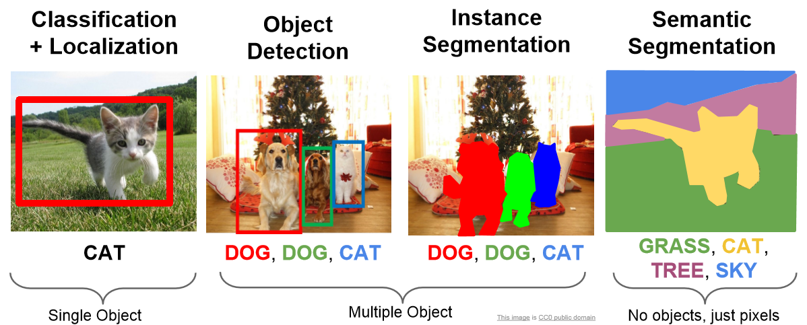
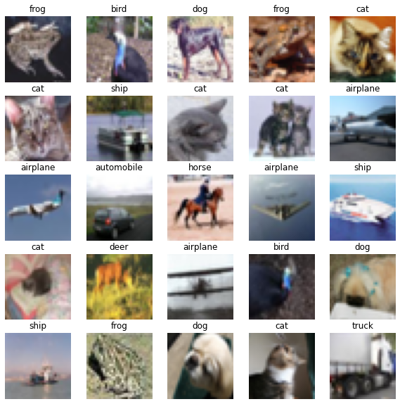
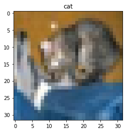

:::::::::::::::::::::::::::::::::::::: questions

- What is machine learning and what is it used for?
- What is deep learning?
- How do I use a neural network for image classification?

::::::::::::::::::::::::::::::::::::::::::::::::

::::::::::::::::::::::::::::::::::::: objectives

- Explain the difference between artificial intelligence, machine learning and deep learning.
- Understand the different types of computer vision tasks.
- Perform an image classification using a convolutional neural network (CNN).

::::::::::::::::::::::::::::::::::::::::::::::::

## Deep Learning, Machine Learning and Artificial Intelligence

Artificial Intelligence (AI) is the broad field that involves creating machines capable of performing tasks that typically require human intelligence. This includes everything from recognizing speech and images to making decisions and translating languages. Within AI, Machine Learning (ML) is a subset focused on the development of algorithms that allow computers to learn and improve from experience without being explicitly programmed.

Deep Learning (DL), a further subset of ML, utilizes neural networks with many layers (hence "deep") to model complex patterns in large amounts of data. This technique has led to significant advances in various fields, such as image and speech recognition.

Since the 1950s, the idea of AI has captured the imagination of many, often depicted in science fiction as machines with human-like or even superior intelligence. While recent advancements in AI and ML have been remarkable, we are currently capable of achieving human-like intelligence only in specific areas. The goal of creating a general-purpose AI, one that can perform any intellectual task a human can, remains a long-term challenge.

The image below illustrates some differences between artificial intelligence, machine learning and deep learning.

![The image above is by Tukijaaliwa, CC BY-SA 4.0, via Wikimedia Commons, [original source]](fig/01_AI_ML_DL_differences.png){alt='Three nested circles defining deep learning as a subset of machine learning which is a subset of artifical intelligence'}

## What is machine learning?

Machine learning is a set of tools and techniques which let us find patterns in data. The techniques break down into two broad categories, predictors and classifiers. Predictors are used to predict a value (or set of values) given a set of inputs whereas classifiers try to classify data into different categories, or assign a label.

Many, but not all, machine learning systems “learn” by taking a series of input data and output data and using it to form a model. The maths behind the machine learning doesn’t care what the data is as long as it can represented numerically or categorised. Some examples might include:

- Predicting a person’s weight based on their height.
- Predicting house prices given stock market prices.
- Classifying an email as spam or not.
- Classifying an image as, e.g., a person, place, or particular object.

Typically we train our models with hundreds, thousands or even millions of examples before they work well enough to do any useful predictions or classifications with them.

This lesson will introduce you to only one of these techniques, **Deep Learning** with **Convolutional Neural Network**, abbreviated as **CNN**, but there are many more.

A CNN is a DL algorithm that has become a cornerstone in image classification due to its ability to automatically learn features from images in a hierarchical fashion (i.e. each layer builds upon what was learned by the previous layer). It can achieve remarkable performance on a wide range of tasks.

## What is image classification?

Image classification is a fundamental task in computer vision, which is a field of artificial intelligence focused on teaching computers to interpret and understand visual information from the world. Image classification specifically involves the process of assigning a label or category to an input image. The goal is to enable computers to recognise and categorise objects, scenes, or patterns within images, just as a human would. Image classification can refer to one of several computer vision tasks:

{alt='Four types of image classification tasks include semantic segmentation to label every pixel; classification and localisation to detect a single object like a cat; object detection to detect multiple objects like cats and dogs; and instance segmentation to detect each pixel of multiple objects'}


Image classification has numerous practical applications, including:

- **Object Recognition**: Identifying objects within images, such as cars, animals, or household items.
- **Medical Imaging**: Diagnosing diseases from medical images like X-rays or MRIs.
- **Quality Control**: Inspecting products for defects on manufacturing lines.
- **Autonomous Vehicles**: Identifying pedestrians, traffic signs, and other vehicles in self-driving cars.
- **Security and Surveillance**: Detecting anomalies or unauthorised objects in security footage.


## Deep Learning Workflow
To apply Deep Learning to a problem there are several steps to go through:

### Step 1. Formulate / Outline the problem
Firstly we must decide what it is we want our Deep Learning system to do. This lesson is all about image classification so our aim is to put an image into one of a few categories. Specifically in our case, we have 10 categories: airplane, automobile, bird, cat, deer, dog, frog, horse, ship, truck

### Step 2. Identify inputs and outputs
Next identify what the inputs and outputs of the neural network will be. In our case, the data is images and the inputs could be the individual pixels of the images. We are performing a classification problem and we will have one output for each potential class.

### Step 3. Prepare data
Many datasets are not ready for immediate use in a neural network and will require some preparation. Neural networks can only really deal with numerical data, so any non-numerical data (e.g., images) will have to be somehow converted to numerical data. Information on how this is done and the data structure will be explored in [Episode 02 Introduction to Image Data](episodes/02-image-data).

For this lesson, we will use an existing image dataset known as [CIFAR-10] (Canadian Institute for Advanced Research). We will introduce the different data preparation tasks in more detail in the next episode but for this introduction, we will prepare the datset with these steps:

- normalise the image pixel values to be between 0 and 1
- one-hot encode the training image labels
- divide the data into **training**, **validation**, and **test** subsets

#### Preparing the code

It is the goal of this training workshop to produce a Deep Learning program, using a Convolutional Neural Network.  At the end of this workshop, we hope this code can be used as a "starting point".  We will create an "initial program" for this introduction chapter that will be used as a foundation for the rest of the episodes.

:::::::::::::::::::::::::::::::::::::: callout
Here's one we prepared earlier!

To follow along in Spyder, [Set the working directory] to the '.../intro-image-classification-cnn/scripts' folder where '...' is your project folder.

:::::::::::::::::::::::::::::::::::::::::::::::

```python
# load the required packages
from tensorflow import keras # for neural networks 
from sklearn.model_selection import train_test_split # for splitting data into sets
import matplotlib.pyplot as plt # for plotting

# create a function to prepare the training dataset
def prepare_dataset(train_images, train_labels):
    
    # normalize the RGB values to be between 0 and 1
    train_images = train_images / 255.0
    
    # one hot encode the training labels
    train_labels = keras.utils.to_categorical(train_labels, len(class_names))
    
    # split the training data into training and validation set
    train_images, val_images, train_labels, val_labels = train_test_split(
    train_images, train_labels, test_size = 0.2, random_state=42)

    return train_images, val_images, train_labels, val_labels

# load the data
(train_images, train_labels), (test_images, test_labels) = keras.datasets.cifar10.load_data()

# create a list of class names associated with each CIFAR-10 label
class_names = ['airplane', 'automobile', 'bird', 'cat', 'deer', 'dog', 'frog', 'horse', 'ship', 'truck']

### Step 3. Prepare data

# prepare the dataset for training
train_images, val_images, train_labels, val_labels = prepare_dataset(train_images, train_labels)

```

::::::::::::::::::::::::::::::::::::: challenge 

## CHALLENGE Examine the CIFAR-10 dataset

Explain the output of these commands?

```python
print('Train: Images=%s, Labels=%s' % (train_images.shape, train_labels.shape))
print('Validate: Images=%s, Labels=%s' % (val_images.shape, val_labels.shape))
print('Test: Images=%s, Labels=%s' % (test_images.shape, test_labels.shape))

```

:::::::::::::::::::::::: solution 

## Output
 
```output
Train: Images=(40000, 32, 32, 3), Labels=(40000, 10)
Validate: Images=(10000, 32, 32, 3), Labels=(10000, 10)
Test: Images=(10000, 32, 32, 3), Labels=(10000, 1)
```
The training set consists of 40000 images of 32x32 pixels and three channels (RGB values) and one-hot encoded labels.

The validation set consist of 10000 images of 32x32 pixels and three channels (RGB values) and one-hot encoded labels.

The test set consists of 10000 images of 32x32 pixels and three channels (RGB values) and labels.

:::::::::::::::::::::::::::::::::
::::::::::::::::::::::::::::::::::::::::::::::::


#### Visualise a subset of the CIFAR-10 dataset

```python
# set up plot region, including width, height in inches
fig, axes = plt.subplots(nrows=5, ncols=5, figsize=(10,10))

# add images to plot
for i,ax in enumerate(axes.flat):
    ax.imshow(train_images[i])
    ax.axis('off')
    ax.set_title(class_names[train_labels[i,].argmax()])
    
# view plot
plt.show()
```

{alt='Subset of 25 CIFAR-10 images representing different object classes'}

### Step 4. Choose a pre-trained model or build a new architecture from scratch

Often we can use an existing neural network instead of designing one from scratch. Training a network can take a lot of time and computational resources. There are a number of well publicised networks which have been demonstrated to perform well at certain tasks. If you know of one which already does a similar task well, then it makes sense to use one of these.

If instead we decide to design our own network, then we need to think about how many input neurons it will have, how many hidden layers and how many outputs, and what types of layers to use. This will require some experimentation and tweaking of the network design a few times before achieving acceptable results.

Here we present an initial model to be explained in detail later on:

#### Define the Model

```python
def create_model_intro():
    
    # CNN Part 1
    # Input layer of 32x32 images with three channels (RGB)
    inputs_intro = keras.Input(shape=train_images.shape[1:])
    
    # CNN Part 2
    # Convolutional layer with 16 filters, 3x3 kernel size, and ReLU activation
    x_intro = keras.layers.Conv2D(filters=16, kernel_size=(3,3), activation='relu')(inputs_intro)
    # Pooling layer with input window sized 2x2
    x_intro = keras.layers.MaxPooling2D(pool_size=(2,2))(x_intro)
    # Second Convolutional layer with 32 filters, 3x3 kernel size, and ReLU activation
    x_intro = keras.layers.Conv2D(filters=32, kernel_size=(3,3), activation='relu')(x_intro)
    # Second Pooling layer with input window sized 2x2
    x_intro = keras.layers.MaxPooling2D(pool_size=(2,2))(x_intro)
    # Flatten layer to convert 2D feature maps into a 1D vector
    x_intro = keras.layers.Flatten()(x_intro)
    # Dense layer with 64 neurons and ReLU activation
    x_intro = keras.layers.Dense(units=64, activation='relu')(x_intro)
    
    # CNN Part 3
    # Output layer with 10 units (one for each class) and softmax activation
    outputs_intro = keras.layers.Dense(units=10, activation='softmax')(x_intro)
    
    # create the model
    model_intro = keras.Model(inputs = inputs_intro, 
                              outputs = outputs_intro, 
                              name = "cifar_model_intro")
    
    return model_intro

# create the introduction model
model_intro = create_model_intro()

# view model summary
model_intro.summary()
```

### Step 5. Choose a loss function and optimizer and compile model

To set up a model for training we need to compile it. This is when you set up the rules and strategies for how your network is going to learn.

The loss function tells the training algorithm how far away the predicted value was from the true value. We will learn how to choose a loss function in more detail in [Episode 4 Compile and Train (Fit) a Convolutional Neural Network](episodes/04-fit-cnn.md).

The optimizer is responsible for taking the output of the loss function and then applying some changes to the weights within the network. It is through this process that “learning” (adjustment of the weights) is achieved.

```python
# compile the model
model_intro.compile(optimizer = keras.optimizers.Adam(),
                    loss = keras.losses.CategoricalCrossentropy(),
                    metrics = keras.metrics.CategoricalAccuracy())
```

### Step 6. Train the model

We can now go ahead and start training our neural network. We will probably keep doing this for a given number of iterations through our training dataset (referred to as epochs) or until the loss function gives a value under a certain threshold.

```python
# fit the model
history_intro = model_intro.fit(x = train_images, y = train_labels,
                                batch_size = 32,
                                epochs = 10, 
                                validation_data = (val_images, val_labels))

```
Your output will begin to print similar to the output below:
```output
Epoch 1/10

1250/1250 [==============================] - 15s 12ms/step - loss: 1.4651 - accuracy: 0.4738 - val_loss: 1.2736 - val_accuracy: 0.5507
```

#### What does this output mean?

This output printed during the fit phase, i.e. training the model against known image labels, can be broken down as follows:

- `Epoch` describes the number of full passes over all *training data*. 
- `In the output above, there are **1250** batches (steps) to complete each epoch. 
    - This number is calculated as the total number of images used as input divided by the batch size (40000/32). After 1250 batches, all training images will have been seen once and the model moves on to the next epoch.

- `loss` is a value the model will attempt to minimise and is a measure of the dissimilarity or error between the true label of an image and the model prediction. Minimising this distance is where *learning* occurs to adjust weights and bias which reduce `loss`. 
- `val_loss` is a value calculated against the validation data and is a measure of the model's performance against unseen data. 
    - Both values are a summation of errors made during each epoch.

- `accuracy` and `val_accuracy` values are a percentage and are only revelant to **classification problems**. 
    - The `val_accuracy` score can be used to communicate a model's effectiveness on unseen data.


### Step 7. Perform a Prediction/Classification

After training the network we can use it to perform predictions. This is how  you would use the network after you have fully trained it to a satisfactory performance. The predictions performed here on a special hold-out set is used in the next step to measure the performance of the network. Make sure the images you use to test are prepared the same way as the training images.

```python
# normalize test dataset RGB values to be between 0 and 1
test_images = test_images / 255.0

# make prediction for the first test image
result_intro = model_intro.predict(test_images[0].reshape(1,32,32,3))
print(result_intro)

# extract class with highest probability
print(class_names[result_intro.argmax()])
```
```output
1/1 [==============================] - 0s 93ms/step
[[0.00896197 0.00345764 0.20091638 0.3295959 0.3042777 0.03966621 0.06654432 0.00352677 0.03928733 0.00376582]]
cat
```

Congratulations, you just created your first image classification model and used it to classify an image! 

Was the classification correct? 

```python
# plot the first test image with its true label

# create a plot
plt.figure()

# display image
plt.imshow(test_images[0])
plt.title('True class:' + class_names[result_intro.argmax()])

# view plot
plt.show() 
```

{alt='poor resolution image of a cat'}


::::::::::::::::::::::::::::::::::::::::: callout
My result is different! Why? What can I do about?

This is actually not surprising. The architecture we are using is shallow and the model only trained for 10 epochs. 

Training a model for more epochs (longer time) and using a deeper model (more layers) usually helps it learn better and give more accurate predictions. When a model has learned well and its performance doesn't change much with more training, we say it has 'converged.' **Convergence** refers to the point where the model has reached an optimal or near-optimal state in terms of learning from the training data. If you are finding significant differences in the model predictions, this could be a sign the model is not fully converged. 

You may even find you get a different answer if you run this model again. Although the neural network itself is deterministic (ie without randomness), various factors in the training process, system setup, and hardware configurations can lead to small variations in the output. These variations are usually minor and should not significantly impact the overall performance of the model, _if it has fully converged_.

There are many ways to try to improve the accuracy of our model, such as adding or removing layers to the model definition and fine-tuning the hyperparameters, which takes us to the next steps in our workflow.
:::::::::::::::::::::::::::::::::::::::::::::::::


### Step 8. Measure Performance

Once we trained the network we want to measure its performance. To do this, we use additional data that was **not** part of the training, called a test dataset. There are many different methods available for measuring performance and which one is best depends on the type of task we are attempting. These metrics are often published as an indication of how well our network performs.

### Step 9. Tune Hyperparameters

When building image recognition models in Python, especially using libraries like TensorFlow or Keras, the process involves not only designing a neural network but also choosing the best values for various hyperparameters that govern the training process.

**Hyperparameters** are all the parameters set by the person configuring the model as opposed to those learned by the algorithm itself. These hyperparameters can include the learning rate, the number of layers in the network, the number of neurons per layer, and many more. Hyperparameter tuning refers to the process of systematically searching for the best combination of hyperparameters that will optimise the model's performance. This concept will be continued, with practical examples, in [Episode 05 Evaluate a Convolutional Neural Network and Make Predictions (Classifications)](episodes/05-evaluate-predict-cnn.md).

### Step 10. Share Model

Once we have a trained network that performs at a level we are happy with we can use it to predict on real-world data. At this point we might want to consider publishing a file with both the architecture of our network and the weights which it has learned (assuming we did not use a pre-trained network). This will allow others to use it as as pre-trained network for their own purposes and for them to (mostly) reproduce our result.

To share the model we must save it first:

```python
# save  model
model_intro.save('fit_outputs/model_intro.keras')
```

We will return to each of these workflow steps throughout this lesson and discuss each component in more detail.

::::::::::::::::::::::::::::::::::::: keypoints

- Machine learning is the process where computers learn to recognise patterns of data.
- Deep learning is a subset of machine learning, which is a subset of artificial intelligence.
- Convolutional neural networks are well suited for image classification.
- To use Deep Learning effectively we follow a workflow of: defining the problem, identifying inputs and outputs, preparing data, choosing the type of network, training the model, tuning hyperparameters, and measuring performance before we can classify data.
::::::::::::::::::::::::::::::::::::::::::::::::

<!-- Collect your link references at the bottom of your document -->

[original source]: https://en.wikipedia.org/wiki/File:AI-ML-DL.svg
[CIFAR-10]: https://www.cs.toronto.edu/~kriz/cifar.html
[Set the working directory]: https://carpentries-incubator.github.io/intro-image-classification-cnn/#set-the-working-directory


