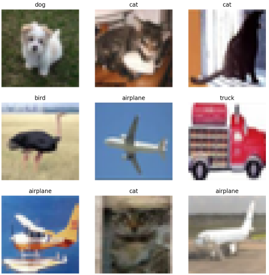
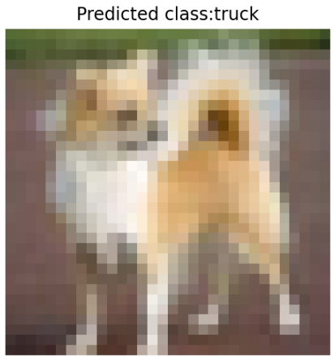

:::::::::::::::::::::::::::::::::::::: questions


- What is deep learning and how is it used for images?
- How can I train a simple model to classify images?


::::::::::::::::::::::::::::::::::::::::::::::::

::::::::::::::::::::::::::::::::::::: objectives

- Describe what deep learning is and how it can be used for image classification
- Train a simple convolutional neural network (CNN) to classify images


::::::::::::::::::::::::::::::::::::::::::::::::

## Deep learning for image classification

In this lesson, we will use **deep learning** to classify images.

Deep learning is a type of machine learning that uses structures called **neural networks**. These networks learn patterns directly from data by adjusting their internal settings during training.

For image data, deep learning models can learn to recognise shapes, colours, and textures. By combining these simple patterns, they can identify more complex features such as objects in an image.

We will focus on a specific type of model called a **Convolutional Neural Network (CNN)**. CNNs are designed for working with images and are widely used for tasks such as:

- recognising objects in photos
- identifying medical images
- classifying plants, animals, or other categories

In this lesson, we will train a CNN to classify images into different categories.


## What is image classification?

Image classification is one of the most common tasks in deep learning and involves assigning a label to an image.

For example, a model might look at an image and decide whether it shows a:

- car or bicycle
- cat or dog
- healthy or diseased plant

In this lesson, we will train a CNN to look at images and predict the correct category for each one.

## What we’ll do in this lesson

When working with programming problems, it’s useful to follow a series of steps or a workflow.
Some workflows are very simple, while others — like deep learning — involve a few more stages.

In this lesson, we’ll follow a simplified version of a deep learning workflow to train and use an image classification model.

### Step 1. Formulate / Outline the problem
First we must decide what we want our Deep Learning system to do. This lesson is about image classification and our aim is to put an image into one of a few categories. Specifically, in our case, we have 5 categories: ['airplane', 'bird', 'cat', 'dog', 'truck']

### Step 2. Identify inputs and outputs
Next identify what the inputs and outputs of the neural network. In our case, the data is images and the inputs could be the individual pixels of the images. We want one output prediction for each potential image.

### Step 3. Prepare data
Many datasets are not ready for immediate use in a deep learning and require some preparation. Neural networks can really only deal with numerical data, so any non-numerical data (e.g., images) have to be converted to numerical data.

For this lesson, we use an existing image dataset known as [CIFAR-10] (Canadian Institute for Advanced Research).

More information on preparing data is explored in [Episode 02 Introduction to Image Data](episodes/02-image-data) but for now we'll use a custom-defined function.

:::::::::::::::::::::::::::::::::::::: callout
Python reminder: functions and methods

In Python, we can use functions in a few different ways:

- Built-in functions available by default: `print()` or `len()`
- Functions from libraries we import: `tf.keras.layers.Conv2D()`
- Functions we write ourselves: `def`

:::::::::::::::::::::::::::::::::::::::::::::::

```python
# load the required packages
import tensorflow as tf # neural network 
import matplotlib.pyplot as plt # for plotting
import icwithcnn_functions as icfn # pre-defined helpers

### Step 3. Prepare data

# create a list of class names associated with each CIFAR-10 label
class_names = ['airplane', 'bird', 'cat', 'dog', 'truck']

# load the data
train_ds, val_ds, test_ds = icfn.prepare_datasets()
```
```output
Found 1000 files belonging to 5 classes.
Found 250 files belonging to 5 classes.
Found 250 files belonging to 5 classes.
```

Before starting any analysis, it’s important to check that your data looks the way you expect. Let's do that now:


#### Visualise a subset of the CIFAR-10 dataset

```python
# set up plot region, including width, height in inches
fig, axes = plt.subplots(figsize=(5,5))

# add images to plot
for images, labels in train_ds.take(1):
    for i in range(9):
        
        ax = plt.subplot(3, 3, i + 1)
        plt.imshow(images[i].numpy().astype("uint8"))
        plt.title(class_names[labels[i]])
        plt.axis("off")
    
# view plot
plt.show()
```

{alt='Subset of 9 CIFAR-10 images representing different object classes'}

::::::::::::::::::::::::::::::::::::: challenge 
## Inspect the dataset

Looking at the images above, and knowing you will be asking a computer to label them, what kinds of questions might you ask yourself about this dataset?

:::::::::::::::::::::::: solution

Answers will vary.

- Are the images clear and easy to interpret?
- Do the labels seem correct?
- Are the images all the same size?
- Do the images look similar within each category?
- Are there any unusual or unexpected images?

::::::::::::::::::::::::
::::::::::::::::::::::::::::::::::::: 


### Step 4. Choose a pre-trained model or build a new architecture from scratch

Often we can use an existing neural network instead of designing one from scratch because training a network can take a lot of time and computational resources. There are a number of well publicised networks which have been demonstrated to perform well at certain tasks. If you know of one which already does a similar task well, then it makes sense to use one of these.

If instead we decide to design our own network, then there a lot of decisions that have to be made. Model selection will require iterative experimentation and tweaking before acceptable results can be achieved.

In today's workshop we want to build an architecture for training purpurses. For now, similar to dataset preparation, we'll use a function already prepared, `create_model_intro()`, and save the details for [Episode 03 Build a Convolutional Neural Network](episodes/03-build-cnn.md).

```python
# create the introduction model using pre-defined function
model_intro = create_model_intro()
```

### Step 5. Choose a loss function and optimizer and compile model

To set up a model for training we need to compile it. This is when you set up the rules and strategies for how your network is going to learn.

The loss function tells the training algorithm how far away the predicted value was from the true value. 

The optimizer takes information from the loss function and applys some changes to the weights within the network to try to do better. It is through this process that “learning” (adjustment of the weights) is achieved.

We will learn how to choose a loss function and optimizer in more detail in [Episode 4 Compile and Train (Fit) a Convolutional Neural Network](episodes/04-fit-cnn.md).

For now, let's use options that have been proven to work well for image classfiication tasks.

```python
# compile the model
model_intro.compile(optimizer = "adam",
                    loss = "sparse_categorical_crossentropy",
                    metrics =["accuracy"])
```

### Step 6. Train the model

Now we can start training our neural network. Typically, we train the model by looping over the training data multiple times (called epochs) until performance improves or reaches a stable level.

```python
# fit the model
history_intro = model_intro.fit(x = train_ds)

```
Your output will begin to print similar to the output below:
```output
32/32 [==============================] - 0s 5ms/step - loss: 58.7726 - accuracy: 0.2690
```

#### What does this output mean?

This output is printed during the fit phase, i.e. training the model against known image labels:

- It took **32** steps to look at all of the training images once (called an `epoch`)
- `loss` shows how wrong the model’s predictions are (lower is better)
- `accuracy` shows how often the model is correct (higher is better)

::::::::::::::::::::::::::::::::::::: challenge 
## Is our model doing well?

Considering the `loss` and `accuracy` values from the training above:

- What do these values tell you about how well the model is performing?
- Is this what you would expect at this stage?
- Can you think of any ways that might help improve these values?

:::::::::::::::::::::::: solution

Answers may vary.

- The accuracy is quite low, so the model is not making many correct predictions yet  
- The loss is high, which suggests the model’s predictions are still far from the true labels  
- This is expected, since the model has only just started training and is very simple 
- Train for longer, use a more complex model, use more data

::::::::::::::::::::::::
::::::::::::::::::::::::::::::::::::: 

### Step 7. Perform a Prediction/Classification

After training the network we can use it to perform predictions. This is how you would use the network after you have fully trained it to a satisfactory performance. The predictions performed here on a special hold-out set is used in the next step to measure the performance of the network. Make sure the images you use to test are prepared the same way as the training images.

To make a single prediction we need to first extract a single image and its associated label from our test dataset and then use our model to predict the class of that image.

```python
# extract image and label for first image
for images, labels in test_ds.take(1):
    first_image = images[0]
    first_label = labels[0]
    
# use the model to predict class
prediction = model_intro.predict(tf.expand_dims(first_image, axis=0))
print("Predict:", prediction)

# extract class name with highest probability
predicted_label = tf.argmax(prediction[0])

print("Predicted class:", class_names[predicted_label])
print("True class:", class_names[first_label])
```
```output
1/1 [==============================] - 0s 11ms/step
Predict: [[3.0071956e-01 9.7787231e-20 6.9927925e-01 5.2796623e-32 1.1614857e-06]]
Predicted class: cat
True class: airplane
```

Congratulations, you just created your first image classification model! 
Notice that the model doesn’t just give one answer — it assigns a probability to each class. The class with the highest probability becomes the prediction.

Was the classification correct? Let's plot the first test image with its true label:

```python
# display image
plt.imshow(test_images[0])
plt.title('Predicted:' + class_names[predicted_label])
plt.axis("off")
plt.show() 
```

{alt='poor resolution image of an dog'}


::::::::::::::::::::::::::::::::::::: challenge 
## Interpreting the prediction

Compare the model prediction with the true class name.

- What does this tell you about the model’s performance?
- Why might the model have made this mistake?

:::::::::::::::::::::::: solution

Answers may vary.

- The model made an incorrect prediction  
- This shows the model has not yet learned enough to reliably distinguish between classes  
- This is expected, since the model is simple and has only trained for a short time  
- The image itself may also be unclear or difficult to classify  

::::::::::::::::::::::::
::::::::::::::::::::::::::::::::::::: 

Clearly, our model can be improved — we’ll look at ways to do this later.

For now, we’ve trained a model and used it to make a prediction. The next step is to see how well it performs on data it hasn’t seen before. 


### Step 8. Measure Performance

Once we trained the network we want to measure its performance on data that was **not** part of the training process, called a **test dataset**. Although there are many indicators of how well our network performs - called metrics - often the chosen metric(s) will depend on the type of task.

### Step 9. Tune Hyperparameters

When building image classification models in Python, especially using libraries like TensorFlow or Keras, the process involves not only designing a neural network but also choosing the best values for various parameters set by the person configuring the model - these are known as **hyperparameters**. Searching for the best options for your dataset can enhance model performance.

### Step 10. Share Model

Once we’re happy with how our model performs, we can save it and share it with others. This includes both the model structure and what it has learned, so others can use it, with or without retraining.

To share the model we must save it.

```python
# save  model
model_intro.save('models/model_intro.keras')
```

::::::::::::::::::::::::::::::::::::::::: callout
Create the output folder if needed

If the `models` folder does not already exist, Python will return an error when trying to save the model.

You can create it first with:

```python
import os
os.makedirs("models", exist_ok=True)
```
::::::::::::::::::::::::::::::::::::::::: 

We will return to each of these workflow steps throughout this lesson and discuss each component in more detail.

::::::::::::::::::::::::::::::::::::: keypoints
- Deep learning uses neural networks to learn patterns directly from data.
- Convolutional neural networks (CNNs) are commonly used for image classification.
- Training a model involves compiling it, fitting it to data, and making predictions.
- Model performance may be imperfect at first and can be improved with further training and tuning.
::::::::::::::::::::::::::::::::::::::::::::::::

<!-- Collect your link references at the bottom of your document -->
[CIFAR-10]: https://www.cs.toronto.edu/~kriz/cifar.html


