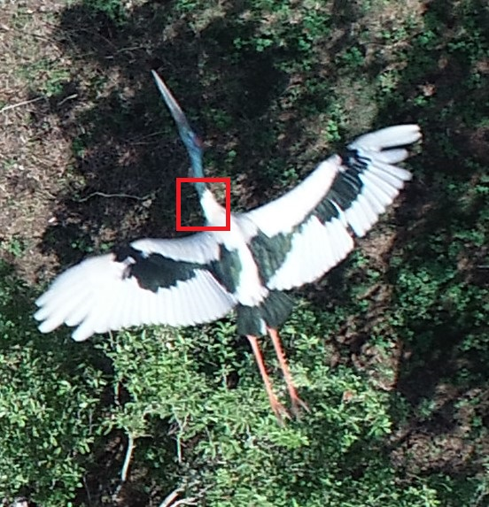

:::::::::::::::::::::::::::::::::::::: questions 
- How is image data organised for this workshop?
- How do I load image data into Python for deep learning?
- What are training, validation, and test datasets used for?
::::::::::::::::::::::::::::::::::::::::::::::::

::::::::::::::::::::::::::::::::::::: objectives
- Describe how the workshop image dataset is organised into folders.
- Load image data using `keras.utils.image_dataset_from_directory()`.
- Inspect images, labels, and class names in a dataset.
- Explain the roles of training, validation, and test datasets.
::::::::::::::::::::::::::::::::::::::::::::::::

In Episode 1, we used prepared data to train a simple image classification model. 

In this episode, we’ll take a closer look at how image datasets are organised and loaded into Python.

Depending on your situation, you will either use a pre-existing dataset, prepare your own data for training, or some combination of the two.

In this workshop, we’ll use a prepared dataset so we can focus on the deep learning workflow but in real-world projects, you may need to collect, label, resize, and split your own images.

Before jumping into more specific tasks, it's important to understand that images on a computer are stored as numbers. For colour images, these numbers represent red, green, and blue (RGB) values.


### Images are data

Images on a computer are stored as rectangular arrays of hundreds, thousands, or millions of discrete "picture elements," otherwise known as pixels. Each pixel can be thought of as a single square point of coloured light.

For example, consider this image of a Jabiru, with a square area designated by a red box:

{alt='Jabiru image that is 552 pixels wide and 573 pixels high. A red square around the neck region indicates the area to zoom in on.'}

Now, if we zoomed in close enough to the red box, the individual pixels would stand out:

{alt='zoomed in area of Jabiru where the individual pixels stand out'}

Note each square in the enlarged image area (i.e. each pixel) is all one colour, but each pixel can be a different colour from its neighbours. Viewed from a distance, these pixels seem to blend together to form the image.


### Image data in this workshop

In this workshop, we use a small subset of the CIFAR-10 dataset containing images from five classes:

- airplane
- bird
- cat
- dog
- truck

For learning purposes, and to make computation faster, a much smaller, random selection of images from the full dataset was used.

Most importantly, the data was split it into three distinct subsets: train, validation and test.

::::::::::::::::::::::::::::::::::::::::: callout
We use different parts of the dataset for different purposes:

- **Training set**: used to teach the model
- **Validation set**: used to check how the model is doing while we develop it
- **Test set**: used at the end to evaluate performance on unseen data

Keeping these sets separate helps us judge how well the model is likely to perform on new images.
:::::::::::::::::::::::::::::::::::::::::

### Dataset organisation matters

The way your data is organised matters - it affects whether and how easily it can be used for image classification tasks. 

For example, to use the `tf.keras.utils.image_dataset_from_directory()` function packaged with Tensorflow, we use folder names to indicate which split the data belongs to and what class name to use as the label. This saves us from having to label each image individually.


#### How our images are organised

Our images are stored in folders; each class has its own folder and the data is split into training, validation, and test sets. For example:

```
cifar10_images_small/
|
├── train/
│   ├── airplane/
│   ├── bird/
│   ├── cat/
│   ├── dog/
│   └── truck/
├── val/
│   ├── airplane/
│   ├── bird/
│   ├── cat/
│   ├── dog/
│   └── truck/
└── test/
    ├── airplane/
    ├── bird/
    ├── cat/
    ├── dog/
    └── truck/
```

:::::::::::::::::::::::::::::::::::: challenge
## Understanding the dataset structure

Look at the folder structure for the dataset.

- How many classes are included?
- How does Keras know which label belongs to each image?

:::::::::::::::::::::::: solution
- There are five classes.
- Keras uses the folder names as the class labels.
::::::::::::::::::::::::
::::::::::::::::::::::::::::::::::::::::::::::::

::::::::::::::::::::::::::::::::::::: challenge
## Understanding the dataset contents

The dataset contains 1500 images across 5 classes and randomly split into training, validation, and test sets.

- How many images would you expect in each split?
- How many images per class would you expect in the training set if it was balanced?

:::::::::::::::::::::::: solution
Answers may vary. For a 60:20:20 split you might expect: 

- Training: 900 images  
- Validation: 300 images  
- Test: 300 images  

If training set had 900 images, you would expect 180 images per class in a well-balanced set.
::::::::::::::::::::::::
::::::::::::::::::::::::::::::::::::::::::::::::

### Load the datasets

In the last episode, we used the `icfn.prepare_datasets()` helper function in `icwithcnn_functions.py` to prepare our datasets: 

Let us now see how to write the code inside that helper function. This is the same type of dataset we used in Episode 1 — here we’re just seeing how it is created.  

We'll start by preparing the training dataset with the understanding that the The other two splits sets will be prepared similarly.

Using the `tf.keras.utils.image_dataset_from_directory()` function, we specify:

- the file path to the top level folder for the data
- the size of the images in pixels (`image_size`)
- how many images to work with at a time (`batch_size`)
- whether we want to `shuffle` the images or load them sequentially
- whether we want everyone in the class to have the same order of images (`seed`)

```python
import tensorflow as tf

# create training dataeset from folder of cifar images
train_ds = tf.keras.utils.image_dataset_from_directory(
    "../data/cifar10_images_small/train",
    image_size = (32, 32),
    batch_size = 32,
    shuffle = True,
    seed = 32
)

print(train_ds)
```
```output
Found 1000 files belonging to 5 classes.
Train_ds: <_PrefetchDataset element_spec=(TensorSpec(shape=(None, 32, 32, 3), dtype=tf.float32, name=None), TensorSpec(shape=(None,), dtype=tf.int32, name=None))>
```

The object returned by this function might look unfamiliar. That's because, instead of loading all the images at once, it loads them in batches as needed.

How do we inspect what was loaded?

We can extract class names directly from the dataset:

```python
# extract the list of class names
class_names = train_ds.class_names
print(class_names)
```
```output
['airplane', 'bird', 'cat', 'dog', 'truck']
```

We can look at a single batch to find information about the training images and labels.

```python
# inspect one batch of images and labels
for images, labels in train_ds.take(1):
    print("Train images batch shape:", images.shape)
    print("Train labels batch shape:", labels.shape)
```
```output
Train images batch shape: (32, 32, 32, 3)
Train labels batch shape: (32,)
```

These numbers represent (batch size, image height, image width, colour channels):

- There are 32 images in this batch
- Each image is 32 pixels high and 32 pixels wide
- Each image has 3 colour channels (RGB)
- There is one label for each image in the batch

Finally, we can look at the image data types and pixel values:
```python
 # inspect image data types and pixel values
for images, labels in train_ds.take(1):
    print("Data type: ", images.dtype)
    print("Pixel value range:", images[0].numpy().min(), images[0].numpy().max())
```
```output
Data type:  <dtype: 'float32'>
Pixel value range: 15.0 253.0
```
::::::::::::::::::::::::::::::::::::::::: callout
A note about pixel values

The images are loaded with pixel values between 0 and 255.

In most cases, we rescale these values to make training more efficient. 

In this workshop, we will do this inside the model before training.
:::::::::::::::::::::::::::::::::::::::::

::::::::::::::::::::::::::::::::::::: challenge
## On your own - prepare the Test dataset

Using what we've learned in this lesson with the **training** dataset, perform the same steps for the **test** dataset.

1) Write the code to load the test data 

- Hint 1: Turn `shuffle` off
- Hint 2: Remove the `seed`

2) Inspect the `test` dataset and find out:

- dimensions of the images and labels
- class names
- total number of images
- number of images in each of the five classes (optional)

:::::::::::::::::::::::: solution
```python
# create test dataset from folder of cifar images
test_ds = tf.keras.utils.image_dataset_from_directory(
    "../data/cifar10_images_small/test",
    image_size = (32, 32),
    batch_size = 32,
    shuffle = False,
)

# class names
print("Test class names: ", test_ds.class_names)

# dimensions of the images and labels
for images, labels in test_ds.take(1):
    print("Test images batch shape:", images.shape)
    print("Test labels batch shape:", labels.shape)

# total number of images
# 250 as noted previously

# images in each class
# ????
```
::::::::::::::::::::::::
::::::::::::::::::::::::::::::::::::::::::::::::

Now we understand how to prepare our data works we are ready to learn how to build a CNN.


::::::::::::::::::::::::::::::::::::: keypoints 
- Images consist of pixels arranged in a particular order.
- Image datasets can be organised into folders where each folder represents a class.
- `image_dataset_from_directory()` lets us load images without writing custom data preparation code.
- Images are loaded in batches and represented as numerical arrays.
- Training, validation, and test sets are used to build and evaluate models.
::::::::::::::::::::::::::::::::::::::::::::::::

<!-- Collect your link references at the bottom of your document -->
[CIFAR-10]: https://www.cs.toronto.edu/~kriz/cifar.html
[keras.utils.image_dataset_from_directory()]:  https://keras.io/api/data_loading/image/

