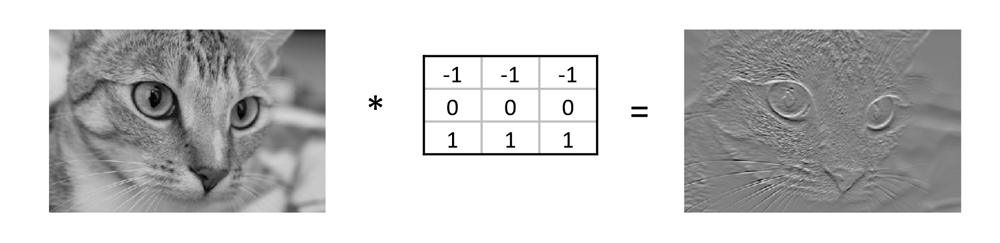

:::::::::::::::::::::::::::::::::::::: questions

- How is a convolutional neural network (CNN) different from an ANN?
- What are the different layers used to build a CNN?
- What is an activation function?

::::::::::::::::::::::::::::::::::::::::::::::::

::::::::::::::::::::::::::::::::::::: objectives

- Understand how a convolutional neural network diffs from a basic neural network
- Explain the terms: kernel, filter, back prop
- Define the terms: weights, bias, activation function

::::::::::::::::::::::::::::::::::::::::::::::::

## Neural Networks
A neural network is an artificial intelligence technique loosely based on the way neurons in the brain work. A neural network consists of connected computational units called neurons. Each neuron ...

- has one or more inputs, e.g. input data expressed as floating point numbers
- most of the time, each neuron conducts 3 main operations:
    - take the weighted sum of the inputs
    - add an extra constant weight (i.e. a bias term) to this weighted sum
    - apply a non-linear function to the output so far (using a predefined activation function)
- return one output value, again a floating point number

{alt=''}

Multiple neurons can be joined together by connecting the output of one to the input of another. These connections are associated with weights that determine the 'strength' of the connection, the weights are adjusted during training. In this way, the combination of neurons and connections describe a computational graph, an example can be seen in the image below. In most neural networks neurons are aggregated into layers. Signals travel from the input layer to the output layer, possibly through one or more intermediate layers called hidden layers. The image below shows an example of a neural network with three layers, each circle is a neuron, each line is an edge and the arrows indicate the direction data moves in.

![The image above is by Glosser.ca, [CC BY-SA 3.0], via Wikimedia Commons, [original source]](fig/03_neural_net.png){alt=''}

Neural networks aren't a new technique, they have been around since the late 1940s. But until around 2010 neural networks tended to be quite small, consisting of only 10s or perhaps 100s of neurons. This limited them to only solving quite basic problems. Around 2010 improvements in computing power and the algorithms for training the networks made much larger and more powerful networks practical. These are known as deep neural networks or Deep Learning.

## Convolutional layers

A convolution matrix, or kernel, is a matrix transformation that we 'slide' over the image to calculate features at each position of the image. For each pixel, we calculate the matrix product between the kernel and the pixel with its surroundings. A kernel is typically small, between 3x3 and 7x7 pixels. We can for example think of the 3x3 kernel:

```output
[[-1, -1, -1],
 [0, 0, 0]
 [1, 1, 1]]
```
This kernel will give a high value to a pixel if it is on a horizontal border between dark and light areas. Note that for RGB images, the kernel should also have a depth of 3.

In the following image, we see the effect of such a kernel on the values of a single-channel image. The red cell in the output matrix is the result of multiplying and summing the values of the red square in the input, and the kernel. Applying this kernel to a real image shows that it indeed detects horizontal edges.

{alt=''}

{alt=''}

In our convolutional layer our hidden units are a number of convolutional matrices (or kernels), where the values of the matrices are the weights that we learn in the training process. The output of a convolutional layer is an 'image' for each of the kernels, that gives the output of the kernel applied to each pixel.

:::::::::::::::::::::::::::::::::::::: callout
Playing with convolutions

Convolutions applied to images can be hard to grasp at first. Fortunately there are resources out there that enable users to interactively play around with images and convolutions:

[Image kernels explained] shows how different convolutions can achieve certain effects on an image, like sharpening and blurring.
The [convolutional neural network cheat sheet] shows animated examples of the different components of convolutional neural nets
:::::::::::::::::::::::::::::::::::::::::::::::

::::::::::::::::::::::::::::::::::::: challenge

## Border pixels
What, do you think, happens to the border pixels when applying a convolution?

:::::::::::::::::::::::: solution

There are different ways of dealing with border pixels. You can ignore them, which means that your output image is slightly smaller then your input. It is also possible to 'pad' the borders, e.g. with the same value or with zeros, so that the convolution can also be applied to the border pixels. In that case, the output image will have the same size as the input image.
:::::::::::::::::::::::::::::::::
::::::::::::::::::::::::::::::::::::::::::::::::

::::::::::::::::::::::::::::::::::::: challenge

## Number of model parameters
Suppose we apply a convolutional layer with 100 kernels of size 3 * 3 * 3 (the last dimension applies to the rgb channels) to our images of 32 * 32 * 3 pixels. How many parameters do we have? Assume, for simplicity, that the kernels do not use bias terms. Compare this to the answer of the previous exercise

:::::::::::::::::::::::: solution

We have 100 matrices with 3 * 3 * 3 = 27 values each so that gives 27 * 100 = 2700 weights. This is a magnitude of 100 less than the fully connected layer with 100 units! Nevertheless, as we will see, convolutional networks work very well for image data. This illustrates the expressiveness of convolutional layers.
:::::::::::::::::::::::::::::::::
::::::::::::::::::::::::::::::::::::::::::::::::

So let us look at a network with a few convolutional layers. We need to finish with a Dense layer to connect the output cells of the convolutional layer to the outputs for our classes.

```python
inputs = keras.Input(shape=train_images.shape[1:])
x = keras.layers.Conv2D(50, (3, 3), activation='relu')(inputs)
x = keras.layers.Conv2D(50, (3, 3), activation='relu')(x)
x = keras.layers.Flatten()(x)
outputs = keras.layers.Dense(10)(x)

model = keras.Model(inputs=inputs, outputs=outputs, name="cifar_model_small")

model.summary()
```

::::::::::::::::::::::::::::::::::::: challenge

## Convolutional Neural Network
Inspect the network above:

- What do you think is the function of the Flatten layer?
- Which layer has the most parameters? Do you find this intuitive?
- (optional) Pick a model from https://paperswithcode.com/sota/image-classification-on-cifar-10 . Try to understand how it works.

:::::::::::::::::::::::: solution

- The Flatten layer converts the 28x28x50 output of the convolutional layer into a single one-dimensional vector, that can be used as input for a dense layer.
- The last dense layer has the most parameters. This layer connects every single output 'pixel' from the convolutional layer to the 10 output classes. That results in a large number of connections, so a large number of parameters. This undermines a bit the expressiveness of the convolutional layers, that have much fewer parameters.

:::::::::::::::::::::::::::::::::
::::::::::::::::::::::::::::::::::::::::::::::::

Often in convolutional neural networks, the convolutional layers are intertwined with **Pooling layers**. As opposed to the convolutional layer, the pooling layer actually alters the dimensions of the image and reduces it by a scaling factor. It is basically decreasing the resolution of your picture. The rationale behind this is that higher layers of the network should focus on higher-level features of the image. By introducing a pooling layer, the subsequent convolutional layer has a broader 'view' on the original image.

## 4. Build an architecture from scratch

### Keras for neural networks

For this lesson we will be using Keras to define and train our neural network models. Keras is a machine learning framework with ease of use as one of its main features. It is part of the tensorflow python package and can be imported using from tensorflow import keras.

Keras includes functions, classes and definitions to define deep learning models, cost functions and optimizers (optimizers are used to train a model).

```python
from tensorflow import keras
```

### Build a neural network from scratch
Now we will build a neural network from scratch, and although this sounds like a daunting task, with Keras it is actually surprisingly straightforward.

With Keras you compose a neural network by creating layers and linking them together. We used several different types of layers in our model:

- **Conv2D**: 2D convolution layer (e.g. spatial convolution over images) defined by the tf.keras.layers.Conv2D class
- **MaxPooling2D**: Max pooling operation for 2D spatial data defined by the tf.keras.layers.MaxPool2D class
- **Flatten**: Flattens the input and is defined by the tf.keras.layers.Flatten class
- **Dense**: Fully connected or Dense layer defined by the keras.layers.Dense class

A **Dense** layer has a number of neurons, which is a parameter you can choose when you create the layer. When connecting the layer to its input and output layers every neuron in the dense layer gets an edge (i.e. connection) to all of the input neurons and all of the output neurons.

The input in Keras also gets special treatment, Keras automatically calculates the number of inputs and outputs a layer needs and therefore how many edges need to be created. This means we need to let Keras now how big our input is going to be. We do this by instantiating a keras. Input class and tell it how big our input is.

```python
# define the inputs
inputs = keras.Input(shape=train_images.shape[1:])
```

We store a reference to this input class in a variable so we can pass it to the creation of our hidden layer. Creating the hidden layer can then be done as follows:

```python
# first layer
x = keras.layers.Conv2D(50, (3, 3), activation='relu')(inputs)
```

The instantiation here has 3 parameters and a seemingly strange combination of parentheses, so let us take a closer look. 
- The first parameter 50 is the number of neurons we want in this layer, this is one of the hyperparameters of our system and needs to be chosen carefully. We will get back to this in the section on hyperparameter tuning.
- The second parameter is the kernel size
- The third parameter is the activation function to use, here we choose **relu** which is 0 for inputs that are 0 and below and the identity function (returning the same value) for inputs above 0. This is a commonly used activation function in deep neural networks that is proven to work well. 
- Next we see an extra set of parenthenses with inputs in them, this means that after creating an instance of the Conv2D layer we call it as if it was a function. This tells the Conv2D layer to connect the layer passed as a parameter, in this case the inputs. 
- Finally we store a reference so we can pass it to the next layer.

Now we can add additional layers. 

TODO specify these in words and then let them put it all together?


```python
# add layers
inputs = keras.Input(shape=train_images.shape[1:])
x = keras.layers.Conv2D(50, (3, 3), activation='relu')(inputs)
x = keras.layers.MaxPooling2D((2, 2))(x)
x = keras.layers.Conv2D(50, (3, 3), activation='relu')(x)
x = keras.layers.MaxPooling2D((2, 2))(x)
x = keras.layers.Flatten()(x)
x = keras.layers.Dense(50, activation='relu')(x)
```

Finally we create a final layer that will be our output layer. We use a Dense layer with a single argument reflecting the dimensionality of the output space.

```python
# define outputs
outputs = keras.layers.Dense(10)(x)
```

Putting it all together:
```python
# create the model
model = keras.Model(inputs=inputs, outputs=outputs, name="cifar_model_small")

model.summary()
```

::::::::::::::::::::::::::::::::::::: challenge

## Create the neural network
Inspect the network above:

With the code snippets above, we defined a Keras model with 1 hidden layer with 10 neurons and an output layer with 3 neurons. TODO change these

- How many parameters does the resulting model have?
- What happens to the number of parameters if we increase or decrease the number of neurons in the hidden layer?

:::::::::::::::::::::::: solution

```python
# define the inputs, layers, and outputs of a cnn model
inputs = keras.Input(shape=train_images.shape[1:])
x = keras.layers.Conv2D(50, (3, 3), activation='relu')(inputs)
x = keras.layers.MaxPooling2D((2, 2))(x)
x = keras.layers.Conv2D(50, (3, 3), activation='relu')(x)
x = keras.layers.MaxPooling2D((2, 2))(x)
x = keras.layers.Flatten()(x)
x = keras.layers.Dense(50, activation='relu')(x)
outputs = keras.layers.Dense(10)(x)

model = keras.Model(inputs=inputs, outputs=outputs, name="cifar_model_small")
model.summary()
```

```output

Model: "cifar_model"
_________________________________________________________________
 Layer (type)                Output Shape              Param #
=================================================================
 input_6 (InputLayer)        [(None, 32, 32, 3)]       0

 conv2d_13 (Conv2D)          (None, 30, 30, 50)        1400

 max_pooling2d_8 (MaxPooling  (None, 15, 15, 50)       0
 2D)

 conv2d_14 (Conv2D)          (None, 13, 13, 50)        22550

 max_pooling2d_9 (MaxPooling  (None, 6, 6, 50)         0
 2D)

 conv2d_15 (Conv2D)          (None, 4, 4, 50)          22550

 flatten_5 (Flatten)         (None, 800)               0

 dense_9 (Dense)             (None, 50)                40050

 dense_10 (Dense)            (None, 10)                510

=================================================================
Total params: 87,060
Trainable params: 87,060
Non-trainable params: 0
_________________________________________________________________
```
TODO modify this to reflect out model
The model has 83 trainable parameters. If you increase the number of neurons in the hidden layer the number of trainable parameters in both the hidden and output layer increases or decreases accordingly of neurons. The name in quotes within the string Model: "model_1" may be different in your view; this detail is not important.

:::::::::::::::::::::::::::::::::
::::::::::::::::::::::::::::::::::::::::::::::::

## How to choose an architecture?
Even for this small neural network, we had to make a choice on the number of hidden neurons. Other choices to be made are the number of layers and type of layers (as we will see later). You might wonder how you should make these architectural choices. Unfortunately, there are no clear rules to follow here, and it often boils down to a lot of trial and error. However, it is recommended to look what others have done with similar datasets and problems. Another best practice is to start with a relatively simple architecture. Once running start to add layers and tweak the network to see if performance increases. 

## Discuss

::::::::::::::::::::::::::::::::::::: challenge 

## Challenge Network depth

What, do you think, will be the effect of adding a convolutional layer to your model? Will this model have more or fewer parameters? Try it out. Create a model that has an additional Conv2d layer with 50 filters after the last MaxPooling2D layer. Train it for 20 epochs and plot the results.

**HINT**: The model definition that we used previously needs to be adjusted as follows:

```python
inputs = keras.Input(shape=train_images.shape[1:])
x = keras.layers.Conv2D(50, (3, 3), activation='relu')(inputs)
x = keras.layers.MaxPooling2D((2, 2))(x)
x = keras.layers.Conv2D(50, (3, 3), activation='relu')(x)
x = keras.layers.MaxPooling2D((2, 2))(x)
# Add your extra layer here
x = keras.layers.Flatten()(x)
x = keras.layers.Dense(50, activation='relu')(x)
outputs = keras.layers.Dense(10)(x)
```

:::::::::::::::::::::::: solution 

## Output
 
```output
inputs = keras.Input(shape=train_images.shape[1:])
x = keras.layers.Conv2D(50, (3, 3), activation='relu')(inputs)
x = keras.layers.MaxPooling2D((2, 2))(x)
x = keras.layers.Conv2D(50, (3, 3), activation='relu')(x)
x = keras.layers.MaxPooling2D((2, 2))(x)
x = keras.layers.Conv2D(50, (3, 3), activation='relu')(x)
x = keras.layers.Flatten()(x)
x = keras.layers.Dense(50, activation='relu')(x)
outputs = keras.layers.Dense(10)(x)

model = keras.Model(inputs=inputs, outputs=outputs, name="cifar_model")
```

:::::::::::::::::::::::::::::::::
::::::::::::::::::::::::::::::::::::::::::::::::

With the model defined above, we can inspect the number of parameters:

```python
model.summary()
```

```output
Model: "cifar_model"
_________________________________________________________________
 Layer (type)                Output Shape              Param #
=================================================================
 input_7 (InputLayer)        [(None, 32, 32, 3)]       0

 conv2d_16 (Conv2D)          (None, 30, 30, 50)        1400

 max_pooling2d_10 (MaxPoolin  (None, 15, 15, 50)       0
 g2D)

 conv2d_17 (Conv2D)          (None, 13, 13, 50)        22550

 max_pooling2d_11 (MaxPoolin  (None, 6, 6, 50)         0
 g2D)

 conv2d_18 (Conv2D)          (None, 4, 4, 50)          22550

 flatten_6 (Flatten)         (None, 800)               0

 dense_11 (Dense)            (None, 50)                40050

 dense_12 (Dense)            (None, 10)                510

=================================================================
Total params: 87,060
Trainable params: 87,060
Non-trainable params: 0
_________________________________________________________________
```

The number of parameters has decreased by adding this layer. We can see that the conv layer decreases the resolution from 6x6 to 4x4, as a result, the input of the Dense layer is smaller than in the previous network.

TODO thinking we have two models, cifar small and this one, then section can compare the two?

:::::::::::::::::::::::::::::::::::::::::::::::::::::::::::::::::::: instructor

Inline instructor notes can help inform instructors of timing challenges
associated with the lessons. They appear in the "Instructor View"

::::::::::::::::::::::::::::::::::::::::::::::::::::::::::::::::::::::::::::::::


::::::::::::::::::::::::::::::::::::: keypoints 

- Use `.md` files for episodes when you want static content
- Use `.Rmd` files for episodes when you need to generate output
- Run `sandpaper::check_lesson()` to identify any issues with your lesson
- Run `sandpaper::build_lesson()` to preview your lesson locally

::::::::::::::::::::::::::::::::::::::::::::::::

<!-- Collect your link references at the bottom of your document -->
[CC BY-SA 3.0]: https://creativecommons.org/licenses/by-sa/3.0
[original source]: https://commons.wikimedia.org/wiki/File:Colored_neural_network.svg
[Image kernels explained]: https://setosa.io/ev/image-kernels/
[convolutional neural network cheat sheet]: https://stanford.edu/~shervine/teaching/cs-230/cheatsheet-convolutional-neural-networks
