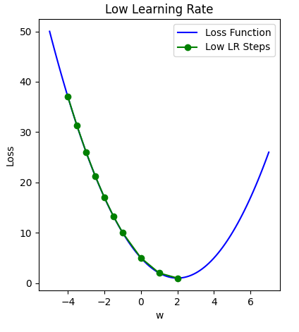
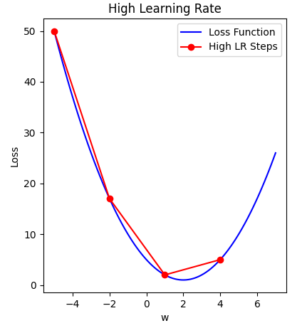
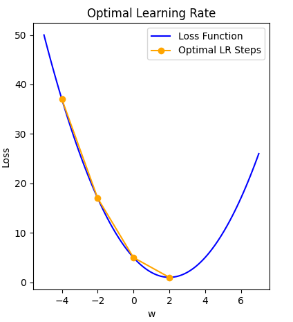
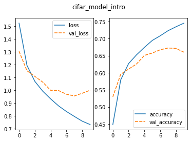

:::::::::::::::::::::::::::::::::::::: questions

- How do you compile a convolutional neural network (CNN)?
- What is a loss function and an optimizer?
- How do you train (fit) a CNN?
- How can we check how well our model is learning during training?

::::::::::::::::::::::::::::::::::::::::::::::::

::::::::::::::::::::::::::::::::::::: objectives

- Compile a CNN by choosing an optimizer, loss function, and metric.
- Train a CNN using `Model.fit()`.
- Explain what loss and accuracy represent during training.
- Recognise signs of overfitting in training results.

::::::::::::::::::::::::::::::::::::::::::::::::

In the previous episode, we built the structure of our convolutional neural network. Now it’s time to make it learn. 

In this episode, we’ll compile the model, train it on our data, and look at how its performance changes during training.

### Step 5. Choose a loss function and optimizer and compile model

Before we can train the model, we need to **compile** it.

Compiling sets up how the model will learn by specifying:

- the `optimizer` (how the model updates its weights)
- the `loss` function (how wrong the predictions are)
- the `metrics` (how we measure performance)

We do this using the `Model.compile()` function:


#### Optimizer

An **optimizer** controls how the model updates its weights during training.

Here we’ll use one of the most common choices, `'adam'`, which works well for many image classification tasks.

Optimizers have settings such as the **learning rate**, which controls how quickly the model learns. We’ll use the default values here.

::::::::::::::::::::::::::::::::::::::::: spoiler 

## WANT TO KNOW MORE: Learning Rate

ChatGPT

**Learning rate** is a hyperparameter that determines the step size at which the model's parameters are updated during training. A higher learning rate allows for more substantial parameter updates, which can lead to faster convergence, but it may risk overshooting the optimal solution. On the other hand, a lower learning rate leads to smaller updates, providing more cautious convergence, but it may take longer to reach the optimal solution. Finding an appropriate learning rate is crucial for effectively training machine learning models.

The figure below illustrates how a small learning rate will not traverse toward the minima of the gradient descent algorithm in a timely manner, i.e. number of epochs.

{alt='Plot of loss over weight value illustrating how a small learning rate takes a long time to reach the optimal solution.'}

On the other hand, specifying a learning rate that is *too high* will result in a loss value that never approaches the minima. That is, 'bouncing between the sides', thus never reaching a minima to cease learning.

{alt='Plot of loss over weight value illustrating how a large learning rate never approaches the optimal solution because it bounces between the sides.'}

Finally, a modest learning rate will ensure that the product of multiplying the scalar gradient value and the learning rate does not result in too small steps, nor a chaotic bounce between sides of the gradient where steepness is greatest.

{alt='Plot of loss over weight value illustrating how a good learning rate gets to optimal solution gradually.'}

::::::::::::::::::::::::::::::::::::::::::::::

#### Loss function

The **loss function** measures how wrong the model’s predictions are.

During training, the model tries to reduce this value — lower loss means better predictions.

For our classification problem, we’ll use `'sparse_categorical_crossentropy'`, which works when each image belongs to one class.

#### Metrics

A **metric** is used to measure how well the model is performing.

For classification problems, we commonly use `'accuracy'`, which tells us how often the model’s predictions are correct.

Unlike the loss function, metrics are used to monitor performance — they don’t directly affect how the model learns.

::::::::::::::::::::::::::::::::::::: challenge 

## Compile the model

We’ve chosen the optimizer, loss function, and metric.

Now put them together to compile the model.

```python
# compile the model
_____.compile(optimizer = _____,
			        loss = _____, 
			        metrics = _____)
```

:::::::::::::::::::::::: solution 

```output
# compile the model
model_intro.compile(optimizer = 'adam',
                    loss = 'sparse_categorical_crossentropy',
                    metrics = ['accuracy'])
```

:::::::::::::::::::::::::::::::::
::::::::::::::::::::::::::::::::::::::::::::::::

### Step 6. Train (Fit) model

Now that our model is compiled, we are ready to train it.

Training is where the model learns from the data by making predictions, comparing them to the true labels, and gradually improving over time.

We do this using the `Model.fit()` function. It returns a history object, which stores the loss and accuracy values from training, and can be specifyied with:

- the training data, `x`
- how many times to loop through the data, `epochs`
- optionally, `validation_data` to monitor performance during training

```python
history_intro = model_intro.fit(x = train_ds,
                                epochs = 10,
                                validation_data = val_ds
)
```

During training, the model:

- makes predictions
- compares them to the true labels
- updates its weights to improve

The `Model.fit()` function 

#### Monitor Training Progress (aka Model Evaluation during Training)

After training, we can check how well the model learned by looking at the loss and accuracy over time.

We stored this information in the `history_intro` object returned by `Model.fit()`. We can convert this to a data frame and plot it:


```python
import seaborn as sns
import pandas as pd

# convert the model history to a dataframe for plotting 
history_intro_df = pd.DataFrame.from_dict(history_intro.history)

# plot the loss and accuracy 
fig, axes = plt.subplots(1, 2)
fig.suptitle('cifar_model_intro')

sns.lineplot(ax=axes[0], data=history_intro_df[['loss', 'val_loss']])
sns.lineplot(ax=axes[1], data=history_intro_df[['accuracy', 'val_accuracy']])
```

{alt='two panel figure; the figure on the left illustrates the training loss starting at 1.5 and decreasing to 0.7 and the validation loss decreasing from 1.3 to 1.0 before leveling out; the figure on the right illustrates the training accuracy increasing from 0.45 to 0.75 and the validation accuracy increasing from 0.53 to 0.65 before leveling off'}

The two plots show how the model changed during training:

- **Loss** (left): how wrong the model is — lower is better  
- **Accuracy** (right): how often the model is correct — higher is better  

Each plot shows:

- the training data (solid line)  
- the validation data (dashed line)  

We expect:

- loss to decrease over time  
- accuracy to increase over time

::::::::::::::::::::::::::::::::::::: challenge 

## Inspect the training curves

Look at the plots and answer:

1. What happens to the loss during training?  
2. What happens to the accuracy?  
3. Do the training and validation lines behave similarly?  
4. Based on this, do you think the model will perform well on new data?

:::::::::::::::::::::::: solution 

- Loss decreases over time, which shows the model is improving  
- Accuracy increases over time  
- The validation lines improve at first, but then level off  
- This suggests the model is starting to overfit and may not perform as well on new data 

:::::::::::::::::::::::::::::::::
::::::::::::::::::::::::::::::::::::::::::::::::

### What is overfitting?

In the plots, we can see that:

- training performance keeps improving  
- validation performance stops improving  

This is called **overfitting**. Overfitting happens when the model learns the training data too well, including details that don’t generalize to new data. 
As a result, the model performs well on the training data but less well on new images. Signs of overfitting include:

- training loss keeps decreasing  
- validation loss stops improving or increases  
- training accuracy is much higher than validation accuracy  


### How can we address overfitting?

There are several ways to reduce overfitting. Common approaches include:

- collecting more training data  
- simplifying the model (fewer layers or parameters)  
- adding techniques that help the model generalise better  

These approaches aim to help the model focus on general patterns rather than memorising the training data. In a later episode, we’ll look at one of these techniques: **dropout**.


## What did we do?

In this episode, we took our CNN and made it learn from data.

We:

- compiled the model by choosing an optimizer, loss function, and metric  
- trained the model using `Model.fit()`  
- monitored how its performance changed during training  

By plotting the loss and accuracy, we could see how well the model was learning and identify when it started to overfit.

We now have a trained model, and understand how to check whether it is learning effectively. In the next part of the workflow, we’ll use this model to make predictions and evaluate how well it performs on new data.

::::::::::::::::::::::::::::::::::::: keypoints 

- Use `Model.compile()` to set how a model will learn.
- The optimizer controls how the model updates its weights.
- The loss function measures how wrong the model’s predictions are.
- Metrics such as accuracy tell us how well the model is performing.
- Use `Model.fit()` to train the model on data.
- Training and validation loss and accuracy help us monitor learning.
- Overfitting occurs when a model performs well on training data but less well on new data.

::::::::::::::::::::::::::::::::::::::::::::::::

<!-- Collect your link references at the bottom of your document -->
[Model training APIs]: https://keras.io/api/models/model_training_apis/
[Keras loss documentation]: https://keras.io/api/losses/
[Keras optimizer documentation]: https://keras.io/api/optimizers/
[Keras metrics]: https://keras.io/api/metrics/
[Keras fit method]: https://keras.io/api/models/model_training_apis/
[seaborn]: https://seaborn.pydata.org/
[Google Developers Machine Learning Crash Course]: https://developers.google.com/machine-learning/crash-course/reducing-loss/learning-rate
[Creative Commons 4.0 Attribution Licence]: https://creativecommons.org/licenses/by/4.0/

