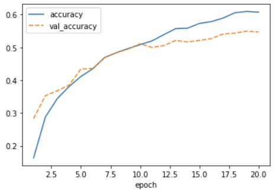
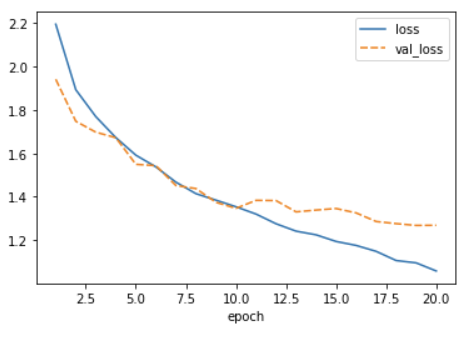
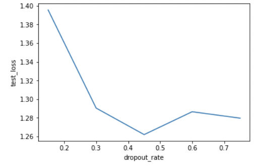

:::::::::::::::::::::::::::::::::::::: questions 

- How do you compile a CNN?
- What is a loss function?
- What is an optimizer?
- How do you train a CNN?
- What are hyperparameters?

::::::::::::::::::::::::::::::::::::::::::::::::

::::::::::::::::::::::::::::::::::::: objectives

- Explain how you compile and train a CNN
- Understand what an optimizer is and be familiar with advantages and disadvantages of different optimizers
- Know how to select a loss function for you model
- Define the terms: learning rate, batch size, epoch TODO

::::::::::::::::::::::::::::::::::::::::::::::::

### 5. Choose a loss function and optimizer

We have designed a convolutional neural network that in theory we should be able to train to classify images. 

We now need to select an appropriate optimizer and loss function that we will use during training. 

Recall how we compiled our model in the introduction:
```python
model.compile(optimizer='adam', 
              loss=keras.losses.SparseCategoricalCrossentropy(from_logits=True),               
              metrics=['accuracy'])
```              

#### Loss function

The **loss function** tells the training algorithm how wrong, or how 'far away' from the true value the predicted value is. The purpose of loss functions is to compute the quantity that a model should seek to minimize during training. Which class of loss functions you choose depends on your task. 

For classification purposes, there are a number of probabilistic losses to choose from. We chose **SparseCategoricalCrossentropy** because we want to compute the crossentropy loss between our class labels represented by integers (i.e., not one-hot encoded) and the model predictions.

- This loss function is appropriate to use when the data has two or more label classes.
- defined by the tf.keras.losses.SparseCategoricalCrossentropy class

For regression tasks, we might want to stipulate that the predicted numerical values are as close as possible to the true values. This is commonly done by using the **mean squared error** (mse) or the **mean absolute error** (mae) loss funtions, both of which should work. Often, mse is preferred over mae because it “punishes” large prediction errors more severely.

- defined by the keras.losses.MeanSquaredError class
- this can be provided into the model.compile method with the loss parameter and setting it to mse, e.g.
```python
model_ex.compile(loss='mse')
```
 
For more information on these and other available loss functions in Keras you can check the [loss documentation].

TODO pick Keras or Tensorflow doc and be consistent


#### Optimizer

Somewhat coupled to the loss function is the optimizer. The optimizer here refers to the algorithm with which the model learns to optimize on the provided loss function.

We need to choose which optimizer to use and, if this optimizer has parameters, what values to use for those. Furthermore, we need to specify how many times to show the training samples to the optimizer.


**Adam** 

Here we picked one of the most common optimizers that works well for most tasks: the **Adam** optimizer. Similar to activation functions, the choice of optimizer depends on the problem you are trying to solve, your model architecture and your data. Adam is a good starting point though, which is why we chose it. Adam has a number of parameters, but the default values work well for most problems. So we will use it with its default parameters.

- defined by the tf.keras.optimizers.Adam class

There are many optimizers to choose from so check the [optimizer documentation]. A couple more popular or famous ones include:

**Stochastic Gradient Descent (sgd)**

TODO

**Root Mean Square (rms)prop**

TODO

TODO Learning rate

Combining the optimizer with the loss function we can now compile the model using model.compile. Compiling the model prepares it to start the training.


## Model Compilation

After we select the desired optimizer and loss function we want to specify the metric(s) to be evaluated by the model during training and testing. Typically you will use 'accuracy' which calculates how often predictions matches labels.

The accuracy function creates two local variables, total and count that are used to compute the frequency with which predictions matches labels. This frequency is ultimately returned as accuracy: an idempotent operation that simply divides total by count.

```python
model.compile(optimizer='adam', 
              loss=keras.losses.SparseCategoricalCrossentropy(from_logits=True),               
              metrics=['accuracy'])
``` 
TODO explain logits (log-odds vs probability, default=FALSE)
#https://www.tensorflow.org/api_docs/python/tf/keras/losses/SparseCategoricalCrossentropy


### 6. Train model

We are now ready to train the model.

Training the model is done using the fit method. It takes the input data and target data as inputs and it has several other parameters for certain options of the training. Here we only set a different number of epochs. One training **epoch** means that every sample in the training data has been shown to the neural network and used to update its parameters.

TODO batch_size

We want to train the model for 10 epochs:

```python
history = model.fit(train_images, train_labels, epochs=10,
                    validation_data=(test_images, test_labels))
```

The fit method returns a history object that has a history attribute with the training loss and potentially other metrics per training epoch. 

It can be very insightful to plot the training loss to see how the training progresses. 

Using seaborn we can plot the training process using the history:

```python
import seaborn as sns
import pandas as pd

# plot the accuracy from the training process
history_df = pd.DataFrame.from_dict(history.history)
sns.lineplot(data=history_df[['accuracy', 'val_accuracy']])
```
{alt=''}

```python
# plot the loss from the training process
sns.lineplot(data=history_df[['loss', 'val_loss']])
```

{alt=''}

This plot can be used to identify whether the training is well configured or whether there are problems that need to be addressed.

It seems that the model is overfitting somewhat, because the validation accuracy and loss stagnates.

TODO note the network depth challenge at the end of 03 has accuracy metrics as well if
we want to present those and compare

::::::::::::::::::::::::::::::::::::: challenge 

## Challenge The Training Curve

Looking at the training curve we have just made.

1. How does the training progress?
- Does the training loss increase or decrease?
- Does it change fast or slowly?
- Is the graph look very jittery?
1. Do you think the resulting trained network will work well on the test set?

:::::::::::::::::::::::: solution 

1. The loss curve should drop quite quickly in a smooth line with little jitter.
1. The results of the training give very little information on its performance on a test set. You should be careful not to use it as an indication of a well trained network.

:::::::::::::::::::::::::::::::::
::::::::::::::::::::::::::::::::::::::::::::::::

## Dropout
Note that the training loss continues to decrease, while the validation loss stagnates, and even starts to increase over the course of the epochs. Similarly, the accuracy for the validation set does not improve anymore after some epochs. This means we are overfitting on our training data set.

Techniques to avoid overfitting, or to improve model generalization, are termed **regularization techniques**. One of the most versatile regularization technique is **dropout** (Srivastava et al., 2014). Dropout essentially means that during each training cycle a random fraction of the dense layer nodes are turned off. This is described with the dropout rate between 0 and 1 which determines the fraction of nodes to silence at a time. 

{alt=''}

The intuition behind dropout is that it enforces redundancies in the network by constantly removing different elements of a network. The model can no longer rely on individual nodes and instead must create multiple "paths". In addition, the model has to make predictions with much fewer nodes and weights (connections between the nodes). As a result, it becomes much harder for a network to memorize particular features. At first this might appear a quiet drastic approach which affects the network architecture strongly. In practice, however, dropout is computationally a very elegant solution which does not affect training speed. And it frequently works very well.

**Important to note**: Dropout layers will only randomly silence nodes during training! During a predictions step, all nodes remain active (dropout is off). During training, the sample of nodes that are silenced are different for each training instance, to give all nodes a chance to observe enough training data to learn its weights.

Let us add one dropout layer towards the end of the network, that randomly drops 20% of the input units.

```python
inputs = keras.Input(shape=train_images.shape[1:])
x = keras.layers.Conv2D(50, (3, 3), activation='relu')(inputs)
x = keras.layers.MaxPooling2D((2, 2))(x)
x = keras.layers.Conv2D(50, (3, 3), activation='relu')(x)
x = keras.layers.MaxPooling2D((2, 2))(x)
x = keras.layers.Conv2D(50, (3, 3), activation='relu')(x)
x = keras.layers.Dropout(0.8)(x) # This is new!
x = keras.layers.Flatten()(x)
x = keras.layers.Dense(50, activation='relu')(x)
outputs = keras.layers.Dense(10)(x)

model_dropout = keras.Model(inputs=inputs, outputs=outputs, name="cifar_model")

model_dropout.summary()
```
```output
Model: "cifar_model_dropout"
_________________________________________________________________
 Layer (type)                Output Shape              Param #
=================================================================
 input_8 (InputLayer)        [(None, 32, 32, 3)]       0

 conv2d_19 (Conv2D)          (None, 30, 30, 50)        1400

 max_pooling2d_12 (MaxPoolin  (None, 15, 15, 50)       0
 g2D)

 conv2d_20 (Conv2D)          (None, 13, 13, 50)        22550

 max_pooling2d_13 (MaxPoolin  (None, 6, 6, 50)         0
 g2D)

 conv2d_21 (Conv2D)          (None, 4, 4, 50)          22550

 dropout_2 (Dropout)         (None, 4, 4, 50)          0

 flatten_7 (Flatten)         (None, 800)               0

 dense_13 (Dense)            (None, 50)                40050

 dense_14 (Dense)            (None, 10)                510

=================================================================
Total params: 87,060
Trainable params: 87,060
Non-trainable params: 0
_________________________________________________________________
```

We can see that the dropout does not alter the dimensions of the image, and has zero parameters.

We again compile and train the model.

```python
model_dropout.compile(optimizer='adam',
              loss=keras.losses.SparseCategoricalCrossentropy(from_logits=True),
              metrics=['accuracy'])

history_dropout = model_dropout.fit(train_images, train_labels, epochs=20,
                    validation_data=(test_images, test_labels))
```
And inspect the training results:
```python
history_df = pd.DataFrame.from_dict(history_dropout.history)
history_df['epoch'] = range(1,len(history_df)+1)
history_df = history_df.set_index('epoch')
sns.lineplot(data=history_df[['accuracy', 'val_accuracy']])

test_loss, test_acc = model_dropout.evaluate(test_images,  test_labels, verbose=2)
```
```output
313/313 - 2s - loss: 1.4683 - accuracy: 0.5307
```

{alt=''}

```python
# plot the loss from the training process
sns.lineplot(data=history_df[['loss', 'val_loss']])
```

{alt=''}

Now we see that the gap between the training accuracy and validation accuracy is much smaller, and that the final accuracy on the validation set is higher than without dropout. Nevertheless, there is still some difference between the training loss and validation loss, so we could experiment with regularization even more.

::::::::::::::::::::::::::::::::::::: challenge 

## Vary dropout rate

1. What do you think would happen if you lower the dropout rate? Try it out, and see how it affects the model training.
2. You are varying the dropout rate and checking its effect on the model performance, what is the term associated to this procedure?

:::::::::::::::::::::::: solution 

1. Varying the dropout rate
The code below instantiates and trains a model with varying dropout rates. You can see from the resulting plot that the ideal dropout rate in this case is around 0.45. This is where the test loss is lowest.

- NB1: It takes a while to train these 5 networks.
- NB2: In the real world you should do this with a validation set and not with the test set!

```python
dropout_rates = [0.15, 0.3, 0.45, 0.6, 0.75]
test_losses = []
for dropout_rate in dropout_rates:
    inputs = keras.Input(shape=train_images.shape[1:])
    x = keras.layers.Conv2D(50, (3, 3), activation='relu')(inputs)
    x = keras.layers.MaxPooling2D((2, 2))(x)
    x = keras.layers.Conv2D(50, (3, 3), activation='relu')(x)
    x = keras.layers.MaxPooling2D((2, 2))(x)
    x = keras.layers.Conv2D(50, (3, 3), activation='relu')(x)
    x = keras.layers.Dropout(dropout_rate)(x)
    x = keras.layers.Flatten()(x)
    x = keras.layers.Dense(50, activation='relu')(x)
    outputs = keras.layers.Dense(10)(x)

    model_dropout = keras.Model(inputs=inputs, outputs=outputs, name="cifar_model_dropout")

    model_dropout.compile(optimizer='adam',
              loss=keras.losses.SparseCategoricalCrossentropy(from_logits=True),
              metrics=['accuracy'])

    model_dropout.fit(train_images, train_labels, epochs=20,
                    validation_data=(test_images, test_labels))

    test_loss, test_acc = model_dropout.evaluate(test_images,  test_labels)
    test_losses.append(test_loss)

loss_df = pd.DataFrame({'dropout_rate': dropout_rates, 'test_loss': test_losses})

sns.lineplot(data=loss_df, x='dropout_rate', y='test_loss')
```
{alt=''}

2. Term associated to this procedure
This is called hyperparameter tuning.

:::::::::::::::::::::::::::::::::
::::::::::::::::::::::::::::::::::::::::::::::::

TODO Add a challenge to change the loss?

## Pick the best model and use it to predict
model model_dropout

```
# save the model(s)
model.save('model.h5')
model_dropout('model_dropout.h5')
```

:::::::::::::::::::::::::::::::::::::::::::::::::::::::::::::::::::: instructor

Inline instructor notes can help inform instructors of timing challenges
associated with the lessons. They appear in the "Instructor View"

::::::::::::::::::::::::::::::::::::::::::::::::::::::::::::::::::::::::::::::::


::::::::::::::::::::::::::::::::::::: keypoints 

- Dropout is a way to prevent overfitting

::::::::::::::::::::::::::::::::::::::::::::::::

<!-- Collect your link references at the bottom of your document -->
[loss documentation]: https://www.tensorflow.org/api_docs/python/tf/keras/losses
[optimizer documentation]: https://www.tensorflow.org/api_docs/python/tf/keras/optimizers