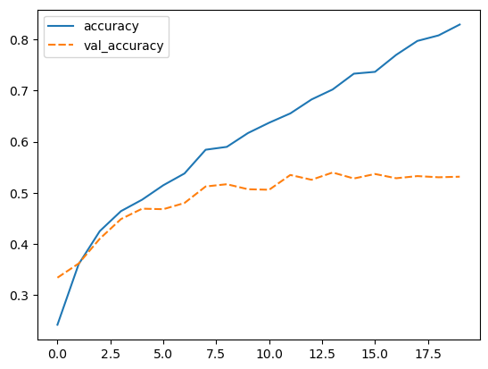

:::::::::::::::::::::::::::::::::::::: questions 

- How do you fit and compile a CNN?
- What is an optimizer?
- What are hyperparameters?

::::::::::::::::::::::::::::::::::::::::::::::::

::::::::::::::::::::::::::::::::::::: objectives

- Explain how you fit and compile a CNN
- Understand what an optimizer is and be familiar with advantages and disadvantages of different optimizers
- Define the terms: learning rate, batch size, epoch

::::::::::::::::::::::::::::::::::::::::::::::::

## 5. Choose a loss function and optimizer

We have now designed a neural network that in theory we should be able to train to classify images. However, we first need to select an appropriate loss function that we will use during training. This loss function tells the training algorithm how wrong, or how 'far away' from the true value the predicted value is.

For the one-hot encoding that we selected before a fitting loss function is the Categorical Crossentropy loss. In Keras this is implemented in the keras.losses.CategoricalCrossentropy class. This loss function works well in combination with the softmax activation function we chose earlier. The Categorical Crossentropy works by comparing the probabilities that the neural network predicts with 'true' probabilities that we generated using the one-hot encoding. This is a measure for how close the distribution of the three neural network outputs corresponds to the distribution of the three values in the one-hot encoding. It is lower if the distributions are more similar.

For more information on the available loss functions in Keras you can check the [documentation].

Next we need to choose which optimizer to use and, if this optimizer has parameters, what values to use for those. Furthermore, we need to specify how many times to show the training samples to the optimizer.

Once more, Keras gives us plenty of choices all of which have their own pros and cons, but for now let us go with the widely used Adam optimizer. Adam has a number of parameters, but the default values work well for most problems. So we will use it with its default parameters.

Combining this with the loss function we decided on earlier we can now compile the model using model.compile. Compiling the model prepares it to start the training.

## Model Compilation

We compile the model using the adam optimizer (other optimizers could also be used here!). Similar to the penguin classification task, we will use the crossentropy function to calculate the model's loss. This loss function is appropriate to use when the data has two or more label classes.

To calculate crossentropy loss for data that has its classes represented by integers (i.e., not one-hot encoded), we use the SparseCategoricalCrossentropy() function:

```python
model.compile(optimizer='adam',
              loss=keras.losses.SparseCategoricalCrossentropy(from_logits=True),
              metrics=['accuracy'])
```

## 6. Train model

We are now ready to train the model.

Training the model is done using the fit method, it takes the input data and target data as inputs and it has several other parameters for certain options of the training. Here we only set a different number of epochs. One training epoch means that every sample in the training data has been shown to the neural network and used to update its parameters.

We then train the model for 10 epochs:

```python
history = model.fit(train_images, train_labels, epochs=10,
                    validation_data=(test_images, test_labels))
```

The fit method returns a history object that has a history attribute with the training loss and potentially other metrics per training epoch. It can be very insightful to plot the training loss to see how the training progresses. Using seaborn we can do this as follows:

We can plot the training process using the history:
```python
import seaborn as sns
import pandas as pd

# plot the accuracy from the training process
history_df = pd.DataFrame.from_dict(history.history)
sns.lineplot(data=history_df[['accuracy', 'val_accuracy']])
```
{alt=''}

```python
# plot the loss from the training process
sns.lineplot(data=history_df[['loss', 'val_loss']])
```

{alt=''}

This plot can be used to identify whether the training is well configured or whether there are problems that need to be addressed

It seems that the model is overfitting somewhat, because the validation accuracy and loss stagnates.

::::::::::::::::::::::::::::::::::::: challenge 

## Challenge The Training Curve

Looking at the training curve we have just made.

1. How does the training progress?
- Does the training loss increase or decrease?
- Does it change fast or slowly?
- Is the graph look very jittery?
1. Do you think the resulting trained network will work well on the test set?

:::::::::::::::::::::::: solution 

1. The loss curve should drop quite quickly in a smooth line with little jitter
1. The results of the training give very little information on its performance on a test set. You should be careful not to use it as an indication of a well trained network.

:::::::::::::::::::::::::::::::::
::::::::::::::::::::::::::::::::::::::::::::::::

TODO Check these are the results from the second model
assumming we put both models in 03-build

To train the network and plot the results:

```python
model.compile(optimizer='adam',
              loss=keras.losses.SparseCategoricalCrossentropy(from_logits=True),
              metrics=['accuracy'])

history = model.fit(train_images, train_labels, epochs=20,
                    validation_data=(test_images, test_labels))

history_df = pd.DataFrame.from_dict(history.history)
sns.lineplot(data=history_df[['accuracy', 'val_accuracy']])
```

{alt=''}

```python
# plot the loss from the training process
sns.lineplot(data=history_df[['loss', 'val_loss']])
```

{alt=''}

TODO Add a challenge to change the optimizer?

## Pick the best model and use it to predict

:::::::::::::::::::::::::::::::::::::::::::::::::::::::::::::::::::: instructor

Inline instructor notes can help inform instructors of timing challenges
associated with the lessons. They appear in the "Instructor View"

::::::::::::::::::::::::::::::::::::::::::::::::::::::::::::::::::::::::::::::::


::::::::::::::::::::::::::::::::::::: keypoints 

- Use `.md` files for episodes when you want static content
- Use `.Rmd` files for episodes when you need to generate output
- Run `sandpaper::check_lesson()` to identify any issues with your lesson
- Run `sandpaper::build_lesson()` to preview your lesson locally

::::::::::::::::::::::::::::::::::::::::::::::::

<!-- Collect your link references at the bottom of your document -->
[documentation]: https://www.tensorflow.org/api_docs/python/tf/keras/losses
