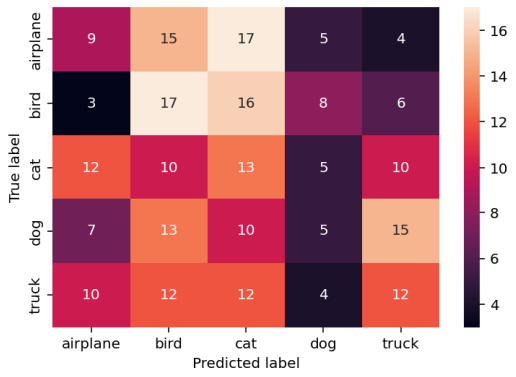

:::::::::::::::::::::::::::::::::::::: questions 

- How do you use a trained CNN to make predictions?
- How do you convert model predictions into class labels?
- How do you evaluate model performance on a test dataset?

::::::::::::::::::::::::::::::::::::::::::::::::

::::::::::::::::::::::::::::::::::::: objectives

- Use a trained CNN to make predictions on new data.
- Convert model outputs into predicted class labels.
- Evaluate model performance using accuracy.
- Interpret model performance using a confusion matrix.

::::::::::::::::::::::::::::::::::::::::::::::::

### Step 7. Perform a Prediction

Now that we have a trained model, we can use it to make predictions on new data.

We’ll use our **test dataset**, which contains images the model has not seen before.


:::::::::::::::::::::::::::::::::::::: callout
## Don’t have your model?

If you don’t have the trained model from the previous episode, you can load it instead:

```python
# load pre-trained model
model_intro = tf.keras.models.load_model('../models/cifar_model_intro.keras')
```
:::::::::::::::::::::::::::::::::::::: 

#### Make predictions

We can use the `Model.predict()` function to generate predictions for the test dataset:

```python
# make predictions
predictions = model_intro.predict(x = test_ds)
```

The model does not return a single answer.

Instead, it returns a list of values for each image — one for each class.

These values represent how confident the model is for each class.

#### Convert predictions to labels

To get a single predicted class, we select the highest value for each prediction:

```python
# convert predictions to class labels
predicted_labels = tf.argmax(predictions, axis=1)
```

### Step 8. Measuring performance

Now that we have predictions, we can measure how well our model performs on the test dataset.


#### Accuracy

A simple way to evaluate our model is to calculate its **accuracy** — how often the predictions match the true labels. To do this, we also need the true labels from our test dataset.

We can do this using:

```python
from sklearn.metrics import accuracy_score

test_labels = np.concatenate([y for x, y in test_ds], axis=0)
test_acc = accuracy_score(y_true=test_labels, y_pred=predicted_labels)
print('Accuracy:', round(test_acc,2))
```
```output
Accuracy: 0.67
```

Accuracy is the proportion of correct predictions.

For example, an accuracy of 0.67 means the model correctly classified 67% of the test images.


#### Confusion matrix

Accuracy gives us an overall score, but it doesn’t tell us *which classes* the model is getting right or wrong.

A **confusion matrix** helps us see this.

```python
from sklearn.metrics import confusion_matrix

conf_matrix = confusion_matrix(y_true=test_labels, y_pred=predicted_labels)
print(conf_matrix)
```
```output
[[ 9 15 17  5  4]
 [ 3 17 16  8  6]
 [12 10 13  5 10]
 [ 7 13 10  5 15]
 [10 12 12  4 12]]
```

In a confusion matrix:

- rows represent the true labels  
- columns represent the predicted labels  

Values along the diagonal are correct predictions.

We can make this easier to read using a heatmap:

```python
sns.heatmap(data=conf_matrix, annot=True, fmt='3g')
```

Darker values along the diagonal indicate correct predictions.

Off-diagonal values show where the model is confusing one class with another.

{alt='Confusion matrix of model predictions where the colour scale goes from black to light to represent values from 0 to the total number of test observations in our test set of 1000. The diagonal has much lighter colours, indicating our model is predicting well, but a few non-diagonal cells also have a lighter colour to indicate where the model is making a large number of prediction errors.'}


::::::::::::::::::::::::::::::::::::: challenge 

## Inspect model performance

Look at the confusion matrix and answer:

1. Does the model perform equally well across all classes?  
2. Which classes seem to be confused with each other?  
3. How does this compare to the accuracy value?  

:::::::::::::::::::::::: solution 

- The model performs better on some classes than others  
- Some classes are frequently confused with similar ones  
- Accuracy gives an overall score, but the confusion matrix shows where errors occur

:::::::::::::::::::::::::::::::::
::::::::::::::::::::::::::::::::::::::::::::::::

## What did we do?

In this episode, we used our trained CNN to make predictions on new data and evaluate how well it performs.

We:

- used the model to generate predictions  
- converted those predictions into class labels  
- measured performance using accuracy  
- used a confusion matrix to better understand the results  

We can now see not just how often the model is correct, but also where it is making mistakes.

In the next part of the workflow, we’ll look at ways to improve our model and make more accurate predictions.

::::::::::::::::::::::::::::::::::::: keypoints 

- Use `Model.predict()` to make predictions with a trained model.
- Model outputs represent confidence values for each class.
- Use `argmax` to convert model outputs into predicted class labels.
- Accuracy measures how often predictions are correct.
- Confusion matrices help identify which classes are predicted correctly and where errors occur.

::::::::::::::::::::::::::::::::::::::::::::::::

<!-- Collect your link references at the bottom of your document -->
[Model training APIs]: https://keras.io/api/models/model_training_apis/
[seaborn]: https://seaborn.pydata.org/
[RMSprop in Keras]: https://keras.io/api/optimizers/rmsprop/
[RMSProp, Cornell University]: https://optimization.cbe.cornell.edu/index.php?title=RMSProp

