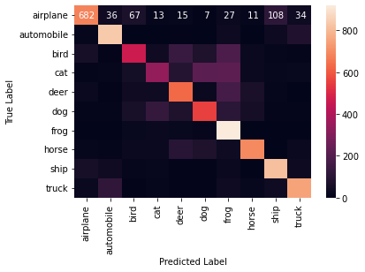

:::::::::::::::::::::::::::::::::::::: questions 


- How do you measure model prediction accuracy?
- How do you use a model to make a prediction?
- How to you improve model performance?

::::::::::::::::::::::::::::::::::::::::::::::::

::::::::::::::::::::::::::::::::::::: objectives

- Expain how to measure the performance of model predictions
- Understand what steps to take to improve model accuracy

::::::::::::::::::::::::::::::::::::::::::::::::

### Step 7. Perform a Prediction/Classification

After you have fully trained the network to a satisfactory performance on the training and validation sets, we can use it to perform predictions on a special hold-out set, the **test** set. The prediction accuracy of the model on new images is used in the next step to measure the performance of the network.

#### Choosing a test set

The test set should only contain images that the model has never seen before. We will use the [CINIC-10 dataset] (CINIC-10 Is Not ImageNet or CIFAR-10) for out test data. CINIC-10 was designed to be used as a benchmarking dataset as a drop-in alternative to CIFAR-10 and therefore the images are the same size.

::::::::::::::::::::::::::::::::::::: challenge 

Is the CINIC-10 model a good test data set? Hint: Read the 'Details' and 'Construction' sections of the [CINIC-10 dataset].

:::::::::::::::::::::::: solution 

No! "The entirety of the original CIFAR-10 test set is within the above mentioned new test set."

:::::::::::::::::::::::::::::::::
::::::::::::::::::::::::::::::::::::::::::::::::

TODO Find a different set?

::::::::::::::::::::::::::::::::::::: challenge 

How big should our test data set be?

:::::::::::::::::::::::: solution 

Depends! Recall in Episode 02 we talked about the different ways to partition the data into training, validation and test data sets. For **Stratified Sampling**, for example, we might split the data using these rations: 80-10-10 or 70-15-15.

:::::::::::::::::::::::::::::::::
::::::::::::::::::::::::::::::::::::::::::::::::

TODO Set this test images set up in Ep 02 instead so it's ready to go OR use the Tiny Images and use the same construction (uhoh -  https://groups.csail.mit.edu/vision/TinyImages)

We will use our convolutional neural network to predict the class names of the test set using the predict function and use these predictions in the next step to measure the performance of our trained network.

TODO talk about this website somewhere:
https://franky07724-57962.medium.com/once-upon-a-time-in-cifar-10-c26bb056b4ce

Recall our model will return a vector of probabilities, one for each class. By finding the class with the highest probability, we can select the most likely class name of the object.


```python
# CINAC-10 uses the same class names
class_names = ['airplane', 'automobile', 'bird', 'cat', 'deer', 'dog', 'frog', 'horse', 'ship', 'truck']

# read in the real class values
test_labels = load_CINIC_labels(filepath)

# read in test images
test_images = load_CINIC_images(filepath) # TODO 

# use our current best model to predict probability of each class on new test set
predicted_prob = model_dropout.predict(test_images)

# convert probability predictions to table using class names for column names
prediction_df = pd.DataFrame(predicted_prob, columns=class_names)

# inspect 
prediction_df.head()
```

```output
     airplane  automobile        bird  ...       horse        ship       truck
0 -122.712860 -129.267731 -167.219070  ... -123.657021 -159.014191 -163.177200
1 -124.170799 -130.616486 -169.133301  ... -125.039940 -160.607788 -164.996490
2 -122.743195 -129.151138 -167.131165  ... -123.587769 -158.856171 -163.279022
3 -123.213806 -129.727814 -167.872360  ... -124.088776 -159.516998 -163.856964
4 -122.018211 -128.308029 -165.941437  ... -122.628334 -157.797241 -162.291702
```

```python
# now find the maximum probability for each image
predicted_labels = predicted_prob.argmax(axis=1)
```

### Step 8. Measuring performance

Once we trained the network we want to measure its performance. There are many different methods available for measuring performance and which one is best depends on the type of task we are attempting. These metrics are often published as an indication of how well our network performs.

An easy way to visually check the observed versus predicted classes is to plot the index of each:

```python
# plot the predicted versus the true class
plt.plot(test_labels, predicted_labels, xlab='Test Class', ylab='Predicted Class')

```

{alt=''}


To obtain more quantitative measures of model performance, we we will create a confusion matrix.


#### Confusion matrix

With the predicted species we can now create a confusion matrix and display it using seaborn. To create a confusion matrix we will use another convenient function from sklearn called confusion_matrix. This function takes as a first parameter the true labels of the test set. The second parameter is the predicted labels which we did above.

```python
from sklearn.metrics import confusion_matrix

true_class = TODO

matrix = confusion_matrix(true_species, predicted_species)
print(matrix)
```
```output
[[ 0  0  0  0 50  0  0  0  0  0]
 [ 0  0  0  0 42  0  8  0  0  0]
 [ 0  0  0  0 44  0  6  0  0  0]
 [ 0  0  0  0 39  0 11  0  0  0]
 [ 0  0  0  0 50  0  0  0  0  0]
 [ 0  0  0  0 45  0  5  0  0  0]
 [ 0  0  0  0 36  0 14  0  0  0]
 [ 0  0  0  0 46  0  4  0  0  0]
 [ 0  0  0  0 45  0  5  0  0  0]
 [ 0  0  0  0 38  0 12  0  0  0]]
 ```

Unfortunately, this matrix is kinda hard to read. Its not clear which column and which row corresponds to which species. So let's convert it to a pandas dataframe with its index and columns set to the species as follows:

```python
# Convert to a pandas dataframe
confusion_df = pd.DataFrame(matrix, index=class_namess, columns=class_names)

# Set the names of the x and y axis, this helps with the readability of the heatmap.
confusion_df.index.name = 'True Label'
confusion_df.columns.name = 'Predicted Label'
```

We can then use the heatmap function from seaborn to create a nice visualization of the confusion matrix. The annot=True parameter here will put the numbers from the confusion matrix in the heatmap.

```python
sns.heatmap(confusion_df, annot=True)
```

{alt=''}

::::::::::::::::::::::::::::::::::::: challenge 

## Challenge Confusion Matrix

Looking at the training curve we have just made.

Measure the performance of the neural network you trained and visualize a confusion matrix.

- Did the neural network perform well on the test set?
- Did you expect this from the training loss you saw?
- What could we do to improve the performance?

:::::::::::::::::::::::: solution 

The confusion matrix shows that the predictions for Adelie and Gentoo are decent, but could be improved. However, Chinstrap is not predicted ever.

The training loss was very low, so from that perspective this may be surprising. But this illustrates very well why a test set is important when training neural networks.

We can try many things to improve the performance from here. One of the first things we can try is to balance the dataset better. Other options include: changing the network architecture or changing the training parameters

:::::::::::::::::::::::::::::::::
::::::::::::::::::::::::::::::::::::::::::::::::

::::::::::::::::::::::::::::::::::::: challenge 

Try your own image!

```python
# specify a new image and prepare it to match CIFAR-10 dataset
from icwithcnn_functions import prepare_image_icwithcnn

new_img_path = "../data/Jabiru_TGS.JPG" # path to image
new_img_prepped = prepare_image_icwithcnn(new_img_path)

# predict the classname
result_intro = model_intro.predict(new_img_prepped) # make prediction
print(result_intro) # probability for each class
print(class_names[result_intro.argmax()]) # class with highest probability
```

:::::::::::::::::::::::: solution 

## Output
 
```output
Result: [[-2.0185328   9.337507   -2.4551604  -0.4688053  -4.599108   -3.5822825
   6.427376   -0.09437321  0.82065487  1.2978227 ]]
Class name: automobile

```

:::::::::::::::::::::::::::::::::
::::::::::::::::::::::::::::::::::::::::::::::::


### Step 9. Tune hyperparameters

Hyperparameters are all the parameters set by the person configuring the machine learning instead of those learned by the algorithm itself. It might be necessary to adjust these and re-run the training many times before we are happy with the result.

Some hyperparameters include:

Build:
- number of neurons
- activation function

Compile:
- loss function
- optimizer
    - learning rate
    - batch size
    
Train:
- epoch
- batch size

#### How do you know what activation function to choose?

Neural networks can be tuned to leverage many different types of activation functions. In fact, it is a crucial decision as the choice of activation function will have a direct impact on the performance of the model.

The table below describes each activation function, its benefits, and drawbacks.

| Activation Function | Positives                                                        | Negatives                                  |
|---------------------|------------------------------------------------------------------|--------------------------------------------|
| ReLU                | - Addresses vanishing gradient problem <br/> - Computationally efficient | - Can cause "dying neurons" <br/> - Not zero-centered |
| Leaky ReLU          | - Addresses the "dying ReLU" problem <br/> - Computationally efficient | - Empirical results can be inconsistent <br/> - Not zero-centered |
| Sigmoid             | - Outputs between 0 and 1 <br/> - Smooth gradient               | - Can cause vanishing gradient problem <br/> - Computationally more expensive |
| Tanh                | - Outputs between -1 and 1 <br/> - Zero-centered                | - Can still suffer from vanishing gradients to some extent |
| Softmax             | - Used for multi-class classification <br/> - Outputs a probability distribution | - Used only in the output layer for classification tasks |
| SELU                | - Self-normalizing properties <br/> - Can outperform ReLU in deeper networks | - Requires specific weight initialization <br/> - May not perform well outside of deep architectures |

##### Assessing activiation function performance

The code below serves as a practical means for exploring activation performance on an image dataset.

```python
import numpy as np
import matplotlib.pyplot as plt
import tensorflow as tf
from tensorflow.keras.datasets import cifar10
from tensorflow.keras.models import Sequential
from tensorflow.keras.layers import Dense, Flatten, Conv2D, MaxPooling2D

# Load data
(train_images, train_labels), (test_images, test_labels) = cifar10.load_data()

# Preprocess the data
train_images = train_images / 255.0
test_images = test_images / 255.0

# Define a function to create a model with a given activation function
def create_model(activation_function):
    model = Sequential([
        Conv2D(32, (3, 3), activation=activation_function, input_shape=(32, 32, 3)),
        MaxPooling2D(2, 2),
        Flatten(),
        Dense(128, activation=activation_function),
        Dense(10, activation='softmax')
    ])
    model.compile(optimizer='adam', loss='sparse_categorical_crossentropy', metrics=['accuracy'])
    return model

# List of activation functions to try
activations = ['relu', 'sigmoid', 'tanh', 'selu', tf.keras.layers.LeakyReLU()]

history_data = {}

# Train a model with each activation function and store the history
for activation in activations:
    model = create_model(activation)
    history = model.fit(train_images, train_labels, epochs=10, validation_data=(test_images, test_labels))
    history_data[str(activation)] = history

# Plot the validation accuracy for each activation function
plt.figure(figsize=(12, 6))

for activation, history in history_data.items():
    plt.plot(history.history['val_accuracy'], label=activation)

plt.title('Validation accuracy for different activation functions')
plt.xlabel('Epochs')
plt.ylabel('Validation Accuracy')
plt.legend()
plt.show()
```
TODO include output for the above
TODO how to choose activation function - here or back in build with a callout?
TODO Add a challenge to change the loss or optimizer

#### Set expectations: How difficult is the defined problem?

Before we dive deeper into handling overfitting and (trying to) improving the model performance, let us ask the question: How well must a model perform before we consider it a good model?

Now that we defined a problem (classify an image into one of 10 different classes), it makes sense to develop an intuition for how difficult the posed problem is. Frequently, models will be evaluated against a so called **baseline**. A baseline can be the current standard in the field or if such a thing does not exist it could also be an intuitive first guess or toy model. The latter is exactly what we would use for our case.

TODO might be able to do something like this

#### Watch your model training closely

As we saw when comparing the predictions for the training and the test set, deep learning models are prone to overfitting. Instead of iterating through countless cycles of model trainings and subsequent evaluations with a reserved test set, it is common practice to work with a second split off dataset to monitor the model during training. This is the validation set which can be regarded as a second test set. As with the test set, the datapoints of the validation set are not used for the actual model training itself. Instead, we evaluate the model with the validation set after every epoch during training, for instance to stop if we see signs of clear overfitting. Since we are adapting our model (tuning our hyperparameters) based on this validation set, it is very important that it is kept separate from the test set. If we used the same set, we would not know whether our model truly generalizes or is only overfitting.


TODO add new model with validation data
see this section deep-learning 03 weather

::::::::::::::::::::::::::::::::::::: challenge 

## Exercise: plot the training progress

1. Is there a difference between the training and validation data? And if so, what would this imply?
1. (Optional) Take a pen and paper, draw the perfect training and validation curves. (This may seem trivial, but it will trigger you to think about what you actually would like to see)

:::::::::::::::::::::::: solution 

The difference between training and validation data shows that something is not completely right here. The model predictions on the validation set quickly seem to reach a plateau while the performance on the training set keeps improving. That is a common signature of overfitting.

Optional: Ideally you would like the training and validation curves to be identical and slope down steeply to 0. After that the curves will just consistently stay at 0.

:::::::::::::::::::::::::::::::::
::::::::::::::::::::::::::::::::::::::::::::::

#### Counteract model overfitting

Overfitting is a very common issue and there are many strategies to handle it. Most similar to classical machine learning might to **reduce the number of parameters**.

TODO revisit this section deep-learning 03 weather
TODO might need to break this out into new episode


::::::::::::::::::::::::::::::::::::: challenge 

## Open question: What could be next steps to further improve the model?

With unlimited options to modify the model architecture or to play with the training parameters, deep learning can trigger very extensive hunting for better and better results. Usually models are "well behaving" in the sense that small chances to the architectures also only result in small changes of the performance (if any). It is often tempting to hunt for some magical settings that will lead to much better results. But do those settings exist? Applying common sense is often a good first step to make a guess of how much better could results be. In the present case we might certainly not expect to be able to reliably predict sunshine hours for the next day with 5-10 minute precision. But how much better our model could be exactly, often remains difficult to answer.

- What changes to the model architecture might make sense to explore?
- Ignoring changes to the model architecture, what might notably improve the prediction quality?

:::::::::::::::::::::::: solution 

This is on open question. And we don't actually know how far one could push this sunshine hour prediction (try it out yourself if you like! We're curious!). But there is a few things that might be worth exploring.

Regarding the model architecture:

- In the present case we do not see a magical silver bullet to suddenly boost the performance. But it might be worth testing if deeper networks do better (more layers).

Other changes that might impact the quality notably:

- The most obvious answer here would be: more data! Even this will not always work (e.g. if data is very noisy and uncorrelated, more data might not add much).
- Related to more data: use data augmentation. By creating realistic variations of the available data, the model might improve as well.
- More data can mean more data points (you can test it yourself by taking more than the 3 years we used here!)
- More data can also mean more features! What about adding the month?
- The labels we used here (sunshine hours) are highly biased, many days with no or nearly no sunshine but few with >10 hours. Techniques such as oversampling or undersampling might handle such biased labels better. Another alternative would be to not only look at data from one day, but use the data of a longer period such as a full week. This will turn the data into time series data which in turn might also make it worth to apply different model architectures....

:::::::::::::::::::::::::::::::::
::::::::::::::::::::::::::::::::::::::::::::::


:::::::::::::::::::::::::::::::::::::::::::::::::::::::::::::::::::: instructor

Inline instructor notes can help inform instructors of timing challenges
associated with the lessons. They appear in the "Instructor View"

::::::::::::::::::::::::::::::::::::::::::::::::::::::::::::::::::::::::::::::::

::::::::::::::::::::::::::::::::::::: keypoints 

- Use `.md` files for episodes when you want static content
- Use `.Rmd` files for episodes when you need to generate output
- Run `sandpaper::check_lesson()` to identify any issues with your lesson
- Run `sandpaper::build_lesson()` to preview your lesson locally

::::::::::::::::::::::::::::::::::::::::::::::::

<!-- Collect your link references at the bottom of your document -->
[CINIC-10 dataset]: https://github.com/BayesWatch/cinic-10/

