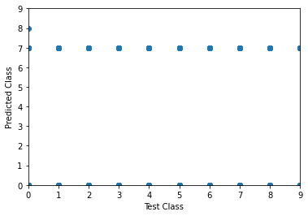

:::::::::::::::::::::::::::::::::::::: questions 

- How do you use a model to make a prediction?
- How do you measure model prediction accuracy?
- What is a hyperparameter?
- What can you do to improve model performance?

::::::::::::::::::::::::::::::::::::::::::::::::

::::::::::::::::::::::::::::::::::::: objectives

- Use a convolutional neural network (CNN) to make a prediction (ie classify an image)
- Explain how to measure the performance of a CNN
- Explain hyperparameter tuning
- Understand what steps to take to improve model accuracy

::::::::::::::::::::::::::::::::::::::::::::::::

### Step 7. Perform a Prediction/Classification

After you fully train the network to a satisfactory performance on the training and validation sets, we use it to perform predictions on a special hold-out set, the **test** set. The prediction accuracy of the model on new images will be used in **Step 8. Measuring performance** to measure the performance of the network.

#### Prepare test dataset

Recall in Episode 2 Introduction to Image Data we discussed how to split your data into training, validation and test datasets and why. In most cases, that means you already have a test set on hand. For example, in that episode we create a variable `test_images` and assigned a sample of the CINIC-10 dataset.

When creating a test set there are a few things to check:

- only contains images that the model has never seen before
- sufficiently large to provide a meaningful evaluation of model performance
  - images from every target label
  - images of classes not in your target set
- processed in the same way as your training set

Check to make sure you have a model in memory and a test dataset:

```python
# check correct model is loaded
print('We are using', model_dropout.name)

# check test image dataset is loaded
print('The number and shape of images in our test dataset is: ', test_images.shape)
print('The number of labels in our test dataset is: ', len(test_labels))
```
```output
We are using  cifar_model_dropout
The number and shape of images in our test dataset is:  (10000, 32, 32, 3)
The number of labels in our test dataset is:  10000
```


::::::::::::::::::::::::::::::::::::: challenge 

Is the CINIC-10 model a good test data set? Hint: Read the 'Details' and 'Construction' sections of the [CINIC-10].

:::::::::::::::::::::::: solution 

No! "The entirety of the original CIFAR-10 test set is within the above mentioned new test set." 

Make sure the images you use for test have not been used to train!

:::::::::::::::::::::::::::::::::
::::::::::::::::::::::::::::::::::::::::::::::::

::::::::::::::::::::::::::::::::::::: challenge 

How big should our test data set be?

:::::::::::::::::::::::: solution 

Depends! Recall in an Episode 02 Introduction to Image Data Callout we talked about the different ways to partition the data into training, validation and test data sets. For example, using the **Stratified Sampling** technique, we might split the data using these rations: 80-10-10 or 70-15-15.

:::::::::::::::::::::::::::::::::
::::::::::::::::::::::::::::::::::::::::::::::::

#### Predict

Armed with a test dataset, we will use our CNN to predict their class labels using the `predict` function and then use these predictions in Step 8 to measure the performance of our trained network.

Recall our model will return a vector of probabilities, one for each class. By finding the class with the highest probability, we can select the most likely class name of the object.


```python
from tensorflow import keras

# use our current best model to predict probability of each class on new test set
predicted_prob = model_dropout.predict(test_images)

# convert probability predictions to table using class names for column names
prediction_df = pd.DataFrame(predicted_prob, columns=class_names)

# inspect 
prediction_df.head()
```

```output
airplane  automobile      bird  ...     horse      ship     truck
0  0.165748   -0.118394  0.062156  ...  0.215477  0.013811 -0.047446
1  0.213530   -0.126139  0.052813  ...  0.264517  0.009097 -0.091710
2  0.211900   -0.099055  0.047890  ...  0.242345 -0.014492 -0.073153
3  0.187883   -0.085144  0.044609  ...  0.217864  0.007502 -0.055209
4  0.190110   -0.118892  0.054869  ...  0.252434 -0.030064 -0.061485

[5 rows x 10 columns]
```

```python
# now find the maximum probability for each image
predicted_labels = predicted_prob.argmax(axis=1)
```

### Step 8. Measuring performance

Once we trained the network we want to measure its performance. There are many different methods available for measuring performance and which one is best depends on the type of task we are attempting. These metrics are often published as an indication of how well our network performs.

An easy way to visually check the observed versus predicted classes is to plot the index of each:

```python
# plot the predicted versus the true class

# training labels are numeric; want test labels to the same for plotting
# need the list of classnames to convert test_labels to test_values
# recall train_values were numeric, not strings
class_names = ['airplane', 'automobile', 'bird', 'cat', 'deer', 'dog', 'frog', 'horse', 'ship', 'truck']

# use element position in class_names to generate values
test_values = [] 
for i in range(len(test_labels)):
    test_values.append(class_names.index(test_labels[i]))
    
# make the plot
plt.scatter(test_labels_values, predicted_labels)
plt.xlabel('Test Class')
plt.ylabel('Predicted Class')
plt.xlim(0, 9)
plt.ylim(0, 9)
#plt.axline(xy1=(0,0), xy2=(9,9), linestyle='--') # expected
plt.show()

```

{alt=''}


To obtain a more quantitative measure of model performance, we can create a confusion matrix.


#### Confusion matrix

With the predicted species we can now create a confusion matrix and display it using seaborn. To create a confusion matrix we will use another convenient function from sklearn called `confusion_matrix`. This function takes as a first parameter the true labels of the test set. The second parameter is the predicted labels which we did above.

```python
from sklearn.metrics import confusion_matrix

conf_matrix = confusion_matrix(test_labels_values, predicted_labels)
print(conf_matrix)
```
```output
[[ 24   0   0   0   0   0   0 975   1   0]
 [ 38   0   0   0   0   0   0 962   0   0]
 [ 25   0   0   0   0   0   0 975   0   0]
 [ 35   0   0   0   0   0   0 965   0   0]
 [ 23   0   0   0   0   0   0 977   0   0]
 [ 43   0   0   0   0   0   0 957   0   0]
 [ 26   0   0   0   0   0   0 974   0   0]
 [ 39   0   0   0   0   0   0 961   0   0]
 [ 22   0   0   0   0   0   0 978   0   0]
 [ 36   0   0   0   0   0   0 964   0   0]]
 ```

Unfortunately, this matrix is kinda hard to read. Its not clear which column and which row corresponds to which class. So let's convert it to a pandas dataframe with its index and columns set to the class labels as follows:

```python
# Convert to a pandas dataframe
confusion_df = pd.DataFrame(conf_matrix, index=class_names, columns=class_names)

# Set the names of the x and y axis, this helps with the readability of the heatmap.
confusion_df.index.name = 'True Label'
confusion_df.columns.name = 'Predicted Label'
```

We can then use the `heatmap` function from seaborn to create a nice visualization of the confusion matrix. 
- the `annot=True` parameter here will put the numbers from the confusion matrix in the heatmap.
 - the `fmt=3g' will display the values with 3 significant digits

```python
sns.heatmap(confusion_df, annot=True)
```

{alt=''}

::::::::::::::::::::::::::::::::::::: challenge 

Confusion Matrix

Measure the performance of the neural network you trained and visualized as a confusion matrix.

Q1. Did the neural network perform well on the test set?

Q2. Did you expect this from the training loss you saw?

Q3. What could we do to improve the performance?

:::::::::::::::::::::::: solution 

Q1. The confusion matrix shows that the predictions for terrible and can improved.

Q2. I expected the performance to be poor because the accuracy of the model I chose was only 10% on the validation set.

Q3. We can try many things to improve the performance from here. One of the first things we can try is to change the network architecture. However, in the interest of time and given we already saw how to build a CNN we will try to change the training parameters.

:::::::::::::::::::::::::::::::::
::::::::::::::::::::::::::::::::::::::::::::::::

::::::::::::::::::::::::::::::::::::: challenge 

Try your own image!

```python
# specify a new image and prepare it to match CIFAR-10 dataset
from icwithcnn_functions import prepare_image_icwithcnn

new_img_path = "../data/Jabiru_TGS.JPG" # path to YOUR image
new_img_prepped = prepare_image_icwithcnn(new_img_path)

# predict the classname
result_intro = model_intro.predict(new_img_prepped) # make prediction
print(result_intro) # probability for each class
print(class_names[result_intro.argmax()]) # class with highest probability
```

:::::::::::::::::::::::: solution 
```output
Result: [[-2.0185328   9.337507   -2.4551604  -0.4688053  -4.599108   -3.5822825
   6.427376   -0.09437321  0.82065487  1.2978227 ]]
Class name: automobile

NOTE your output will vary!

```

:::::::::::::::::::::::::::::::::
::::::::::::::::::::::::::::::::::::::::::::::::


### Step 9. Tune hyperparameters

Recall the following from Episode 1:

#### What are hyperparameters? 

Hyperparameters are all the parameters set by the person configuring the machine learning instead of those learned by the algorithm itself. These hyperparameters can include the learning rate, the number of layers in the network, the number of neurons per layer, and many more. Hyperparameter tuning refers to the process of systematically searching for the best combination of hyperparameters that will optimize the model's performance.

That is, hyperparameters are all parameters set by the person configuring the machine learning instead of those learned by the algorithm itself. It might be necessary to adjust these and re-run the training many times before we are happy with the result.

Some hyperparameters include:

**During Build:**

- number of neurons
- activation function

**When Compiling:**

- loss function
- optimizer
    - learning rate
    - batch size
    
**During Training:**

- epoch
- batch size

One common method for hyperparameter tuning is **grid search**. 

#### What is Grid Search?

Grid Search or `GridSearchCV` (as per the library function call) is foundation method for hyperparameter tuning. The aim of hyperparameter tuning is to define a grid of possible values for each hyperparameter you want to tune. GridSearch will then evaluate the model performance for each combination of hyperparameters in a brute-force manner, iterating through every possible combination in the grid.

For instance, suppose you're tuning two hyperparameters:

Learning rate: with possible values [0.01, 0.1, 1]

Batch size: with possible values [10, 50, 100]

GridSearch will evaluate the model for all 3x3 = 9 combinations (e.g., {0.01, 10}, {0.01, 50}, {0.1, 10}, and so on).


### Tune Hyperparameters Example: use GridSearch to tune **Optimizer**

In episode 04 we talked briefly about the `Adam` optimizer used in our `model.compile` discussion. Recall the optimizer refers to the algorithm with which the model learns to optimize on the provided loss function.

Here we will use our introductory model to demonstrate how GridSearch is expressed in code to search for an optimizer.

First, we will define a **build function** to use during GridSearch. This function will compile the model for each combination of parameters prior to evaluation.

```python
def create_model():
    # Input layer of 32x32 images with three channels (RGB)
    inputs_intro = keras.Input(shape=train_images.shape[1:])

    # Convolutional layer with 50 filters, 3x3 kernel size, and ReLU activation
    x_intro = keras.layers.Conv2D(50, (3, 3), activation='relu')(inputs_intro)
    # Second Convolutional layer
    x_intro = keras.layers.Conv2D(50, (3, 3), activation='relu')(x_intro)
    # Flatten layer to convert 2D feature maps into a 1D vector
    x_intro = keras.layers.Flatten()(x_intro)

    # Output layer with 10 units (one for each class)
    outputs_intro = keras.layers.Dense(10)(x_intro)

    # create the model
    model = keras.Model(inputs=inputs_intro, outputs=outputs_intro, name="cifar_model_intro")
    model.compile(optimizer = 'adam', loss = keras.losses.SparseCategoricalCrossentropy(from_logits=True), metrics=['accuracy'])
    return model
```

Secondly, we can define our GridSearch parameters and assign fit results to a variable for output. If you don't have the **scikeras** or **sklearn** installed already, please do so via the terminal using pip.

```python
from scikeras.wrappers import KerasClassifier
from sklearn.model_selection import GridSearchCV

#Wrap the model
model = KerasClassifier(build_fn=create_model, epochs=2, batch_size=32, verbose=0)  # epochs, batch_size, verbose can be adjusted as required. Using low epochs to save computation time and demonstration purposes only

# Define the grid search parameters
optimizer = ['SGD', 'RMSprop', 'Adam']
param_grid = dict(optimizer=optimizer)

grid = GridSearchCV(estimator=model, param_grid=param_grid, n_jobs=1, cv=3)
grid_result = grid.fit(train_images, train_labels)

# Summarize results
print("Best: %f using %s" % (grid_result.best_score_, grid_result.best_params_))
```
Output from the GridSearch process should look similar to:

```output
Best: 0.586660 using {'optimizer': 'RMSprop'}
```

Thus, we can interpret from this output that our best tested optimiser is the **root mean square propagation** optimiser, or RMSprop. 

Curious about RMSprop? Read more here: [RMSprop in Keras] and [RMSProp, Cornell University].

For more information on other optimizers available in Keras you can check the [optimizer documentation].


### Tune Hyperparameters Example: use brute force to tune **Activation Function**

In episode 03 we talked briefly about the `relu` activation function passed as an argument to our `Conv2D` hidden layers.

An activation function is like a switch or a filter that we use in artificial neural networks, inspired by how our brains work. These functions play a crucial role in determining whether a neuron (a small unit in the neural network) should "fire" or become active. 

Think of an activation function as a tiny decision-maker for each neuron in a neural network. It helps determine whether the neuron should 'fire', or pass on information, or stay 'off' and remain silent, much like a light switch that decides whether the light should be ON or OFF. Activation functions are crucial because they add non-linearity to the neural network. Without them, the network would be like a simple linear model, unable to learn complex patterns in data. 

#### How do you know what activation function to choose?

Neural networks can be tuned to leverage many different types of activation functions. In fact, it is a crucial decision as the choice of activation function will have a direct impact on the performance of the model.

The table below describes each activation function, its benefits, and drawbacks.

| Activation Function | Positives                                                        | Negatives                                  |
|---------------------|------------------------------------------------------------------|--------------------------------------------|
| ReLU                | - Addresses vanishing gradient problem <br/> - Computationally efficient | - Can cause "dying neurons" <br/> - Not zero-centered |
| Leaky ReLU          | - Addresses the "dying ReLU" problem <br/> - Computationally efficient | - Empirical results can be inconsistent <br/> - Not zero-centered |
| Sigmoid             | - Outputs between 0 and 1 <br/> - Smooth gradient               | - Can cause vanishing gradient problem <br/> - Computationally more expensive |
| Tanh                | - Outputs between -1 and 1 <br/> - Zero-centered                | - Can still suffer from vanishing gradients to some extent |
| Softmax             | - Used for multi-class classification <br/> - Outputs a probability distribution | - Used only in the output layer for classification tasks |
| SELU                | - Self-normalizing properties <br/> - Can outperform ReLU in deeper networks | - Requires specific weight initialization <br/> - May not perform well outside of deep architectures |

#### Assessing activiation function performance

The code below serves as a practical means for exploring activation performance on an image dataset.

```python
import numpy as np
import matplotlib.pyplot as plt
import tensorflow as tf
from tensorflow.keras.datasets import cifar10
from tensorflow.keras.models import Sequential
from tensorflow.keras.layers import Dense, Flatten, Conv2D, MaxPooling2D

# Load data
(train_images, train_labels), (test_images, test_labels) = cifar10.load_data()

# Preprocess the data
train_images = train_images / 255.0
test_images = test_images / 255.0

# Define a function to create a model with a given activation function
def create_model(activation_function):
    model = Sequential([
        Conv2D(32, (3, 3), activation=activation_function, input_shape=(32, 32, 3)),
        MaxPooling2D(2, 2),
        Flatten(),
        Dense(128, activation=activation_function),
        Dense(10, activation='softmax')
    ])
    model.compile(optimizer='adam', loss='sparse_categorical_crossentropy', metrics=['accuracy'])
    return model

# List of activation functions to try
activations = ['relu', 'sigmoid', 'tanh', 'selu', tf.keras.layers.LeakyReLU()]

history_data = {}

# Train a model with each activation function and store the history
for activation in activations:
    model = create_model(activation)
    history = model.fit(train_images, train_labels, epochs=10, validation_data=(test_images, test_labels))
    history_data[str(activation)] = history

# Plot the validation accuracy for each activation function
plt.figure(figsize=(12, 6))

for activation, history in history_data.items():
    plt.plot(history.history['val_accuracy'], label=activation)

plt.title('Validation accuracy for different activation functions')
plt.xlabel('Epochs')
plt.ylabel('Validation Accuracy')
plt.legend()
plt.show()
```
TODO include output for the above


::::::::::::::::::::::::::::::::::::: challenge 

Open question: What could be next steps to further improve the model?

With unlimited options to modify the model architecture or to play with the training parameters, deep learning can trigger very extensive hunting for better and better results. Usually models are "well behaving" in the sense that small chances to the architectures also only result in small changes of the performance (if any). It is often tempting to hunt for some magical settings that will lead to much better results. But do those settings exist? Applying common sense is often a good first step to make a guess of how much better could results be. In the present case we might certainly not expect to be able to reliably predict sunshine hours for the next day with 5-10 minute precision. But how much better our model could be exactly, often remains difficult to answer.

- What changes to the model architecture might make sense to explore?
- Ignoring changes to the model architecture, what might notably improve the prediction quality?

:::::::::::::::::::::::: solution 

This is an open question. And we don't actually know how far one could push this sunshine hour prediction (try it out yourself if you like! We're curious!). But there is a few things that might be worth exploring.

Regarding the model architecture:

- In the present case we do not see a magical silver bullet to suddenly boost the performance. But it might be worth testing if deeper networks do better (more layers).

Other changes that might impact the quality notably:

- The most obvious answer here would be: more data! Even this will not always work (e.g. if data is very noisy and uncorrelated, more data might not add much).
- Related to more data: use data augmentation. By creating realistic variations of the available data, the model might improve as well.
- More data can mean more data points (you can test it yourself by taking more than the 3 years we used here!)
- More data can also mean more features! What about adding the month?
- The labels we used here (sunshine hours) are highly biased, many days with no or nearly no sunshine but few with >10 hours. Techniques such as oversampling or undersampling might handle such biased labels better. Another alternative would be to not only look at data from one day, but use the data of a longer period such as a full week. This will turn the data into time series data which in turn might also make it worth to apply different model architectures....

:::::::::::::::::::::::::::::::::
::::::::::::::::::::::::::::::::::::::::::::::

::::::::::::::::::::::::::::::::::::: keypoints 

- Use model.predict to make a prediction with your model
- Model accuracy must be measured on a test dataset with images your model has not seen before
- There are many hyperparameters to choose from to improve model performance

::::::::::::::::::::::::::::::::::::::::::::::::

<!-- Collect your link references at the bottom of your document -->
[CINIC-10]: https://github.com/BayesWatch/cinic-10/
[RMSprop in Keras]: https://keras.io/api/optimizers/rmsprop/
[RMSProp, Cornell University]: https://optimization.cbe.cornell.edu/index.php?title=RMSProp
[optimizer documentation]: https://keras.io/api/optimizers/
