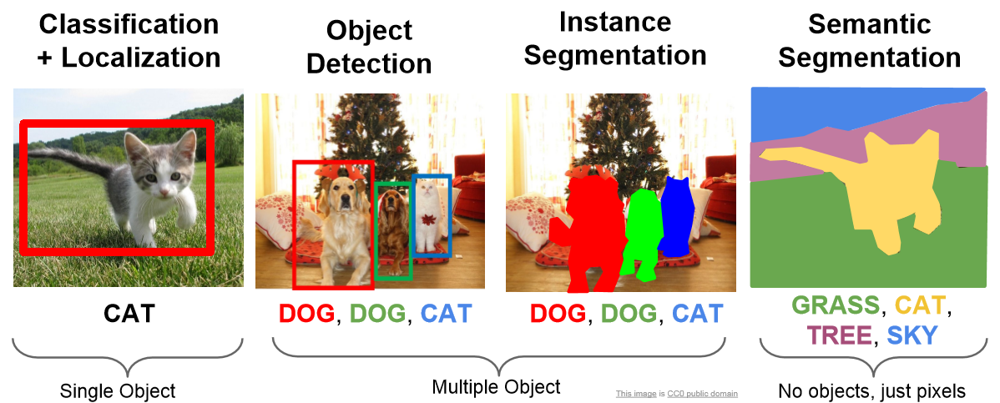
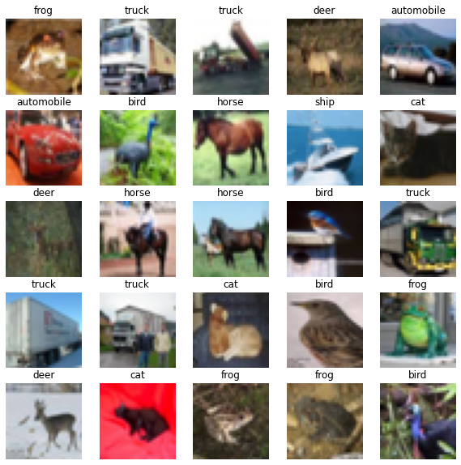

:::::::::::::::::::::::::::::::::::::: questions

- What is machine learning and what is it used for?
- What is deep learning?
- How do I use a neural network for image classification?

::::::::::::::::::::::::::::::::::::::::::::::::

::::::::::::::::::::::::::::::::::::: objectives

- Explain the difference between artificial intelligence, machine learning and deep learning
- Explain how machine learning is used for regression and classification tasks
- Understand what algorithms are used for image classification
- Know the difference between training, testing, and validation datasets
- Perform an image classification using a convolutional neural network (CNN)

::::::::::::::::::::::::::::::::::::::::::::::::

## What is machine learning?
Machine learning is a set of tools and techniques which let us find patterns in data. This lesson will introduce you to only one of these techniques, **Deep Learning** with **Convolutional Neural Network**, abbreviated as **CNN**, but there are many more.

The techniques break down into two broad categories, predictors and classifiers. Predictors are used to predict a value (or set of values) given a set of inputs, for example trying to predict the cost of something given the economic conditions and the cost of raw materials or predicting a country’s GDP given its life expectancy. Classifiers try to classify data into different categories, or assign a label; for example, deciding what characters are visible in a picture of some writing or if a message is spam or not.

## Training Data

Many (but not all) machine learning systems “learn” by taking a series of input data and output data and using it to form a model. The maths behind the machine learning doesn’t care what the data is as long as it can represented numerically or categorised. Some examples might include:

- predicting a person’s weight based on their height
- predicting house prices given stock market prices
- classifying if an email is spam or not
- classifying an image as eg, person, place, or particular object

Typically we will need to train our models with hundreds, thousands or even millions of examples before they work well enough to do any useful predictions or classifications with them.


## Deep Learning, Machine Learning and Artificial Intelligence

Deep Learning (DL) is just one of many machine learning techniques, in which people often talk about machine learning being a form of artificial intelligence (AI). Definitions of artificial intelligence vary, but usually involve having computers mimic the behaviour of intelligent biological systems. Since the 1950s many works of science fiction have dealt with the idea of an artificial intelligence which matches (or exceeds) human intelligence in all areas. Although there have been great advances in AI and ML research recently, we can only come close to human like intelligence in a few specialist areas and are still a long way from a general purpose AI. The image below shows some differences between artificial intelligence, machine learning and deep learning.

![The image above is by Tukijaaliwa, CC BY-SA 4.0, via Wikimedia Commons, [original source]](fig/01_AI_ML_DL_differences.png){alt='Three nested circles describing AI as the largest circle in dark blue; enclosing machine learning in medium blue; enclosing deep learning in even lighter blue'}

::::::::::::::::::::::::::::::::::::::::: callout
Concept: Differentiation between traditional Machine Learning models and Deep Learning models:

**Traditional ML algorithms** can only use one (possibly two layers) of data transformation to calculate an output (shallow models). With high dimensional data and growing feature space (possible set of values for any given feature), shallow models quickly run out of layers to calculate outputs. 

**Deep neural networks** (constructed with multiple layers of neurons) are the extension of shallow models with three layers: input, hidden, and outputs layers. The hidden layer is where learning takes place. As a result, deep learning is best applied to large datasets for training and prediction. As observations and feature inputs decrease, shallow ML approaches begin to perform noticeably better. 
:::::::::::::::::::::::::::::::::::::::::::::::::


## What is image classification?

Image classification is a fundamental task in computer vision, which is a field of artificial intelligence focused on teaching computers to interpret and understand visual information from the world. Image classification specifically involves the process of assigning a label or category to an input image. The goal is to enable computers to recognize and categorize objects, scenes, or patterns within images, just as a human would. Image classification can refer to one of several tasks:

{alt='Four types of image classification tasks include semantic segmentation where every pixel is labelled; classification and localization that detects a single object like a cat; object detection that detects multiple objects like cats and dogs; and instance segmentation that detects each pixel of multiple objects'}

Image classification has numerous practical applications, including:

- **Object Recognition**: Identifying objects within images, such as cars, animals, or household items.
- **Medical Imaging**: Diagnosing diseases from medical images like X-rays or MRIs.
- **Quality Control**: Inspecting products for defects on manufacturing lines.
- **Autonomous Vehicles**: Identifying pedestrians, traffic signs, and other vehicles in self-driving cars.
- **Security and Surveillance**: Detecting anomalies or unauthorized objects in security footage.

Convolutional Neural Networks (CNNs) have become a cornerstone in image classification due to their ability to automatically learn hierarchical features from images and achieve remarkable performance on a wide range of tasks.

## Deep Learning Workflow
To apply Deep Learning to a problem there are several steps we need to go through:

### Step 1. Formulate / Outline the problem
Firstly we must decide what it is we want our Deep Learning system to do. This lesson is all about image classification so our aim is to put an image into one of a few categories. Specifically in our case, we will be looking at 10 categories: airplane, automobile, bird, cat, deer, dog, frog, horse, ship, truck

### Step 2. Identify inputs and outputs
Next we need to identify what the inputs and outputs of the neural network will be. In our case, the data is images and the inputs could be the individual pixels of the images. We are performing a classification problem and we will have one output for each potential class.

### Step 3. Prepare data
Many datasets are not ready for immediate use in a neural network and will require some preparation. Neural networks can only really deal with numerical data, so any non-numerical data (eg images) will have to be somehow converted to numerical data. Information on how this is done and what the data looks like will be explored in the next episode [Introduction to Image Data](episodes/02-image-data).

For this lesson, we will use an existing image dataset known as CIFAR-10. We will introduce this dataset and the different data preparation tasks in more detail in the next episode but for this introduction, we want to divide the data into **training** and **validation** subsets; normalize the image pixel values to be between 0 and 1; and one-hot encode our image labels.

#### Preparing the code

It is the goal of this training workshop to produce a Deep Learning program, using a Convolutional Neural Network.  At the end of this workshop, we hope that this code can be used as a "starting point".  We will be creating an "initial program" for this introduction chapter, that will be copied and used as a foundation for the rest of the episodes.

```python
# load the required packages
from tensorflow import keras # library for neural networks 
import matplotlib.pyplot as plt # library for plotting
from icwithcnn_functions import prepare_image_icwithcnn # custom function

# load the cifar dataset included with the keras library
(train_images, train_labels), (val_images, val_labels) = keras.datasets.cifar10.load_data()

# normalize the RGB values to be between 0 and 1
train_images = train_images / 255.0
val_images = val_images / 255.0

# create a list of class names
class_names = ['airplane', 'automobile', 'bird', 'cat', 'deer', 'dog', 'frog', 'horse', 'ship', 'truck']

# one-hot encode labels
train_labels = keras.utils.to_categorical(train_labels, len(class_names))
val_labels = keras.utils.to_categorical(val_labels, len(class_names))
```

::::::::::::::::::::::::::::::::::::: challenge 

## Challenge Examine the CIFAR-10 dataset

Explain the output of these commands?

```python
print('Train: Images=%s, Labels=%s' % (train_images.shape, train_labels.shape))
print('Validate: Images=%s, Labels=%s' % (val_images.shape, val_labels.shape))
```

:::::::::::::::::::::::: solution 

## Output
 
```output
Train: Images=(50000, 32, 32, 3), Labels=(50000, 10)
Validate: Images=(10000, 32, 32, 3), Labels=(10000, 10)
```
The training set consists of 50000 images of 32x32 pixels and 3 channels (RGB values) and labels.

The validation set consists of 10000 images of 32x32 pixels and 3 channels (RGB values) and labels.

:::::::::::::::::::::::::::::::::
::::::::::::::::::::::::::::::::::::::::::::::::


#### Visualize a subset of the CIFAR-10 dataset

```python
# create a figure object and specify width, height in inches
plt.figure(figsize=(10,10))

# plot a subset of the images 
for i in range(25):
    plt.subplot(5,5,i+1)
    plt.imshow(train_images[i], cmap=plt.cm.binary)
    plt.axis('off')
    plt.title(class_names[train_labels[i,].argmax()])
plt.show()
```

{alt='Subset of 25 CIFAR-10 images displayed in five rows and five columns '}

### Step 4. Choose a pre-trained model or build a new architecture from scratch

Often we can use an existing neural network instead of designing one from scratch. Training a network can take a lot of time and computational resources. There are a number of well publicised networks which have been shown to perform well at certain tasks. If you know of one which already does a similar task well, then it makes sense to use one of these.

If instead we decide we do want to design our own network then we need to think about how many input neurons it will have, how many hidden layers and how many outputs, what types of layers we use (we will explore the different types later on). This will probably need some experimentation and we might have to try tweaking the network design a few times before we see acceptable results.

Here we present an initial model that will be explained in detail later on:

#### Define the Model

```python
# CNN Part 1
# Input layer of 32x32 images with three channels (RGB)
inputs_intro = keras.Input(shape=train_images.shape[1:])

# CNN Part 2
# Convolutional layer with 32 filters, 3x3 kernel size, and ReLU activation
x_intro = keras.layers.Conv2D(32, (3, 3), activation='relu')(inputs_intro)
# Pooling layer with input window sized 2,2
x_intro = keras.layers.MaxPooling2D((2, 2))(x_intro)
# Second Convolutional layer with 64 filters, 3x3 kernel size, and ReLU activation
x_intro = keras.layers.Conv2D(64, (3, 3), activation='relu')(x_intro)
# Second Pooling layer with input window sized 2,2
x_intro = keras.layers.MaxPooling2D((2, 2))(x_intro)
# Flatten layer to convert 2D feature maps into a 1D vector
x_intro = keras.layers.Flatten()(x_intro)
# Dense layer with 128 neurons and ReLU activation
x_intro = keras.layers.Dense(128, activation='relu')(x_intro)

# CNN Part 3
# Output layer with 10 units (one for each class)
outputs_intro = keras.layers.Dense(10, activation='softmax')(x_intro)

# create the model
model_intro = keras.Model(inputs=inputs_intro, outputs=outputs_intro, name="cifar_model_intro")
```

### Step 5. Choose a loss function and optimizer

The loss function tells the training algorithm how far away the predicted value was from the true value. We will look at choosing a loss function in more detail later on.

The optimizer is responsible for taking the output of the loss function and then applying some changes to the weights within the network. It is through this process that the “learning” (adjustment of the weights) is achieved.

```python
# compile the model
model_intro.compile(optimizer = 'adam',
                    loss = keras.losses.CategoricalCrossentropy(),
                    metrics=['accuracy'])
```

### Step 6. Train the model

We can now go ahead and start training our neural network. We will probably keep doing this for a given number of iterations through our training dataset (referred to as epochs) or until the loss function gives a value under a certain threshold.

```python
# fit the model
history_intro = model_intro.fit(train_images, train_labels, epochs = 10, 
                                validation_data = (val_images, val_labels),
                                batch_size=32)

# save the model
model_intro.save('fit_outputs/model_intro.h5')
```
Your output will begin to print similar to the output below:
```output
Epoch 1/10

1563/1563 [==============================] - 5s 3ms/step - loss: 1.4011 - accuracy: 0.5046 - val_loss: 1.3644 - val_accuracy: 0.5243
```
::::::::::::::::::::::::::::::::::::::::: spoiler 

### What does this output mean?

This output printed during the fit phase, i.e. training the model against known image labels, can be broken down as follows:

- `Epoch` describes the number of full passes over all *training data*. In the output above there are **1563 training observations**. This number is calculated as the total number of images used as input divided by the batch size (50000/32). An epoch will conclude and move to the next epoch after a training pass over all 1563 observations.

- `loss` and `val_loss` can be considered as related. Where `loss` is a value the model will attempt to minimise, and is the distance between the true label of an image and the models prediction. Minimising this distance is where *learning* occurs to adjust weights and bias which reduce `loss`. On the other hand `val_loss` is a value calculated against the validation data and is a measurement of the models performance against **unseen data**. Both values are a summation of errors made for each example when fitting to the training or validation sets.

- `accuracy` and `val_accuracy` can also be considered as related. Unlike `loss` and `val_loss`, these values are a percentage and are only revelant to **classification problems**. The `val_accuracy` score can be used to communicate a percentage value of model effectiveness on unseen data.

:::::::::::::::::::::::::::::::::::::::::

### Step 7. Perform a Prediction/Classification

After training the network we can use it to perform predictions. This is the mode you would use the network in after you have fully trained it to a satisfactory performance. Doing predictions on a special hold-out set is used in the next step to measure the performance of the network.

```python
# specify a new image and prepare it to match CIFAR-10 dataset
from icwithcnn_functions import prepare_image_icwithcnn

new_img_path = "../data/Jabiru_TGS.JPG" # path to image
new_img_prepped = prepare_image_icwithcnn(new_img_path)

# predict the class name
result_intro = model_intro.predict(new_img_prepped) # make prediction

print(' The predicted probability of each class is: \n', result_intro.round(4))
print('The class with the highest predicted probability is: ', class_names[result_intro.argmax()])
```

```output
The predicted probability of each class is:  [[0.0058 0.714  0.     0.0024 0.     0.     0.2777 0.     0.     0.    ]]
The class with the highest predicted probability is:  automobile
```

::::::::::::::::::::::::::::::::::::::::: callout
My result is different!

While the neural network itself is deterministic, various factors in the training process, system setup, and data variability can lead to small variations in the output. These variations are usually minor and should not significantly impact the overall performance or behavior of the model.

If you are finding significant differences in the model predictions, this could be a sign that the model is not fully converged, where "convergence" refers to the point where the model has reached an optimal or near-optimal state in terms of learning from the training data.
:::::::::::::::::::::::::::::::::::::::::::::::::

Congratulations, you just created your first image classification model and used it to classify an image! 

Unfortunately the classification was incorrect. Why might that be?  and  What can we do about? 

There are many ways we can try to improve the accuracy of our model, such as adding or removing layers to the model definition and fine-tuning the hyperparameters, which takes us to the next steps in our workflow.

### Step 8. Measure Performance

Once we trained the network we want to measure its performance. To do this we use some additional data that was **not** part of the training; this is known as a test set. There are many different methods available for measuring performance and which one is best depends on the type of task we are attempting. These metrics are often published as an indication of how well our network performs.

### Step 9. Tune Hyperparameters

When building image recognition models in Python, especially using libraries like TensorFlow or Keras, the process involves not only designing a neural network but also choosing the best values for various hyperparameters that govern the training process.

#### What are hyperparameters? 

Hyperparameters are all the parameters set by the person configuring the machine learning instead of those learned by the algorithm itself. These hyperparameters can include the learning rate, the number of layers in the network, the number of neurons per layer, and many more. Hyperparameter tuning refers to the process of systematically searching for the best combination of hyperparameters that will optimize the model's performance. One common method for hyperparameter tuning is **grid search**. 

#### What is Grid Search?

Grid Search or **GridSearch** (as per the library function call) is foundation method for hyperparameter tuning. The aim of hyperparameter tuning is to define a grid of possible values for each hyperparameter you want to tune. GridSearch will then evaluate the model performance for each combination of hyperparameters in a brute-force manner, iterating through every possible combination in the grid.

These concepts will be continued, with practical examples, in Episode 05.

### Step 10. Share Model

Now that we have a trained network that performs at a level we are happy with we can go and use it on real data to perform a prediction. At this point we might want to consider publishing a file with both the architecture of our network and the weights which it has learned (assuming we did not use a pre-trained network). This will allow others to use it as as pre-trained network for their own purposes and for them to (mostly) reproduce our result.

We will return to each of these workflow steps throughout this lesson and discuss each component in more detail.

:::::::::::::::::::::::::::::::::::::::::::::::::::::::::::::::::::: instructor

Inline instructor notes can help inform instructors of timing challenges
associated with the lessons. They appear in the "Instructor View"

::::::::::::::::::::::::::::::::::::::::::::::::::::::::::::::::::::::::::::::::

::::::::::::::::::::::::::::::::::::: keypoints

- Machine learning is the process where computers learn to recognise patterns of data
- Machine learning is used for regression and classification tasks
- Deep learning is a subset of machine learning, which is a subset of artificial intelligence
- Convolutional neural networks are well suited for image classification
- To use Deep Learning effectively we need to go through a workflow of: defining the problem, identifying inputs and outputs, preparing data, choosing the type of network, training the model, tuning hyperparameters, measuring performance before we can classify data.
::::::::::::::::::::::::::::::::::::::::::::::::

<!-- Collect your link references at the bottom of your document -->
[original source]: https://en.wikipedia.org/wiki/File:AI-ML-DL.svg
