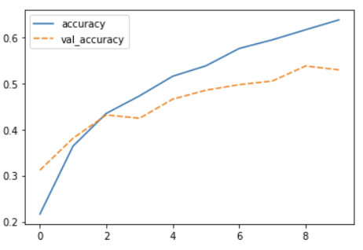

:::::::::::::::::::::::::::::::::::::: questions 

- What is deep learning and what are a few common DL algorithms?
- What is a neural network?
- How do I use a neural network for image classification?


::::::::::::::::::::::::::::::::::::::::::::::::

::::::::::::::::::::::::::::::::::::: objectives

- Explain the difference between artificial intelligence, machine learning and deep learning
- Explain how machine learning is used for regression and classification tasks
- Understand what algorithms are used for image classification
- Demonstrate a convolutional neural network

::::::::::::::::::::::::::::::::::::::::::::::::

## What is Deep Learning?
### Deep Learning, Machine Learning and Artificial Intelligence

Deep Learning (DL) is just one of many techniques collectively known as machine learning. Machine learning (ML) refers to techniques where a computer can "learn" patterns in data, usually by being shown numerous examples to train it. People often talk about machine learning being a form of artificial intelligence (AI). Definitions of artificial intelligence vary, but usually involve having computers mimic the behaviour of intelligent biological systems. Since the 1950s many works of science fiction have dealt with the idea of an artificial intelligence which matches (or exceeds) human intelligence in all areas. Although there have been great advances in AI and ML research recently we can only come close to human like intelligence in a few specialist areas and are still a long way from a general purpose AI. The image below shows some differences between artificial intelligence, Machine Learning and Deep Learning.

![The image above is by Tukijaaliwa, CC BY-SA 4.0, via Wikimedia Commons, [original source]](fig/01_AI_ML_DL_differences.png){alt='Three nested circles describing AI as the largest circle in dark blue; enclosing machine learning in medium blue; enclosing deep learning in even lighter blue'}

## Concept: Differentiation between classical ML models and Deep Learning models
Traditional ML algorithms can only use one (possibly two layers) of data transformation to calculate an output (shallow models). With high dimensional data and growing feature space (possible set of values for any given feature), shallow models quickly run out of layers to calculate outputs. Deep neural networks (constructed with multiple layers of neurons) are the extension of shallow models with three layers: input, hidden, and outputs layers. The hidden layer is where learning takes place. As a result, deep learning is best applied to large datasets for training and prediction. As observations and feature inputs decrease, shallow ML approaches begin to perform noticeably better. 

## Concept: Why deep learning is possible and what infrastructure is best suited to deep learning
Systems with high quality GPUs and/or HPCs if available. [Comment: I feel this is important to note, in order to make it clear that anyone attempting to run neural networks on a standard laptop will quickly reach the upper limit of capacity. By setting this expectation clearly in the course, it could help prevent people from trying to do everything neural net related on their machines and becoming disenfranchise with ML as a result]

## What is image classification?
{alt='Four types of image classification tasks include semantic segmentation where every pixel is labelled; classification and localization that detects a single object like a cat; object detection that detects multiple objects like cats and dogs; and instance segmentation that detects each pixel of multiple objects'}

## Deep Learning workflow
To apply Deep Learning to a problem there are several steps we need to go through:

1. Formulate/ Outline the problem
Firstly we must decide what it is we want our Deep Learning system to do. This lesson is all about image classification so our aim is to put an imaget into one of a few categories?

2. Identify inputs and outputs
Next we need to identify what the inputs and outputs of the neural network will be. In our case, the data is images and the inputs could be the individual pixels of the images.

For the output we are performing a classification problem and we will have one output for each potential class.

3. Prepare data
Many datasets are not ready for immediate use in a neural network and will require some preparation. Neural networks can only really deal with numerical data, so any non-numerical data (eg images) will have to be somehow converted to numerical data.

Next we will need to divide the data into multiple sets. One of these will be used by the training process and we will call it the training set. Another will be used to evaluate the accuracy of the training and we will call that one the test set. Sometimes we will also use a 3rd set known as a validation set to tune hyperparameters.

## Workflow
1. Load the data
1. Define the Model
1. Fit the Model
1. Evaluate the Model
1. Make a prediction (ie classify an image)


### Load data

```python
# load the cifar dataset included with the keras packages
from tensorflow import keras
(train_images, train_labels), (test_images, test_labels) = keras.datasets.cifar10.load_data()
```

::::::::::::::::::::::::::::::::::::: challenge 

## Challenge Load the Cifar10 dataset

Explain the output of these commands?

```python
print('Train: Images=%s, Labels=%s' % (train_images.shape, train_labels.shape))
print('Test: Images=%s, Labels=%s' % (test_images.shape, test_labels.shape))
```

:::::::::::::::::::::::: solution 

## Output
 
```output
Train: Images=(50000, 32, 32, 3), Labels=(50000, 1)
Test: Images=(10000, 32, 32, 3), Labels=(10000, 1)
```
The training set consists of 50000 images of 32x32 pixels and 3 channels (RGB values) and labels.
The test set consists of 10000 images of 32x32 pixels and 3 channels (RGB values) and labels.

:::::::::::::::::::::::::::::::::
::::::::::::::::::::::::::::::::::::::::::::::::

We take a small sample of the data as training set for demonstration purposes.

The RGB values are between 0 and 255. For input of neural networks, it is better to have small input values. So we normalize our data between 0 and 1:

```python
# normalize the RGB values to be between 0 and 1
train_images = train_images / 255.0
test_images = test_images / 255.0
```
The labels are single numbers denoting the class. We map the class numbers back to the class names, taken from the documentation:

```python
# create a list of classnames
class_names = ['airplane', 'automobile', 'bird', 'cat', 'deer', 'dog', 'frog', 'horse', 'ship', 'truck']
```
### Visualize the Cifar10 dataset

```python
# plot a subset of the images
import matplotlib.pyplot as plt
plt.figure(figsize=(10,10))
for i in range(25):
    plt.subplot(5,5,i+1)
    plt.imshow(train_images[i], cmap=plt.cm.binary)
    plt.axis('off')
    plt.title(class_names[train_labels[i,0]])
plt.show()
```

{alt='Subset of 25 Cifar10 images displayed in five rows and five columns '}

4. Build a new architecture from scratch

We need to think about how many input neurons it will have, how many hidden layers and how many outputs, what types of layers we use (we will explore the different types later on). This will probably need some experimentation and we might have to try tweaking the network design a few times before we see acceptable results.
 
### Define the Model

```python
# define the inputs, layers, and outputs of a cnn model
inputs = keras.Input(shape=train_images.shape[1:])
x = keras.layers.Conv2D(50, (3, 3), activation='relu')(inputs)
x = keras.layers.MaxPooling2D((2, 2))(x)
x = keras.layers.Conv2D(50, (3, 3), activation='relu')(x)
x = keras.layers.MaxPooling2D((2, 2))(x)
x = keras.layers.Flatten()(x)
x = keras.layers.Dense(50, activation='relu')(x)
outputs = keras.layers.Dense(10)(x)

# create the model
model = keras.Model(inputs=inputs, outputs=outputs, name="cifar_model_small")

# optimize the model
model.compile(optimizer='adam', loss=keras.losses.SparseCategoricalCrossentropy(from_logits=True), metrics=['accuracy'])
```
6. Train the model

We can now go ahead and start training our neural network. We will probably keep doing this for a given number of iterations through our training dataset (referred to as epochs) or until the loss function gives a value under a certain threshold. The graph below show the loss against the number of epochs, generally the loss will go down with each epoch, but occasionally it will see a small rise.

### Fit the Model

```python
# fit the model
history = model.fit(train_images, train_labels, epochs=10, validation_data=(test_images, test_labels))
``` 

### Evaluate the Model

We can plot the training process using the history:
```python
import seaborn as sns
import pandas as pd

# plot the accuracy from the training process
history_df = pd.DataFrame.from_dict(history.history)
sns.lineplot(data=history_df[['accuracy', 'val_accuracy']])
```
{alt='Line plot of training loss in solid blue and validation loss where both lines decrease over each epoch but with a decreasing negative slope'}

```python
# plot the loss from the training process
sns.lineplot(data=history_df[['loss', 'val_loss']])
```

{alt='Line plot of training accuracy in solid blue and validation accuracy in dotted orange where both line increase over each epoch with a decreasing postive slope'}

It seems that the model is overfitting somewhat, because the validation accuracy and loss stagnates.

```python
# calculate the loss and accuracy of the training process
test_loss, test_acc = model.evaluate(test_images, test_labels, verbose=2)
print('Accuracy:', round(test_acc,2))
``` 
```output
Accuracy: 0.68
```

### Save the model

```python
# save the model
model.save('01_intro_model.h5')
``` 
7. Perform a Prediction/Classification

After training the network we can use it to perform predictions. This is the mode you would use the network in after you have fully trained it to a satisfactory performance. Doing predictions on a special hold-out set is used in the next step to measure the performance of the network.

### Make a prediction

```python
from tensorflow.keras.utils import load_img
from tensorflow.keras.utils import img_to_array

# load a new image and prepare it to match cifar10 dataset
new_img_pil = load_img("Jabiru_TGS.JPG", target_size=(32,32)) # Image format
new_img_arr = img_to_array(new_img_pil) # convert to array for analysis
new_img_reshape = new_img_arr.reshape(1, 32, 32, 3) # reshape into single sample
new_img_float =  new_img_reshape.astype('float64') / 255.0 # normalize

# predict the classname
result = model.predict(new_img_float) # make prediction
print(result) # probability for each class
print(class_names[result.argmax()]) # class with highest probability
```

```output
Result: [[-2.0185328   9.337507   -2.4551604  -0.4688053  -4.599108   -3.5822825
   6.427376   -0.09437321  0.82065487  1.2978227 ]]
Class name: automobile
```

Congratulations, you just created your first image classification model and used it to classify an image! 

Unfortunately the classification was incorrect! What can we do about?

There are many ways we can try to improve the accuracy of our model, such as adding or removing layers to the model definition and fine-tuning the hyperparameters. 

We will discuss these options later in the lesson but first let us take a step back and spend a bit more time discussing each workflow component in depth.

:::::::::::::::::::::::::::::::::::::::::::::::::::::::::::::::::::: instructor

Inline instructor notes can help inform instructors of timing challenges
associated with the lessons. They appear in the "Instructor View"

::::::::::::::::::::::::::::::::::::::::::::::::::::::::::::::::::::::::::::::::

::::::::::::::::::::::::::::::::::::: keypoints

- Deep learning is a subset of machine learning, which is a subset of artificial intelligence
- Machine learning is used for regression and classification tasks
- Convolutional neural networks are well suited for image classification

::::::::::::::::::::::::::::::::::::::::::::::::

[r-markdown]: https://rmarkdown.rstudio.com/

<!-- Collect your link references at the bottom of your document -->
[original source]: https://en.wikipedia.org/wiki/File:AI-ML-DL.svg
