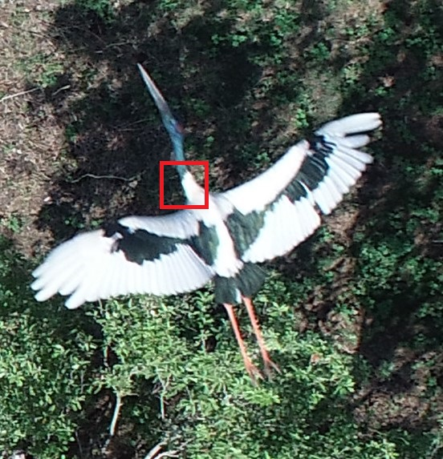
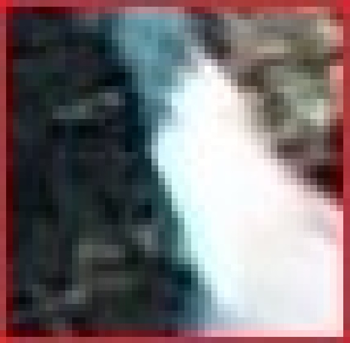

:::::::::::::::::::::::::::::::::::::: questions 

- How are images represented in digital format?
- Where can I find image data to train my model?
- How do I plot image data in python?
- How do I prepare image data for use in a convolutional neural network (CNN)?
- What is one hot encoding?
- How much data do you need for Deep Learning?

::::::::::::::::::::::::::::::::::::::::::::::::

::::::::::::::::::::::::::::::::::::: objectives

- Identify sources of image data
- Write code to plot image data
- Understand the properties of image data
- Prepare an image data set to train a convolutional neural network (CNN)
- Know how to perform one-hot encoding

::::::::::::::::::::::::::::::::::::::::::::::::

## Deep Learning Workflow

Let's start over with the first steps in our workflow.

### Step 1. Formulate/ Outline the problem

Firstly we must decide what it is we want our Deep Learning system to do. This lesson is all about image classification so our aim is to put an image into one of a few categories.

### Step 2. Identify inputs and outputs

Next we need to identify what the inputs and outputs of the neural network will be. In our case, the data is images and the inputs could be the individual pixels of the images. 

We are performing a classification problem and we will have one output for each potential class.

### Step 3. Prepare data

Deep Learning requires extensive training using example data which shows the network what output it should produce for a given input. In this workshop our network will be trained by being “shown” a series of images and told what they contain. Once the network is trained it should be able to take another image and correctly classify its contents.

We will use an existing image dataset known as CINIC-10 that we saw in the introduction. Let's explore this dataset in more detail and talk about steps you would take to make your own dataset.

#### Pre-existing image data

In some cases you will be able to download an image dataset that is already labelled and can be used to classify a number of different object like we see with the CINIC-10 dataset. Other examples include:

- [MNIST database] - 60,000 training images of handwritten digits (0-9)
- [ImageNet] - 14 million hand-annotated images indicating objects from more than 20,000 categories. ImageNet sponsors an [annual software contest] where programs compete to achieve the highest accuracy. When choosing a pretrained network, the winners of these sorts of competitions are generally a good place to start.
- [MS COCO] - >200,000 labelled images used for object detection, instance segmentation, keypoint analysis, and captioning

Where labelled data exists, in most cases the data provider or other users will have created functions that you can use to help load the data:

```python
# load the CINIC-10 dataset
from cinic10 # python script needs to be in available

image_dir = '/path/to/dataset/folder'
(train_images, train_labels), (val_images, val_labels) = cinic10.loadData("/path/to/dataset/folder", oneHot=True)
```

In this instance the data is likely already prepared for use in a CNN. However, it is always a good idea to read any associated documentation to find out what steps the data providers took.

#### Custom image data

In other cases, you will need to create your own set of labelled images. 

**Custom data i. Data collection and Labeling:**

For image classification the label applies to the entire image; object detection requires bounding boxes, and instance or semantic segmentation requires each pixel to be labelled.

There are a number of different software that can be used to label your dataset, including:

- (Visual Geometry Group) [VGG Image Annotator] (VIA)

:::::::::::::::::::::::::::::::::::::: callout

How much data do you need for Deep Learning?

The rise of Deep Learning is partially due to the increased availability of very large datasets. But how much data do you actually need to train a Deep Learning model? Unfortunately, this question is not easy to answer. It depends, among other things, on the complexity of the task (which you often do not know beforehand), the quality of the available dataset and the complexity of the network. For complex tasks with large neural networks, we often see that adding more data continues to improve performance. However, this is also not a generic truth: if the data you add is too similar to the data you already have, it will not give much new information to the neural network.

In case you have too little data available to train a complex network from scratch, it is sometimes possible to use a pretrained network that was trained on a similar problem. Another trick is data augmentation, where you expand the dataset with artificial data points that could be real. An example of this is mirroring images when trying to classify cats and dogs. An horizontally mirrored animal retains the label, but exposes a different view.
:::::::::::::::::::::::::::::::::::::::::::::::

**Custom data ii. Data preprocessing:**

This step involves various tasks to enhance the quality and consistency of the data:

- **Resizing**: Resize images to a consistent resolution (e.g., 224x224) to ensure uniformity and reduce computational load.

- **Normalization**: Scale pixel values to a common range, often between 0 and 1 or -1 and 1. Normalization helps the model converge faster during training.

- **Data Augmentation**: Apply random transformations (e.g., rotations, flips, shifts) to create new variations of the same image. This helps improve the model's robustness and generalization by exposing it to more diverse data.

- **Handling Color Channels**: Depending on the model and library you use, you might need to handle different color channel orders (RGB, BGR, etc.).

- **Handling Data Formats**: Convert image data to a format suitable for your deep learning framework (e.g., NumPy arrays or TensorFlow tensors).

Before we look at some of these tasks in more detail we need to understand that the images we see on hard copy, view with our electronic devices, or process with our programs are represented and stored in the computer as numeric abstractions, or approximations of what we see with our eyes in the real world. And before we begin to learn how to process images with Python programs, we need to spend some time understanding how these abstractions work.

### Pixels

It is important to realise that images are stored as rectangular arrays of hundreds, thousands, or millions of discrete "picture elements," otherwise known as pixels. Each pixel can be thought of as a single square point of coloured light.

For example, consider this image of a maize seedling, with a square area designated by a red box:

{alt='Original size image of a Jabiru with a red square surrounding an area to zoom in on'}

Now, if we zoomed in close enough to see the pixels in the red box, we would see something like this:

{alt='Enlarged image area of Jabiru'}

Note that each square in the enlarged image area - each pixel - is all one colour, but that each pixel can have a different colour from its neighbors. Viewed from a distance, these pixels seem to blend together to form the image we see.

### Working with Pixels

As noted, in practice, real world images will typically be made up of a vast number of pixels, and each of these pixels will be one of potentially millions of colours. In python, an image can be represented as a multidimensional array, also known as a tensor, where each element in the array corresponds to a pixel value in the image. In the context of images, these arrays often have dimensions for height, width, and color channels (if applicable).

::::::::::::::::::::::::::::::::::::::::: callout

Matrices, arrays, images and pixels

The matrix is mathematical concept - numbers evenly arranged in a rectangle. This can be a two dimensional rectangle, like the shape of the screen you're looking at now. Or it could be a three dimensional equivalent, a cuboid, or have even more dimensions, but always keeping the evenly spaced arrangement of numbers. In computing, array refers to a structure in the computer's memory where data is stored in evenly-spaced elements. This is strongly analogous to a matrix. A NumPy array is a type of variable (a simpler example of a type is an integer). For our purposes, the distinction between matrices and arrays is not important, we don't really care how the computer arranges our data in its memory. The important thing is that the computer stores values describing the pixels in images, as arrays. And the terms matrix and array can be used interchangeably.

::::::::::::::::::::::::::::::::::::::::::::::::::

::::::::::::::::::::::::::::::::::::::::: callout

Python image libraries

Two of the most commonly used libraries for image representation and manipulation are NumPy and Pillow (PIL). Additionally, when working with deep learning frameworks like TensorFlow and PyTorch, images are often represented as tensors within these frameworks.

- NumPy is a powerful library for numerical computing in Python. It provides support for creating and manipulating arrays, which can be used to represent images as multidimensional arrays.
  - `import numpy as np`

- The Pillow library (PIL fork) provides functions to open, manipulate, and save various image file formats. It represents images using its own Image class.
  - `from PIL import Image`

- TensorFlow images are often represented as tensors that have dimensions for batch size, height, width, and color channels. This framework provide tools to load, preprocess, and work with image data seamlessly. Note 
  -`from tensorflow import keras`

::::::::::::::::::::::::::::::::::::::::::::::::::

Let us start by looking at the image we used in the introduction.

```python
# load the libraries required
from keras.utils import img_to_array
from keras.utils import load_img

# specify the image path
new_img_path = "../data/Jabiru_TGS.JPG" # path to image

# read in the image with default arguments
new_img_pil = load_img(new_img_path)

# confirm the data class and size
print('The new image is of type :', new_img.__class__, 'and has the size', new_img.size)

# convert the Image into an array for processing
new_img_arr = img_to_array(new_img_pil)

# confirm the data class and shape
print('The new image is of type :', new_img_arr.__class__, 'and has the shape', new_img_arr.shape)
```
```output
The new image is of type : <class 'PIL.JpegImagePlugin.JpegImageFile'> and has the size (552, 573)
The new image is of type : <class 'numpy.ndarray'> and has the shape (573, 552, 3)
```

### Image Dimensions - Resizing

Here we see our new image has shape `(573, 552, 3)`, meaning it is much larger in size, 573x552 pixels, and also consists of 3 colour channels.

Recall from the introduction that our training data set consists of 50000 images of 32x32 pixels and 3 channels (RGB values) and labels. 

To reduce the computational load and ensure all of our images have a uniform size, we need to choose an image resolution (or size in pixels) and ensure that all of the images we use are resized to that shape to be consistent.

There are a couple of ways to do this in python but one way is to specify the size you want using an argument to the 'load_image()' function from `keras.utils`.

```
# read in the new image and specify the size to be the same as our training images
new_img_pil_small = load_img(path_to_img, target_size=(32,32))

# confirm the data class and shape
print('The new image is still of type:', new_img_pil_small.__class__, 'and has the reduced shape', new_img_pil_small.shape)
```

### Image Colours

RGB Images:

- For image classification tasks, RGB images are used because they capture the full spectrum of colors that human vision can perceive, allowing the model to learn intricate features and patterns present in the images.

- RGB (Red, Green, Blue) images have three color channels: red, green, and blue, with each channel having an intensity value that ranges from 0 to 255. Each channel represents the intensity of the corresponding color for each pixel. This results in a 3D array, where the dimensions are height, width, and color channel. 

While RGB is the most common representation, there are scenarios where other color spaces might be considered, such as:

Grayscale Images:

- Grayscale images have only one channel, representing the intensity of the pixels. Each pixel's intensity is usually represented by a single numerical value that ranges from 0 (black) to 255 (white). The image is essentially a 2D array where each element holds the intensity value of the corresponding pixel.

- In cases where color information isn't critical, you might convert RGB images to grayscale to reduce the computational load.

::::::::::::::::::::::::::::::::::::::::: callout

Keras Image data loading

Note that the keras.utils for image data loading offer far more capability than we are using here. For example:

- use load_img() to specify the image size and the colour pallette
- use image_dataset_from_directory() to perform these actions are multiple images

See the Keras API for more [Image data loading] capabilities.

::::::::::::::::::::::::::::::::::::::::::::::::::

### Normalization

Image RGB values are between 0 and 255. As input for neural networks, it is better to have small input values. The process of converting the RGB values to be between 0 and 1 is called normalization.

We already saw how to do this in the introduction:
```python

# check the image values
print('The new image is still of type:', new_img_pil_small.__class__, 'and has the reduced shape', new_img_pil_small.values)

# normalize the RGB values to be between 0 and 1
new_img_pil_small_norm = new_img_pil_small / 255.0


```


## Split data into training and validation set

In the previous episode we saw that the keras installation includes the Cifar-10 dataset and that by using the cifar10.load_data() method the returned data is already split into two. In this instance, there is no test data.

When using a different dataset, or loading a your own, you will need to do the split yourself. Keep in mind you will also need to a validation set.

::::::::::::::::::::::::::::::::::::::::: callout
ChatGPT

Data is typically split into the training, validation, and test data sets using a process called data splitting or data partitioning. There are various methods to perform this split, and the choice of technique depends on the specific problem, dataset size, and the nature of the data. Here are some common approaches:

a. **Hold-Out Method:**

- In the hold-out method, the dataset is divided into two parts initially: a training set and a test set.

- The training set is used to train the model, and the test set is kept completely separate to evaluate the model's final performance.

- This method is straightforward and widely used when the dataset is sufficiently large.

b. **Train-Validation-Test Split:**

- The dataset is split into three parts: the training set, the validation set, and the test set.

- The training set is used to train the model, the validation set is used to tune hyperparameters and prevent overfitting during training, and the test set is used to assess the final model performance.

- This method is commonly used when fine-tuning model hyperparameters is necessary.

c. **K-Fold Cross-Validation:**

- In k-fold cross-validation, the dataset is divided into k subsets (folds) of roughly equal size.

- The model is trained and evaluated k times, each time using a different fold as the test set while the remaining k-1 folds are used as the training set.

- The final performance metric is calculated as the average of the k evaluation results, providing a more robust estimate of model performance.

- This method is particularly useful when the dataset size is limited, and it helps in better utilizing available data.

d. **Stratified Sampling:**

- Stratified sampling is used when the dataset is imbalanced, meaning some classes or categories are underrepresented.

- The data is split in such a way that each subset (training, validation, or test) maintains the same class distribution as the original dataset.

- This ensures that all classes are well-represented in each subset, which is important to avoid biased model evaluation.

It's important to note that the exact split ratios (e.g., 80-10-10 or 70-15-15) may vary depending on the problem, dataset size, and specific requirements. Additionally, data splitting should be performed randomly to avoid introducing any biases into the model training and evaluation process.
:::::::::::::::::::::::::::::::::::::::::::::::::

To split a cleaned dataset into a training and test set we will use a very convenient function from sklearn called `train_test_split`.

```python
from sklearn.model_selection import train_test_split

X_train, X_test, y_train, y_test = train_test_split(your_data, target, test_size=0.2, random_state=0, shuffle=True, stratify=target)
```

TODO need some test data - maybe not use cifar in this section?

This function takes a number of parameters:

- The first two are the dataset and the corresponding targets.

- Next is the named parameter test_size this is the fraction of the dataset that is used for testing, in this case 0.2 means 20% of the data will be used for testing.

- random_state controls the shuffling of the dataset, setting this value will reproduce the same results (assuming you give the same integer) every time it is called.

- shuffle which can be either True or False, it controls whether the order of the rows of the dataset is shuffled before splitting. It defaults to True.

- stratify is a more advanced parameter that controls how the split is done. By setting it to target the train and test sets the function will return will have roughly the same proportions as the dataset.

::::::::::::::::::::::::::::::::::::: challenge
TRAINING AND TEST SETS

Take a look at the training and test set we created. - How many samples do the training and test sets have? - Are the classes in the training set well balanced?

:::::::::::::::::::::::: solution 

TODO will depend on data - see ep02 deep learning for ex on penguins

:::::::::::::::::::::::::::::::::
::::::::::::::::::::::::::::::::::::::::::::::::

## One-hot encoding

A neural network can only take numerical inputs and outputs, and learns by calculating how “far away” the species predicted by the neural network is from the true species. When the target is a string category column as we have here it is very difficult to determine this “distance” or error. Therefore we will transform this column into a more suitable format. Again there are many ways to do this, however we will be using the one-hot encoding. This encoding creates multiple columns, as many as there are unique values, and puts a 1 in the column with the corresponding correct class, and 0’s in the other columns.

TBC

## Image augmentation

TBC

# Preexisting datasets

TBD

Now that our dataset is ready to go, let us move on to how to build an architecture.

:::::::::::::::::::::::::::::::::::::::::::::::::::::::::::::::::::: instructor

Inline instructor notes can help inform instructors of timing challenges
associated with the lessons. They appear in the "Instructor View"

::::::::::::::::::::::::::::::::::::::::::::::::::::::::::::::::::::::::::::::::

::::::::::::::::::::::::::::::::::::: keypoints 

- Use `.md` files for episodes when you want static content
- Use `.Rmd` files for episodes when you need to generate output
- Run `sandpaper::check_lesson()` to identify any issues with your lesson
- Run `sandpaper::build_lesson()` to preview your lesson locally

::::::::::::::::::::::::::::::::::::::::::::::::

<!-- Collect your link references at the bottom of your document -->
[MNIST database]: https://en.wikipedia.org/wiki/MNIST_database
[ImageNet]: https://www.image-net.org/
[annual software contest]: https://www.image-net.org/challenges/LSVRC/#:~:text=The%20ImageNet%20Large%20Scale%20Visual,image%20classification%20at%20large%20scale.
[MS COCO]: https://cocodataset.org/#home

[VGG Image Annotator]: https://www.robots.ox.ac.uk/~vgg/software/via/
[[Image data loading]: https://keras.io/api/data_loading/image/
