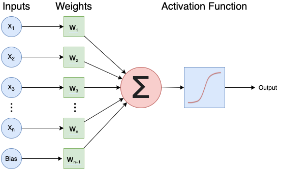
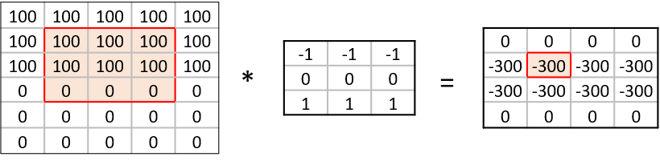
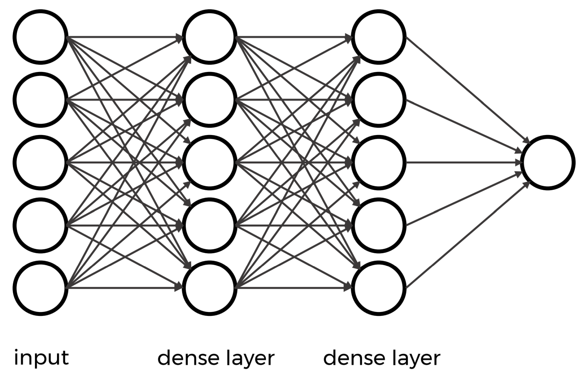

:::::::::::::::::::::::::::::::::::::: questions

- What is a (artificial) neural network (ANN)?
- How is a convolutional neural network (CNN) different from an ANN?
- What are the types of layers used to build a CNN?

::::::::::::::::::::::::::::::::::::::::::::::::

::::::::::::::::::::::::::::::::::::: objectives

- Understand how a convolutional neural network (CNN) differs from an artificial neural network (ANN).
- Explain the terms: kernel, filter.
- Know the different layers: convolutional, pooling, flatten, dense.

::::::::::::::::::::::::::::::::::::::::::::::::

## Neural Networks

A **neural network** is an artificial intelligence technique loosely based on the way neurons in the brain work. 

### A single nueron
A neural network consists of connected computational units called **neurons**. Each neuron will:

- Take one or more inputs ($x_1, x_2, ...$), e.g., input data expressed as floating point numbers.
- Conduct three main operations most of the time:
    - Calculate the weighted sum of the inputs where ($w_1, w_2, ... $) indicate weights
    - Add an extra constant weight (i.e. a bias term) to this weighted sum
    - Apply a non-linear function to the output so far (using a predefined activation function such as the ReLU function)
- Return one output value, again a floating point number.

One example equation to calculate the output for a neuron is: $output=ReLU(∑i(xi∗wi)+bias)$

{alt='diagram of a single neuron taking multiple inputs and their associated weights in and then applying an activation function to predict a single output'}

### Combining multiple neurons into a network

Multiple neurons can be joined together by connecting the output of one to the input of another. These connections are associated with weights that determine the 'strength' of the connection, and the weights are adjusted during training. In this way, the combination of neurons and connections describe a computational graph, an example can be seen in the image below. 

In most neural networks neurons are aggregated into layers. Signals travel from the input layer to the output layer, possibly through one or more intermediate layers called hidden layers. The image below illustrates an example of a neural network with three layers, each circle is a neuron, each line is an edge and the arrows indicate the direction data moves in.

![The image above is by Glosser.ca, [CC BY-SA 3.0], via Wikimedia Commons, [original source]](fig/03_neural_net.png){alt='diagram of a neural with four neurons taking multiple inputs and their weights and predicting multiple outputs'}

Neural networks aren't a new technique, they have been around since the late 1940s. But until around 2010 neural networks tended to be quite small, consisting of only 10s or perhaps 100s of neurons. This limited them to only solving quite basic problems. Around 2010 improvements in computing power and the algorithms for training the networks made much larger and more powerful networks practical. These are known as deep neural networks or Deep Learning.

## Convolutional Neural Networks

A convolutional neural network (CNN) is a type of artificial neural network (ANN) most commonly applied to analyze visual imagery. They are designed to recognize the spatial structure of images when extracting features.

### Step 4. Build an architecture from scratch or choose a pretrained model

Let us explore how to build a neural network from scratch. Although this sounds like a daunting task, with Keras it is surprisingly straightforward. With Keras you compose a neural network by creating layers and linking them together.

### Parts of a neural network

There are three main components of a neural network:

- CNN Part 1. Input Layer
- CNN Part 2. Hidden Layers
- CNN Part 3. Output Layer

The output from each layer becomes the input to the next layer.

#### CNN Part 1. Input Layer

The Input in Keras gets special treatment when images are used. Keras automatically calculates the number of inputs and outputs a specific layer needs and therefore how many edges need to be created. This means we must let Keras know how big our input is going to be. We do this by instantiating a `keras.Input` class and pass it a tuple to indicate the dimensionality of the input data.

The input layer is created with the `keras.Input` function and its first parameter is the expected shape of the input:

```
keras.Input(shape=None, batch_size=None, dtype=None, sparse=None, batch_shape=None, name=None, tensor=None)
```

In our case, the shape of an image is defined by its pixel dimensions and number of channels:

```python
# recall the shape of the images in our dataset
print(train_images.shape)
```
```output
(40000, 32, 32, 3) # number of images, image width in pixels, image height in pixels, number of channels (RGB)
```

::::::::::::::::::::::::::::::::::::: challenge 

## CHALLENGE Create the input layer for our network

Hint 1: Specify shape argument only and use defaults for the rest.

Hint 2: The shape of our input dataset includes the total number of images. We want to take a slice of the shape for a single individual image to use an input.


```python
    # CNN Part 1
    # Input layer of 32x32 images with three channels (RGB)
   inputs_intro = keras.Input(#blank#)
```

:::::::::::::::::::::::: solution 

```output
    # CNN Part 1
    # Input layer of 32x32 images with three channels (RGB)
   inputs_intro = keras.Input(shape=train_images.shape[1:])
```

:::::::::::::::::::::::::::::::::
::::::::::::::::::::::::::::::::::::::::::::::::


#### CNN Part 2. Hidden Layers

The next component consists of the so-called hidden layers of the network. The reason they are referred to as hidden is because the true values of their nodes are unknown.

In a CNN, the hidden layers typically consist of convolutional, pooling, reshaping (e.g., Flatten), and dense layers. 

Check out the [Layers API] section of the Keras documentation for each layer type and its parameters.


##### **Convolutional Layers**

A **convolutional** layer is a fundamental building block in a CNN designed for processing structured grid data, such as images. It applies convolution operations to input data using learnable filters or kernels, extracting local patterns and features (e.g. edges, corners). These filters enable the network to capture hierarchical representations of visual information, allowing for effective feature learning.

To find the particular features of an image, CNNs make use of a concept from image processing that precedes Deep Learning.

A **convolution matrix**, or **kernel**, is a matrix transformation that we 'slide' over the image to calculate features at each position of the image. For each pixel, we calculate the matrix product between the kernel and the pixel with its surroundings. Here is one example of a 3x3 kernel used to detect edges:

```
[[-1, -1, -1],
 [0,   0,  0]
 [1,   1,  1]]
```
This kernel will give a high value to a pixel if it is on a horizontal border between dark and light areas.

In the following image, the effect of such a kernel on the values of a single-channel image stands out. The red cell in the output matrix is the result of multiplying and summing the values of the red square in the input, and the kernel. Applying this kernel to a real image demonstrates it does indeed detect horizontal edges.

{alt='6x5 input matrix representing a single colour channel image being multipled by a 3x3 kernel to produce a 4x4 output matrix to detect horizonal edges in an image '}

{alt='single colour channel image of a cat multiplied by a 3x3 kernel to produce an image of a cat where the edges  stand out'}

There are several types of convolutional layers available in Keras depending on your application. We use the two-dimensional layer typically used for images:

```
keras.layers.Conv2D(filters, kernel_size, strides=(1, 1), padding="valid", activation=None, **kwargs)
```

We want to create a Conv2D layer with 16 filters, a 3x3 kernel size, and the 'relu' activation function.

::::::::::::::::::::::::::::::::::::: challenge 

## CHALLENGE Create a 2D convolutional layer for our network

Hint 1: The input to each layer is the output of the previous layer.


```python
    # CNN Part 2
    # Convolutional layer with 16 filters, 3x3 kernel size, and ReLU activation
    x_intro = keras.layers.Conv2D(filters=#blank#, kernel_size=#blank#, activation=#blank#)(#blank#)
```

:::::::::::::::::::::::: solution 

```output
    # CNN Part 2
    # Convolutional layer with 16 filters, 3x3 kernel size, and ReLU activation
    x_intro = keras.layers.Conv2D(filters=16, kernel_size=(3, 3), activation='relu')(inputs_intro)
```

:::::::::::::::::::::::::::::::::
::::::::::::::::::::::::::::::::::::::::::::::::


The instantiation here has three parameters and a seemingly strange combination of parentheses, so let us break it down.

- The first parameter is the number of filters in this layer. This is one of the hyperparameters of our system and should be chosen carefully.
    - Good practice is to start with a relatively small number of filters in the first layer to prevent overfitting.
    - Choosing a number of filters as a power of two (e.g., 32, 64, 128) is common.
- The second parameter is the kernel size which we already discussed. Smaller kernels are often used to capture fine-grained features and odd-sized filters are preferred because they have a centre pixel which helps maintain spatial symmetry during convolutions.
- The third parameter is the activation function to use.
    - Here we choose **relu** which is one of the most commonly used in deep neural networks that is proven to work well. 
    - We will discuss activation functions later in **Step 9. Tune hyperparameters** but to satisfy your curiosity, `ReLU` stands for Rectified Linear Unit (ReLU).
- Next is an extra set of parenthenses with inputs in them that means after an instance of the Conv2D layer is created, it can be called as if it was a function. This tells the Conv2D layer to connect the layer passed as a parameter, in this case the inputs.
- Finally, we store a reference so we can pass it to the next layer.


:::::::::::::::::::::::::::::::::::::: callout

## Playing with convolutions

Convolutions applied to images can be hard to grasp at first. Fortunately, there are resources out there that enable users to interactively play around with images and convolutions:

- [Image kernels explained] illustrates how different convolutions can achieve certain effects on an image, like sharpening and blurring.

- The [convolutional neural network cheat sheet] provides animated examples of the different components of convolutional neural nets.
:::::::::::::::::::::::::::::::::::::::::::::::

::::::::::::::::::::::::::::::::::::: challenge

## CHALLENGE Border pixels

What do you think happens to the border pixels when applying a convolution?

:::::::::::::::::::::::: solution

There are different ways of dealing with border pixels. 

- You can ignore them, which means your output image is slightly smaller then your input. 
- It is also possible to 'pad' the borders, e.g., with the same value or with zeros, so that the convolution can also be applied to the border pixels. In that case, the output image will have the same size as the input image.
:::::::::::::::::::::::::::::::::
::::::::::::::::::::::::::::::::::::::::::::::::


##### **Pooling Layers**

The convolutional layers are often intertwined with **Pooling** layers. As opposed to the convolutional layer used in feature extraction, the pooling layer alters the dimensions of the image and reduces it by a scaling factor effectively decreasing the resolution of your picture. 

The rationale behind this is that higher layers of the network should focus on higher-level features of the image. By introducing a pooling layer, the subsequent convolutional layer has a broader 'view' on the original image.

Similar to convolutional layers, Keras offers several pooling layers and one used for images (2D spatial data):

```
keras.layers.MaxPooling2D(pool_size=(2, 2), strides=None, padding="valid", data_format=None, name=None, **kwargs)
```

We want to create a pooling layer with input window sized 2,2.

::::::::::::::::::::::::::::::::::::: challenge 

## CHALLENGE Create a Pooling layer for our network

Hint 1: The input to each layer is the output of the previous layer.

```python
    # Pooling layer with input window sized 2,2
    x_intro = keras.layers.MaxPooling2D(#blank#)(#blank#)
```

:::::::::::::::::::::::: solution 

```output
    # Pooling layer with input window sized 2,2
    x_intro = keras.layers.MaxPooling2D(pool_size=(2, 2))(x_intro)
```

:::::::::::::::::::::::::::::::::
::::::::::::::::::::::::::::::::::::::::::::::::

The instantiation here has a single parameter, pool_size.

The function downsamples the input along its spatial dimensions (height and width) by taking the **maximum** value over an input window (of size defined by pool_size) for each channel of the input. By taking the maximum instead of the average, the most prominent features in the window are emphasized.

A 2x2 pooling size reduces the width and height of the input by a factor of 2. Empirically, a 2x2 pooling size has been found to work well in various for image classification tasks and also strikes a balance between down-sampling for computational efficiency and retaining important spatial information.


##### **Dense layers**

A **dense** layer has a number of neurons, which is a parameter you choose when you create the layer. When connecting the layer to its input and output layers every neuron in the dense layer gets an edge (i.e. connection) to **all** of the input neurons and **all** of the output neurons.

{alt='diagram of a neural network with multiple inputs feeding into to two seperate dense layers with connections between all the inputs and outputs'}

This layer is called fully connected, because all input neurons are taken into account by each output neuron. It aggregates global information about the features learned in previous layers to make a decision about the class of the input.

In Keras, a densely-connected layer is defined:

```
keras.layers.Dense(units, activation=None, **kwargs)
```

Units in this case refer to the number of neurons.

The choice of how many neurons to specify is often determined through experimentation and can impact the performance of our CNN. Too few neurons may not capture complex patterns in the data but too many neurons may lead to overfitting.

We will choose 64 for our dense layer and 'relu' activation.

::::::::::::::::::::::::::::::::::::: challenge 

## CHALLENGE Create a Dense layer for our network

Hint 1: The input to each layer is the output of the previous layer.

```python
    # Dense layer with 64 neurons and ReLU activation
    x_intro = keras.layers.Dense(units=#hidden#, activation=#hidden#)(#hidden#)
```

:::::::::::::::::::::::: solution 

```output
    # Dense layer with 64 neurons and ReLU activation
    x_intro = keras.layers.Dense(64, activation='relu')(x_intro)
```

:::::::::::::::::::::::::::::::::
::::::::::::::::::::::::::::::::::::::::::::::::


##### **Reshaping Layers: Flatten**

The next type of hidden layer used in our introductory model is a type of reshaping layer defined in Keras by the `keras.layers.Flatten` class. It is necessary when transitioning from convolutional and pooling layers to fully connected layers.

```
keras.layers.Flatten(data_format=None, **kwargs)
```

The **Flatten** layer converts the output of the previous layer into a single one-dimensional vector that can be used as input for a dense layer.

::::::::::::::::::::::::::::::::::::: challenge 

## CHALLENGE Create a Flatten layer for our network

Hint 1: The input to each layer is the output of the previous layer.

```python
    # Flatten layer to convert 2D feature maps into a 1D vector
    x_intro = keras.layers.Flatten()(=#hidden#)
```

:::::::::::::::::::::::: solution 

```output
    # Flatten layer to convert 2D feature maps into a 1D vector
    x_intro = keras.layers.Flatten()(x_intro)
```

:::::::::::::::::::::::::::::::::
::::::::::::::::::::::::::::::::::::::::::::::::

::::::::::::::::::::::::::::::::::::::::: spoiler

#### What does **Flatten** mean exactly?

A flatten layer function is typically used to transform the two-dimensional arrays (matrices) generated by the convolutional and pooling layers into a one-dimensional array. This is necessary when transitioning from the convolutional/pooling layers to the fully connected layers, which require one-dimensional input.

During the convolutional and pooling operations, a neural network extracts features from the input images, resulting in multiple feature maps, each represented by a matrix. These feature maps capture different aspects of the input image, such as edges, textures, or patterns. However, to feed these features into a fully connected layer for classification or regression tasks, they must be a single vector.

The flatten layer takes each element from the feature maps and arranges them into a single long vector, concatenating them along a single dimension. This transformation preserves the spatial relationships between the features in the original image while providing a suitable format for the fully connected layers to process.

:::::::::::::::::::::::::::::::::::::::::


:::::::::::::::::::::::::::::::::::::: callout

## Is one layer of each type enough?

Not for complex data! 

A typical architecture for image classification is likely to include at least one convolutional layer, one pooling layer, one or more dense layers, and possibly a flatten layer.

Convolutional and Pooling layers are often used together in multipe sets to capture a wider range of features and learn more complex representations of the input data. Using this technique, the network can learn a hierarchical representation of features, where simple features detected in early layers are combined to form more complex features in deeper layers.

There isn't a strict rule of thumb for the number of sets of convolutional and pooling layers to start with, however, there are some guidelines.

We are starting with a relatively small and simple architecture because we are limited in time and computational resources. A simple CNN with one or two sets of convolutional and pooling layers can still achieve decent results for many tasks but for your network you will experiment with different architectures.

:::::::::::::::::::::::::::::::::::::::::::::::

::::::::::::::::::::::::::::::::::::: challenge 

## CHALLENGE Using the four layers above, create a hidden layer architecture that contains:

- 2 sets of Conv2D and Pooling layers, with 16 and 32 filters respectively
- 1 Flatten layer
- 1 Dense layer with

Hint 1: The input to each layer is the output of the previous layer.

:::::::::::::::::::::::: solution 

```output
    # CNN Part 2
    # Convolutional layer with 16 filters, 3x3 kernel size, and ReLU activation
    x_intro = keras.layers.Conv2D(16, (3, 3), activation='relu')(inputs_intro)
    # Pooling layer with input window sized 2,2
    x_intro = keras.layers.MaxPooling2D((2, 2))(x_intro)
    # Second Convolutional layer with 32 filters, 3x3 kernel size, and ReLU activation
    x_intro = keras.layers.Conv2D(32, (3, 3), activation='relu')(x_intro)
    # Second Pooling layer with input window sized 2,2
    x_intro = keras.layers.MaxPooling2D((2, 2))(x_intro)
    # Flatten layer to convert 2D feature maps into a 1D vector
    x_intro = keras.layers.Flatten()(x_intro)
    # Dense layer with 64 neurons and ReLU activation
    x_intro = keras.layers.Dense(64, activation='relu')(x_intro)
```

:::::::::::::::::::::::::::::::::
::::::::::::::::::::::::::::::::::::::::::::::::


#### CNN Part 3. Output Layer

Recall for the outputs we asked ourselves what we want to identify from the data. If we are performing a classification problem, then typically we have one output for each potential class. 

In traditional CNN architectures, a dense layer is typically used as the final layer for classification. This dense layer receives the flattened feature maps from the preceding convolutional and pooling layers and outputs the final class probabilities or regression values.

For multiclass data, the `softmax` activation is used instead of `relu` because it helps the computer give each option (class) a likelihood score, and the scores add up to 100 per cent. This way, it's easier to pick the one the computer thinks is most probable.

::::::::::::::::::::::::::::::::::::: challenge 

## CHALLENGE Create an Output layer for our network using a Dense layer

Hint 1: The input to each layer is the output of the previous layer.

Hint 2: The units (neurons) should be the same as number of classes as our dataset.

Hint 3: Use softmax activation.


```python
    # CNN Part 3
    # Output layer with 10 units (one for each class) and softmax activation
    outputs_intro = keras.layers.Dense(units=#hidden#, activation=#hidden#)(#hidden#)
```

:::::::::::::::::::::::: solution 

```output
    # CNN Part 3
    # Output layer with 10 units (one for each class) and softmax activation
    outputs_intro = keras.layers.Dense(10, activation='softmax')(x_intro)
```

:::::::::::::::::::::::::::::::::
::::::::::::::::::::::::::::::::::::::::::::::::


## Putting it all together

::::::::::::::::::::::::::::::::::::: challenge 

## CHALLENGE Create a function that defines a CNN using the input, hidden, and output layers in previous challenges.

Hint 1: The input to each layer is the output of the previous layer.

Hint 2: The units (neurons) should be the same as number of classes as our dataset.

Hint 3: Use softmax activation.


:::::::::::::::::::::::: solution 

```output
    # CNN Part 3
    # Output layer with 10 units (one for each class) and softmax activation
    outputs_intro = keras.layers.Dense(10, activation='softmax')(x_intro)
```

:::::::::::::::::::::::::::::::::
::::::::::::::::::::::::::::::::::::::::::::::::

```python
def create_model_intro():
    
    # CNN Part 1
    # Input layer of 32x32 images with three channels (RGB)
    inputs_intro = keras.Input(shape=train_images.shape[1:])
    
    # CNN Part 2
    # Convolutional layer with 16 filters, 3x3 kernel size, and ReLU activation
    x_intro = keras.layers.Conv2D(16, (3, 3), activation='relu')(inputs_intro)
    # Pooling layer with input window sized 2,2
    x_intro = keras.layers.MaxPooling2D((2, 2))(x_intro)
    # Second Convolutional layer with 32 filters, 3x3 kernel size, and ReLU activation
    x_intro = keras.layers.Conv2D(32, (3, 3), activation='relu')(x_intro)
    # Second Pooling layer with input window sized 2,2
    x_intro = keras.layers.MaxPooling2D((2, 2))(x_intro)
    # Flatten layer to convert 2D feature maps into a 1D vector
    x_intro = keras.layers.Flatten()(x_intro)
    # Dense layer with 64 neurons and ReLU activation
    x_intro = keras.layers.Dense(64, activation='relu')(x_intro)
    
    # CNN Part 3
    # Output layer with 10 units (one for each class) and softmax activation
    outputs_intro = keras.layers.Dense(10, activation='softmax')(x_intro)
    
    # create the model
    model_intro = keras.Model(inputs = inputs_intro, 
                              outputs = outputs_intro, 
                              name = "cifar_model_intro")
    
    return model_intro
```

Use the function you created to create the introduction model and view a summary of it's structure.

```python
# create the introduction model
model_intro = create_model_intro()

# view model summary
model_intro.summary()
```
```output
Model: "cifar_model_intro"
_________________________________________________________________
 Layer (type)                Output Shape              Param #   
=================================================================
 input_1 (InputLayer)        [(None, 32, 32, 3)]       0         
                                                                 
 conv2d (Conv2D)             (None, 30, 30, 16)        448       
                                                                 
 max_pooling2d (MaxPooling2  (None, 15, 15, 16)        0         
 D)                                                              
                                                                 
 conv2d_1 (Conv2D)           (None, 13, 13, 32)        4640      
                                                                 
 max_pooling2d_1 (MaxPoolin  (None, 6, 6, 32)          0         
 g2D)                                                            
                                                                 
 flatten (Flatten)           (None, 1152)              0         
                                                                 
 dense (Dense)               (None, 64)                73792     
                                                                 
 dense_1 (Dense)             (None, 10)                650       
                                                                 
=================================================================
Total params: 79530 (310.66 KB)
Trainable params: 79530 (310.66 KB)
Non-trainable params: 0 (0.00 Byte)
_________________________________________________________________
```

:::::::::::::::::::::::::::::::::::::: callout

## How to choose an architecture?

Even for this neural network, we had to make a choice on the number of hidden neurons. Other choices to be made are the number of layers and type of layers. You might wonder how you should make these architectural choices. Unfortunately, there are no clear rules to follow here, and it often boils down to a lot of trial and error. However, it is recommended to explore what others have done with similar datasets and problems. Another best practice is to start with a relatively simple architecture. Once running start to add layers and tweak the network to test if performance increases. 

::::::::::::::::::::::::::::::::::::::::::::::

## We have a model now what?

This CNN should be able to run with the CIFAR-10 dataset and provide reasonable results for basic classification tasks. However, do keep in mind this model is relatively simple, and its performance may not be as high as more complex architectures. The reason it's called deep learning is because in most cases, the more layers we have, i.e. the deeper and more sophisticated CNN architecture we use, the better the performance.

How can we tell? We can inspect a couple metrics produced during the training process to detect whether our model is underfitting or overfitting. To do that, we continue with the next steps in our Deep Learning workflow, **Step 5. Choose a loss function and optimizer** and **Step 6. Train model**. 


::::::::::::::::::::::::::::::::::::: keypoints 

- Artificial neural networks (ANN) are a machine learning technique based on a model inspired by groups of neurons in the brain.
- Convolution neural networks (CNN) are a type of ANN designed for image classification and object detection.
- The number of filters corresponds to the number of distinct features the layer is learning to recognise whereas the kernel size determines the level of features being captured.
- A CNN can consist of many types of layers including convolutional, pooling, flatten, and dense (fully connected) layers
- Convolutional layers are responsible for learning features from the input data.
- Pooling layers are often used to reduce the spatial dimensions of the data.
- The flatten layer is used to convert the multi-dimensional output of the convolutional and pooling layers into a flat vector.
- Dense layers are responsible for combining features learned by the previous layers to perform the final classification.

::::::::::::::::::::::::::::::::::::::::::::::::

<!-- Collect your link references at the bottom of your document -->

[CC BY-SA 3.0]: https://creativecommons.org/licenses/by-sa/3.0
[original source]: https://commons.wikimedia.org/wiki/File:Colored_neural_network.svg
[Layers API]: https://keras.io/api/layers/
[Image kernels explained]: https://setosa.io/ev/image-kernels/
[convolutional neural network cheat sheet]: https://stanford.edu/~shervine/teaching/cs-230/cheatsheet-convolutional-neural-networks

