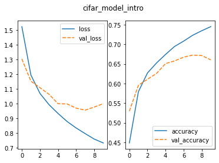
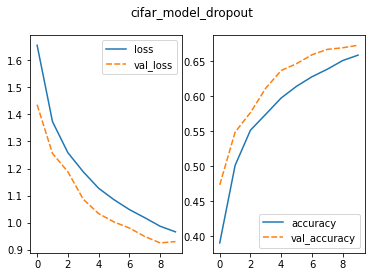

:::::::::::::::::::::::::::::::::::::: questions 

- How do you compile a convolutional neural network (CNN)?
- What is a loss function?
- What is an optimizer?
- How do you train (fit) a CNN?
- How do you evaluate a model during training?
- What is overfitting?

::::::::::::::::::::::::::::::::::::::::::::::::

::::::::::::::::::::::::::::::::::::: objectives

- Explain the difference between compiling and training (fitting) a CNN.
- Know how to select a loss function for your model.
- Understand what an optimizer is.
- Define the terms: learning rate, batch size, epoch.
- Understand what loss and accuracy are and how to monitor them during training.
- Explain what overfitting is and what to do about it.

::::::::::::::::::::::::::::::::::::::::::::::::

### Step 5. Choose a loss function and optimizer and compile model

We have designed a convolutional neural network (CNN) that in theory we should be able to train to classify images. 

We now need to **compile** the model, or set up the rules and strategies for how the network will learn. To do this, we select an appropriate loss function and optimizer to use during training (fitting).

The Keras method to compile a model is found in the [Model training APIs] section of the documentation and has the following structure:

```
Model.compile(
    optimizer="rmsprop",
    loss=None,
    loss_weights=None,
    metrics=None,
    weighted_metrics=None,
    run_eagerly=False,
    steps_per_execution=1,
    jit_compile="auto",
    auto_scale_loss=True,
)
```

The three arguments we want to set for this method are for the optimizer, the loss, and the metrics parameters.

#### Optimizer

An **optimizer** in this case refers to the algorithm with which the model learns to optimize on the provided loss function, or minimise the model error. In other words, the optimizer is responsible for taking the output of the loss function and then applying some changes to the weights within the network. It is through this process that the “learning” (adjustment of the weights) is achieved.

We need to choose an optimizer and, if this optimizer has parameters, decide what values to use for those. Similar to other hyperparameters, the choice of optimizer depends on the problem you are trying to solve, your model architecture, and your data. 

**Adam**

Here we picked one of the most common optimizers demonstrated to work well for most tasks, the **Adam** optimizer, as our starting point.

In Keras, Adam is defined by the `keras.optimizers.Adam` class:

```
keras.optimizers.Adam(
    learning_rate=0.001,
    beta_1=0.9,
    beta_2=0.999,
    epsilon=1e-07,
    amsgrad=False,
    weight_decay=None,
    clipnorm=None,
    clipvalue=None,
    global_clipnorm=None,
    use_ema=False,
    ema_momentum=0.99,
    ema_overwrite_frequency=None,
    loss_scale_factor=None,
    gradient_accumulation_steps=None,
    name="adam",
    **kwargs
)
```

As you can see, the Adam optimizer defines many parameters. For this introductory course, we will accept the default arguments but we highly recommend you investigate all of them if you decide to use this optimizer for your project.

For now, though, we do want to highlight the first parameter.

The **Learning rate** is a hyperparameter that determines the step size at which the model's weights are updated during training. You can think of this like the pace of learning for your model because it's basically how big (or small) a step your model takes to learn from its mistakes. Too high, and it might overshoot the optimal values; too low, and it might take forever to learn.

The learning rate may be fixed and remain constant throughout the entire training process or it may be adaptive and dynamically change during training.

The [Keras optimizer documentation] describes the other optimizers available to choose from. A couple more popular or famous ones include:

- **Stochastic Gradient Descent (sgd)**: Stochastic Gradient Descent (SGD) is one of the fundamental optimization algorithms used to train machine learning models, especially neural networks. It is a variant of the gradient descent algorithm, designed to handle large datasets efficiently.

- **Root Mean Square (rms)prop**: RMSprop is widely used in various deep learning frameworks and is one of the predecessors of more advanced optimizers like Adam, which further refines the concept of adaptive learning rates. It is an extension of the basic Stochastic Gradient Descent (SGD) algorithm and addresses some of the challenges of SGD.
    - For example, one of the main issues with the basic SGD is that it uses a fixed learning rate for all model parameters throughout the training process. This fixed learning rate can lead to slow convergence or divergence (over-shooting) in some cases. RMSprop introduces an adaptive learning rate mechanism to address this problem.

::::::::::::::::::::::::::::::::::::::::: spoiler 

## WANT TO KNOW MORE: Learning Rate

ChatGPT

**Learning rate** is a hyperparameter that determines the step size at which the model's parameters are updated during training. A higher learning rate allows for more substantial parameter updates, which can lead to faster convergence, but it may risk overshooting the optimal solution. On the other hand, a lower learning rate leads to smaller updates, providing more cautious convergence, but it may take longer to reach the optimal solution. Finding an appropriate learning rate is crucial for effectively training machine learning models.

The figure below illustrates how a small learning rate will not traverse toward the minima of the gradient descent algorithm in a timely manner, i.e. number of epochs.

{alt='Plot of loss over weight value illustrating how a small learning rate takes a long time to reach the optimal solution.'}

On the other hand, specifying a learning rate that is *too high* will result in a loss value that never approaches the minima. That is, 'bouncing between the sides', thus never reaching a minima to cease learning.

{alt='Plot of loss over weight value illustrating how a large learning rate never approaches the optimal solution because it bounces between the sides.'}

Finally, a modest learning rate will ensure that the product of multiplying the scalar gradient value and the learning rate does not result in too small steps, nor a chaotic bounce between sides of the gradient where steepness is greatest.

{alt='Plot of loss over weight value illustrating how a good learning rate gets to optimal solution gradually.'}

These images were obtained from [Google Developers Machine Learning Crash Course] and is licenced under the [Creative Commons 4.0 Attribution Licence].

::::::::::::::::::::::::::::::::::::::::::::::

#### Loss function

The **loss function** tells the training algorithm how wrong, or how 'far away' from the true value, the predicted value is. The purpose of loss functions is to compute the quantity that a model should seek to minimize during training. Which class of loss functions you choose depends on your task. 

**Loss for classification**

For classification purposes, there are a number of probabilistic losses to choose from. Here we chose `CategoricalCrossentropy` because we want to compute the difference between our one-hot encoded class labels and the model predictions and this loss function is appropriate when the data has two or more label classes.

It is defined by the `keras.losses.CategoricalCrossentropy` class:

```
keras.losses.CategoricalCrossentropy(
    from_logits=False,
    label_smoothing=0.0,
    axis=-1,
    reduction="sum_over_batch_size",
    name="categorical_crossentropy",
)
```

More information about loss functions can be found in the [Keras loss documentation].


#### Metrics

After we select the desired optimizer and loss function we specify the metric(s) to be evaluated by the model during training and testing. A **metric** is a function used to judge the performance of the model.

Metric functions are similar to loss functions, except the results from evaluating a metric are not used when training the model. Note you can also use any loss function as a metric. The [Keras metrics] documentation provides a list of potential metrics.

Typically, for classification problems, you will use `CategoricalAccuracy`, which calculates how often the model predictions match the true labels, and in Keras is defined as:

```
keras.metrics.CategoricalAccuracy(name="categorical_accuracy", dtype=None)
```

The accuracy function creates two local variables, total and count, that it uses to compute the frequency with which predictions matches labels. This frequency is ultimately returned as accuracy: an operation that divides the  total by count.

Now that we selected which optimizer, loss function, and metric to use, we want to compile the model, or prepare it for training.


::::::::::::::::::::::::::::::::::::: challenge 

## CHALLENGE Write the code to compile the introductory model

Use the `Model.compile` function to compile the `model_intro`.

Hint 1: Use 'Adam' for the optimizer.

Hint 2: Use 'CategoricalCrossentropy' for the loss.

Hint 3: Use 'CategoricalAccuracy' as the metric.


```python
# compile the model
_____.compile(optimizer = _____, 
                    loss = _____, 
                    metrics = _____)
```

:::::::::::::::::::::::: solution 

```output
# compile the model
model_intro.compile(optimizer = keras.optimizers.Adam(),
                    loss = keras.losses.CategoricalCrossentropy(),
                    metrics = keras.metrics.CategoricalAccuracy())
```

:::::::::::::::::::::::::::::::::
::::::::::::::::::::::::::::::::::::::::::::::::

### Step 6. Train (Fit) model

We are ready to train the model. 

Training a model means teaching the computer to recognize patterns in data by adjusting its internal parameters, or iteratively comparing its predictions with the actual outcomes to minimize errors. The result is a model capable of making accurate predictions on new, unseen data.

Training the model is done using the `Model.fit` method:

```
Model.fit(
    x=None,
    y=None,
    batch_size=None,
    epochs=1,
    verbose="auto",
    callbacks=None,
    validation_split=0.0,
    validation_data=None,
    shuffle=True,
    class_weight=None,
    sample_weight=None,
    initial_epoch=0,
    steps_per_epoch=None,
    validation_steps=None,
    validation_batch_size=None,
    validation_freq=1,
)
```

For this introductory course, the arguments we will specify are x, y, batch_size, epochs, and validation data.

- **x** refers to the input data, which in our case is the training data
- **y** refers to the target data, which in our case is the corresponding image labels
- **batch size** determines the number of training samples processed together before updating the model's parameters during each iteration (or mini-batch) of training. 
    - Choosing the right batch size depends on various factors, including your memory constraints, the model complexity, computational resources, and trial and error! 
    - In general, smaller batch sizes may require more iterations to cover the entire dataset, which can lead to longer training times. Larger batch sizes contribute to a smoother learning process, i.e. more consistent updates to the model's parameters, but might not generalise well to new, unseen data.
    - In practice, common sizes range from 32 to 256.
- **epochs** In one epoch, every sample in the training data will be given to the neural network and used to update its parameters. 
    - In general, CNN models improve with more epochs of training, but only to a point.
- **validation_data** is the data used to evaluate loss and model metrics at the end of each epoch. The model will not be trained on this data.

The `Model.fit` method returns a `History` object that records the training loss values and metrics. If we want to keep this data, we need to create a new variable to capture the return.

The weights and biases learned during the training process are stored directly within the model object itself.

Other parameters used to fit our model can be found in the documentation for the [Keras fit method].

::::::::::::::::::::::::::::::::::::: challenge 

## CHALLENGE Write the code to fit the introductory model

Use the `Model.fit` function to train (fit) the `model_intro`.

Hint 1: Use a batch size of 32.

Hint 2: Train for 10 epochs.

Hint 3: Use a tuple of the form (x_val, y_val) and our validation dataset variable names.

Hint 4: Store the training loss and metrics in a variable call 'history_intro'

```python
# fit the model
_____ = _____.fit(x = _____, y = _____,
                                batch_size = _____,
                                epochs = _____, 
                                validation_data = (_____, _____))
```

:::::::::::::::::::::::: solution 

```output
# fit the model
history_intro = model_intro.fit(x = train_images, y = train_labels,
                                batch_size = 32,
                                epochs = 10, 
                                validation_data = (val_images, val_labels))
```

:::::::::::::::::::::::::::::::::
::::::::::::::::::::::::::::::::::::::::::::::::

::::::::::::::::::::::::::::::::::::::::: spoiler 

## WANT TO KNOW MORE: Batch size

ChatGPT

The choice of batch size can have various implications, and there are situations where using different batch sizes can be beneficial. There is no one-size-fits-all answer.

**Large Datasets and Memory Constraints**: If you have a large dataset and limited memory, using a smaller batch size can help fit the data into memory during training. This allows you to train larger models or use more complex architectures that might not fit with larger batch sizes.

**Training on GPUs**: Modern deep learning frameworks and libraries are optimized for parallel processing on GPUs. Using larger batch sizes can fully leverage the parallelism of GPUs and lead to faster training times. However, the choice of batch size should consider the available GPU memory.

**Noise in Parameter Updates**: Smaller batch sizes introduce more noise in the gradients, which can help models escape sharp minima and potentially find better solutions. This regularization effect is similar to the impact of stochasticity in Stochastic Gradient Descent (SGD).

**Generalization**: Using smaller batch sizes may improve the generalization of the model. It prevents the model from overfitting to the training data, as it gets updated more frequently and experiences more diverse samples during training.

It's essential to consider the trade-offs of using different batch sizes. While larger batch sizes may provide more stable gradients during training, there could be a trade-off where the model might not generalise as effectively to new, unseen data. It's a common consideration in machine learning to find a balance between stable training and the ability to generalize well to diverse examples. You should experiment with different batch sizes to find the best-performing one for your specific model, architecture, and dataset.

:::::::::::::::::::::::::::::::::::::::::::::::

Before moving on, let us quickly save our model object. 

We will discuss this method in more detail in [Episode 6 Share a Convolutional Neural Network and Next Steps](episodes/06-share-cnn-next-steps.md) but for now just copy and paste.

```python
# save the model
model_intro.save('fit_outputs/model_intro.keras')
```

#### Monitor Training Progress (aka Model Evaluation during Training)

We now know more about the compilation and fitting of CNNs and have a trained model. How do we know if it is any good? We can inspect the training metrics we stored in our `History` object.

Using [seaborn], a Python data visualization library based on matplotlib that provides a high-level interface for drawing attractive and informative statistical graphics, we can plot the training process using the history:

```python
import seaborn as sns
import pandas as pd

# convert the model history to a dataframe for plotting 
history_intro_df = pd.DataFrame.from_dict(history_intro.history)

# plot the loss and accuracy from the training process
fig, axes = plt.subplots(1, 2)
fig.suptitle('cifar_model_intro')
sns.lineplot(ax=axes[0], data=history_intro_df[['loss', 'val_loss']])
sns.lineplot(ax=axes[1], data=history_intro_df[['categorical_accuracy', 'val_categorical_accuracy']])
```

{alt='two panel figure; the figure on the left illustrates the training loss starting at 1.5 and decreasing to 0.7 and the validation loss decreasing from 1.3 to 1.0 before leveling out; the figure on the right illustrates the training accuracy increasing from 0.45 to 0.75 and the validation accuracy increasing from 0.53 to 0.65 before leveling off'}

This plot is used to identify whether the training is well configured or whether there are problems to address. The solid blue lines represent the training loss and accuracy; the dashed orange lines represent the validation loss and accuracy.

::::::::::::::::::::::::::::::::::::: challenge 

## CHALLENGE Inspect the Training Curve

Inspect the training curves we have just made and recall the difference between the training and the validation datasets.

1. How does the training progress look?
&nbsp;
    - Does the loss increase or decrease?
    - What about the accuracy?
    - Do either change fast or slowly?
    - Do the graphs lines fluctuate or go up and down frequently?
&nbsp;
2. Do you think the resulting trained network will work well on the test set?

:::::::::::::::::::::::: solution 

1. Key things to look for for:
&nbsp;
    - Loss
        - The loss curve should drop quickly in a relatively smooth line with little to no fluctuations. 
        - The val_loss curve should decrease along with the loss.
    - Accuracy
        - The accuracy should increase quickly in a relatively smooth line with little to no fluctuations.
        - The val_accuracy should behave similarly
&nbsp;    
2. The results of the training give very little information on its performance on a test set. You should be careful not to use it as an indication of a well trained network.

:::::::::::::::::::::::::::::::::
::::::::::::::::::::::::::::::::::::::::::::::::

Note the training loss continues to decrease, while the validation loss stagnates, and even starts to increase over the course of the epochs. Similarly, the accuracy for the validation set does not improve anymore after some epochs.

This is evidence of **overfitting** in these plots. If a model is overfitting, it means the model performs exceptionally well on the training data, but poorly on the validation data. Overfitting occurs when the model has learned to memorize the noise and specific patterns in the training data instead of generalizing the underlying relationships. As a result, the model fails to perform well on new, unseen, data because it has become too specialized to the training set.

Key characteristics of an overfit model include:

- High Training Accuracy, Low Validation Accuracy: The model achieves high accuracy on the training data but significantly lower accuracy on the validation (or test) data.

- Small Training Loss, Large Validation Loss: The training loss is low, indicating the model's predictions closely match the true labels in the training set. However, the validation loss is high, indicating the model's predictions are far from the true labels in the validation set.

How to Address Overfitting:

- Reduce the model's complexity by using fewer layers or units to make it less prone to overfitting.
- Collect more training data if possible to provide the model with a diverse and representative dataset.
- Perform data augmentation to artificially increase the size of the training data and introduce variability.

::::::::::::::::::::::::::::::::::::::::: spoiler

## WANT TO KNOW MORE: What is underfitting?

Underfitting occurs when the model is too simple or lacks the capacity to capture the underlying patterns and relationships present in the data. As a result, the model's predictions are not accurate, and it fails to generalize well to unseen data.

Key characteristics of an underfit model include:

- Large Training Loss: The training loss (error) is high, indicating the model's predictions are far from the true labels in the training set.
- Increasing validation loss.
- Low Validation Accuracy: This indicates the model is not learning from the data effectively.

How to address underfitting:

- Perform data augmentation or feature engineering to provide the model with more informative input features.
- Train the model for more epochs to give it more time to learn from the data.
- Increase the model's complexity by adding more layers or units to the existing layers.

::::::::::::::::::::::::::::::::::::::::::::::::::

### Improve Model Generalization (avoid Overfitting)

Techniques to avoid overfitting, or to improve model generalization, are termed **regularization techniques**. A short list of some of these include batch normalization, data augmentation, and dropout. 

#### Dropout

One of the most versatile regularization technique is **dropout** (Srivastava et al., 2014). Dropout essentially means that during each training cycle a random fraction of the dense layer nodes are turned off. This is described with the dropout rate between zero and one, which determines the fraction of nodes to silence at a time. 

{alt='diagram of two neural networks; the first network is densely connected without dropout and the second network has some of the neurons dropped out of of the network'}

The intuition behind dropout is that it enforces redundancies in the network by constantly removing different elements of a network. The model can no longer rely on individual nodes and instead must create multiple "paths". 

In addition, the model has to make predictions with much fewer nodes and weights (connections between the nodes). As a result, it becomes much harder for a network to memorize particular features. At first this might appear a quite drastic approach which affects the network architecture strongly. In practice, however, dropout is computationally a very elegant solution which does not affect training speed. And it frequently works very well.

:::::::::::::::::::::::::::::::::::::: callout

Dropout layers will only randomly silence nodes during training! During the prediction step, all nodes remain active (dropout is off). During training, the sample of nodes that are silenced are different for each training instance, or batch, to give all nodes a chance to observe enough training data to learn its weights.

::::::::::::::::::::::::::::::::::::::::::::::

Dropout layers are defined by the `keras.layers.Dropout` class and have the following definition:

```
keras.layers.Dropout(rate, noise_shape=None, seed=None, **kwargs)
```

- The `rate` parameter is a float between 0 and 1 and represents the fraction of the input units to drop.
    - Good advice is to begin with a small dropout rate, such as 0.1 or 0.2, and gradually increase it if necessary. 
    - A dropout rate of 0.5 is commonly used as a starting point.

The placement of the dropout layer also matters because adding dropout before or after certain layers can have different effects. Although dropout layers are commonly added between dense layers, you will find network architectures with dropout in just about everywhere. Be sure to experiment with different dropout rates and placements to find the optimal configuration for your model and dataset.

::::::::::::::::::::::::::::::::::::: challenge 

## CHALLENGE Create a function that defines a CNN with Dropout

Use the `create_model_intro()` definition as the template, create a new function called `create_model_dropout()`

Hint 1: Add one Dropout Layer that randomly drops 50 per cent of the input units.

Hint 2: Consider adding an additional layer(s) from one of the four layers we discussed.

:::::::::::::::::::::::: solution 

```output
def create_model_dropout():
    
    # CNN Part 1
    # Input layer of 32x32 images with three channels (RGB)
    inputs_dropout = keras.Input(shape=train_images.shape[1:])
    
    # CNN Part 2
    # Convolutional layer with 16 filters, 3x3 kernel size, and ReLU activation
    x_dropout = keras.layers.Conv2D(filters=16, kernel_size=(3,3), activation='relu')(inputs_dropout)
    # Pooling layer with input window sized 2x2
    x_dropout = keras.layers.MaxPooling2D(pool_size=(2,2))(x_dropout)
    # Second Convolutional layer with 32 filters, 3x3 kernel size, and ReLU activation
    x_dropout = keras.layers.Conv2D(filters=32, kernel_size=(3,3), activation='relu')(x_dropout)
    # Second Pooling layer with input window sized 2x2
    x_dropout = keras.layers.MaxPooling2D(pool_size=(2,2))(x_dropout)
    # Third Convolutional layer with 64 filters, 3x3 kernel size, and ReLU activation
    x_dropout = keras.layers.Conv2D(filters=64, kernel_size=(3,3), activation='relu')(x_dropout) # This is new!
    # Dropout layer andomly drops 50 per cent of the input units
    x_dropout = keras.layers.Dropout(rate=0.5)(x_dropout) # This is new!
    # Flatten layer to convert 2D feature maps into a 1D vector
    x_dropout = keras.layers.Flatten()(x_dropout)
    
    # CNN Part 3
    # Output layer with 10 units (one for each class) and softmax activation
    outputs_dropout = keras.layers.Dense(units=10, activation='softmax')(x_dropout)
    
    # create the model
    model_dropout = keras.Model(inputs = inputs_dropout, 
                              outputs = outputs_dropout, 
                              name = "cifar_model_dropout")
    
    return model_dropout
```

:::::::::::::::::::::::::::::::::
::::::::::::::::::::::::::::::::::::::::::::::::

::::::::::::::::::::::::::::::::::::: challenge

## CHALLENGE Does adding Dropout improve our model?

1. Create the dropout model. 

2. Write the code to compile and fit our new dropout model using the same arguments we used for our model in the introduction. 

3. Inspect the training metrics to determine whether the model has improved.

4. Save the dropout model.

5. Monitor the training progress.

:::::::::::::::::::::::: solution

```python
# create the dropout model
model_dropout = create_model_dropout()

# compile the model
model_dropout.compile(optimizer = keras.optimizers.Adam(),
                      loss = keras.losses.CategoricalCrossentropy(),
                      metrics = keras.metrics.CategoricalAccuracy())

# fit the model
history_dropout = model_dropout.fit(x = train_images, y = train_labels,
                                  batch_size = 32,
                                  epochs = 10,
                                  validation_data = (val_images, val_labels))


# save dropout model
model_dropout.save('fit_outputs/model_dropout.keras')

# inspect the training results

# convert the history to a dataframe for plotting 
history_dropout_df = pd.DataFrame.from_dict(history_dropout.history)

# plot the loss and accuracy from the training process
fig, axes = plt.subplots(1, 2)
fig.suptitle('cifar_model_dropout')
sns.lineplot(ax=axes[0], data=history_dropout_df[['loss', 'val_loss']])
sns.lineplot(ax=axes[1], data=history_dropout_df[['categorical_accuracy', 'val_categorical_accuracy']])

val_loss_dropout, val_acc_dropout = model_dropout.evaluate(val_images, val_labels, verbose=2)
```

{alt='two panel figure; the figure on the left illustrates the training loss starting at 1.7 and decreasing to 1.0 and the validation loss decreasing from 1.4 to 0.9 before leveling out; the figure on the right illustrates the training accuracy increasing from 0.40 to 0.65 and the validation accuracy increasing from 0.5 to 0.67'}

In this relatively uncommon situation, the training loss is higher than our validation loss while the validation accuracy is higher than the training accuracy. Using dropout, or other regularization techniques during training, can lead to a lower training accuracy.

Dropout randomly "drops out" units during training, which can prevent the model from fitting the training data too closely. This regularization effect may lead to a situation where the model generalizes better on the validation set.

The final accuracy on the validation set is higher than without dropout.

:::::::::::::::::::::::::::::::::
::::::::::::::::::::::::::::::::::::::::::::::::

::::::::::::::::::::::::::::::::::::::::: spoiler

## WANT TO KNOW MORE: Regularization techniques

ChatGPT

Regularization methods introduce constraints or penalties to the training process, encouraging the model to be simpler and less prone to overfitting

Here are some common regularization methods for CNNs:

1. **L1 and L2 Regularization** are the two most common regularization techniques used in deep learning. They add a penalty term to the loss function during training to restrict the model's weights.
    - L1 regularization adds the absolute value of the weights to the loss function. It tends to produce sparse weight vectors, forcing some of the less important features to have exactly zero weights.
    - L2 regularization adds the square of the weights to the loss function. It encourages the model to have smaller weights overall, preventing extreme values and reducing the impact of individual features.
    - The regularization strength is controlled by a hyperparameter, often denoted as lambda (λ), that determines how much weight should be given to the regularization term. A larger λ value increases the impact of regularization, making the model simpler and more regularized.

2. **Dropout**: Involves randomly "dropping out" a fraction of neurons during training. This means during each training iteration, some neurons are temporarily removed from the network. Dropout effectively reduces the interdependence between neurons, preventing the network from relying too heavily on specific neurons, and making it more robust.

3. **Batch Normalization**: While not explicitly a regularization technique, Batch Normalization has a regularizing effect on the model. It normalizes the activations of each layer in the network, reducing internal covariate shift. This can improve training stability and reduce the need for aggressive dropout or weight decay.

4. **Data Augmentation**: Data augmentation is a technique where the training data is artificially augmented by applying various transformations like rotation, scaling, flipping, and cropping to create new examples. This increases the diversity of the training data and helps the model generalize better to unseen data.

5. **Early Stopping**: Early stopping is a form of regularization that stops the training process when the model's performance on a validation set starts to degrade. It prevents the model from overfitting by avoiding further training after the point of best validation performance.


Using regularization techniques improves the generalization performance of CNNs and reduces the risk of overfitting. It's essential to experiment with different regularization methods and hyperparameters to find the optimal combination for your specific CNN architecture and dataset.

::::::::::::::::::::::::::::::::::::::::::::::::


## Choose the best model and use it to predict

Based on our evaluation of the loss and accuracy metrics, we choose the model that appears to have the best performance **of the models we have examined thus far**. The next step is to use this model to predict the object classes on our test dataset.


::::::::::::::::::::::::::::::::::::: keypoints 

- Use Model.compile() to compile a CNN.
- The choice of optimizer often depends on experimentation and empirical evaluation.
- The choice of loss function will depend on your data and aim.
- Use Model.fit() to make a train (fit) a CNN.
- Training/validation loss and accuracy can be used to evaluate a model during training.
- Dropout is one way regularization technique to prevent overfitting.

::::::::::::::::::::::::::::::::::::::::::::::::

<!-- Collect your link references at the bottom of your document -->

[Model training APIs]: https://keras.io/api/models/model_training_apis/
[Keras loss documentation]: https://keras.io/api/losses/
[Keras optimizer documentation]: https://keras.io/api/optimizers/
[Keras metrics]: https://keras.io/api/metrics/
[Keras fit method]: https://keras.io/api/models/model_training_apis/
[seaborn]: https://seaborn.pydata.org/
[Google Developers Machine Learning Crash Course]: https://developers.google.com/machine-learning/crash-course/reducing-loss/learning-rate
[Creative Commons 4.0 Attribution Licence]: https://creativecommons.org/licenses/by/4.0/

