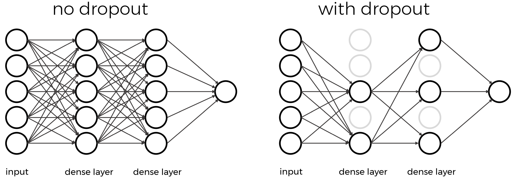

:::::::::::::::::::::::::::::::::::::: questions 

- How do you compile a convolutional neural network (CNN)?
- What is a loss function?
- What is an optimizer?
- How do you train (fit) a CNN?
- What are hyperparameters?
- How do you detect overfitting?
- How do you avoid overfitting?

::::::::::::::::::::::::::::::::::::::::::::::::

::::::::::::::::::::::::::::::::::::: objectives

- Explain the difference between compiling and training a CNN
- Know how to select a loss function for your model
- Understand what an optimizer is
- Define the terms: learning rate, batch size, epoch
- Explain overfitting

::::::::::::::::::::::::::::::::::::::::::::::::

### Step 5. Choose a loss function and optimizer

We have designed a convolutional neural network (CNN) that in theory we should be able to train to classify images. 

We now need to select an appropriate optimizer and loss function that we will use during training. 

Recall how we compiled our model in the introduction:
```
# compile the pooling model
#model_pool.compile(optimizer = 'adam', 
#              loss = keras.losses.SparseCategoricalCrossentropy(from_logits=True),               
#              metrics = ['accuracy'])
```              

#### Loss function

The **loss function** tells the training algorithm how wrong, or how 'far away' from the true value the predicted value is. The purpose of loss functions is to compute the quantity that a model should seek to minimize during training. Which class of loss functions you choose depends on your task. 

**Loss for classification**

For classification purposes, there are a number of probabilistic losses to choose from. We chose `SparseCategoricalCrossentropy` because we want to compute the crossentropy loss between our class labels represented by integers (i.e., not one-hot encoded) and the model predictions.

- This loss function is appropriate to use when the data has two or more label classes.
- defined by the keras.losses.SparseCategoricalCrossentropy class

:::::::::::::::::::::::::::::::::::::: callout
ChatGPT

Logits

**Logits** are the raw, unnormalized predictions that a model generates before they are transformed into probabilities. In many cases, the final layer of a neural network produces logits, and these logits are then passed through a function (usually the softmax function) to obtain probabilities for each class. The softmax function converts the logits into a probability distribution, where the values for each class range between 0 and 1 and sum up to 1.

Here's an example to illustrate this:

Suppose you have a neural network that performs image classification with three classes: "Cat," "Dog," and "Bird." After feeding an image through the model, it generates logits as follows:

Logits: [2.5, 1.2, -0.8]

Now, to turn these logits into probabilities, we apply the softmax function:

Probabilities: [0.755, 0.223, 0.022]

The highest probability (0.755) corresponds to the "Cat" class, suggesting that the model predicts the image contains a cat with a probability of approximately 75.5%.

Now, let's bring in the 'from_logits' argument in the context of defining the loss function. When training a neural network for multi-class classification tasks, the most common loss function is the categorical cross-entropy. This loss function takes in probabilities and the true labels of the data to compute the difference between the predicted probabilities and the ground truth.

However, sometimes, the model may not produce probabilities directly but instead produces logits. In such cases, you have two options:

Option 1. Use the 'from_logits=False' (default): In this case, Keras will apply the softmax function to the logits internally before computing the loss function. It means that you provide the logits, but Keras handles the transformation to probabilities before calculating the loss.

Option 2. Use 'from_logits=True': If you set this argument to True, you are telling Keras that the provided values are already logits and no further transformation is needed. The loss function will directly use the provided logits to compute the loss, avoiding the internal application of the softmax function.

In summary, 'from_logits=True' is useful when your model outputs logits, and you want to manually handle the conversion to probabilities (e.g., when using the logits for other purposes), or if you want to avoid the additional computational overhead of applying the softmax function twice (once by you and once by the loss function). On the other hand, if you provide probabilities or set 'from_logits=False', Keras will handle the conversion to probabilities internally before computing the loss.

::::::::::::::::::::::::::::::::::::::::::::::::

**Loss for Regression**

For regression tasks, we might want to stipulate that the predicted numerical values are as close as possible to the true values. This is commonly done by using the **mean squared error** (mse) or the **mean absolute error** (mae) loss funtions, both of which should work. Often, mse is preferred over mae because it “punishes” large prediction errors more severely.

- defined by the keras.losses.MeanSquaredError class

To compile a model with mse, change the loss argument of the `compile` method:

```
#model_ex.compile(loss = 'mse')
```
 
For more information on these and other available loss functions in Keras you can check the [loss documentation].

#### Optimizer

Somewhat coupled to the loss function is the optimizer. The optimizer here refers to the algorithm with which the model learns to optimize on the provided loss function.

We need to choose which optimizer to use and, if this optimizer has parameters, what values to use for those. Furthermore, we need to specify how many times to show the training samples to the optimizer. In other words, the optimizer is responsible for taking the output of the loss function and then applying some changes to the weights within the network. It is through this process that the “learning” (adjustment of the weights) is achieved.

```
# compile the pooling model
#model_pool.compile(optimizer = 'adam', 
#              loss = keras.losses.SparseCategoricalCrossentropy(from_logits=True),               
#              metrics = ['accuracy'])
``` 

**Adam** 

Here we picked one of the most common optimizers that works well for most tasks, the **Adam** optimizer. Similar to activation functions, the choice of optimizer depends on the problem you are trying to solve, your model architecture and your data. Adam is a good starting point though, which is why we chose it. Adam has a number of parameters, but the default values work well for most problems so we will use it with its default parameters.

- defined by the keras.optimizers.Adam class
- takes a single parameter `learning_rate=0.01`

There are many optimizers to choose from so check the [optimizer documentation]. A couple more popular or famous ones include:

- **Stochastic Gradient Descent (sgd)**: Stochastic Gradient Descent (SGD) is one of the fundamental optimization algorithms used to train machine learning models, especially neural networks. It is a variant of the gradient descent algorithm, designed to handle large datasets efficiently.

- **Root Mean Square (rms)prop**: RMSprop is widely used in various deep learning frameworks and is one of the predecessors of more advanced optimizers like Adam, which further refines the concept of adaptive learning rates. It is an extension of the basic Stochastic Gradient Descent (SGD) algorithm and addresses some of the challenges of SGD.

  - For example, one of the main issues with the basic SGD is that it uses a fixed learning rate for all model parameters throughout the training process. This fixed learning rate can lead to slow convergence or divergence (over-shooting) in some cases. RMSprop introduces an adaptive learning rate mechanism to address this problem.

:::::::::::::::::::::::::::::::::::::: callout
ChatGPT

**Learning Rate**

Learning rate is a hyperparameter that determines the step size at which the model's parameters are updated during training. A higher learning rate allows for more substantial parameter updates, which can lead to faster convergence, but it may risk overshooting the optimal solution. On the other hand, a lower learning rate leads to smaller updates, providing more cautious convergence, but it may take longer to reach the optimal solution. Finding an appropriate learning rate is crucial for effectively training machine learning models.

In the figure below, we can see that a small learning rate will not traverse toward the minima of the gradient descent algorithm in a timely manner i.e. number of epochs.


(This image was obtained from [Google Developers Machine Learning Crash Course](https://developers.google.com/machine-learning/crash-course/reducing-loss/learning-rate) and is licenced under the [Creative Commons 4.0 Attribution Licence](https://creativecommons.org/licenses/by/4.0/).)

On the other hand, specifying a learning rate that is *too high* will result in a loss value that never approaches the minima. That is, 'bouncing between the sides', thus never reaching a minima to cease learning.


(This image was obtained from [Google Developers Machine Learning Crash Course](https://developers.google.com/machine-learning/crash-course/reducing-loss/learning-rate) and is licenced under the [Creative Commons 4.0 Attribution Licence](https://creativecommons.org/licenses/by/4.0/).)

Lastly, we can observe below that a modest learning rate will ensure that the product of multiplying the scalar gradient value, and the learning rate does not result in too small steps, nor a chaotic bounce between sides of the gradient where steepness is greatest.


(This image was obtained from [Google Developers Machine Learning Crash Course](https://developers.google.com/machine-learning/crash-course/reducing-loss/learning-rate) and is licenced under the [Creative Commons 4.0 Attribution Licence](https://creativecommons.org/licenses/by/4.0/).)

::::::::::::::::::::::::::::::::::::::::::::::


#### Metrics

After we select the desired optimizer and loss function we want to specify the metric(s) to be evaluated by the model during training and testing. A **metric** is a function that is used to judge the performance of your model.

```
# compile the pooling model
#model_pool.compile(optimizer = adam', 
#              loss = keras.losses.SparseCategoricalCrossentropy(from_logits=True),               
#              metrics = ['accuracy'])
```

Metric functions are similar to loss functions, except that the results from evaluating a metric are not used when training the model. Note that you may use any loss function as a metric.

Typically you will use `accuracy` which calculates how often predictions matches labels.

The accuracy function creates two local variables, total and count that are used to compute the frequency with which predictions matches labels. This frequency is ultimately returned as accuracy: an operation that simply divides total by count.

For a list of metrics in Keras see [metrics].

Now that we have decided on which loss function, optimizer, and metric to use we can compile the model using `model.compile`. Compiling the model prepares it for training.


### Step 6. Train model

We are now ready to train the model.

Training the model is done using the `fit` method. It takes the image data and target (label) data as inputs and has several other parameters for certain options of the training. Here we only set a different number of epochs.

A training **epoch** means that every sample in the training data has been shown to the neural network and used to update its parameters. In general, CNN models improve with more epochs of training, but only to a point.

We want to train our model for 10 epochs:

```
# fit the pooling model
#history_pool = model_pool.fit(train_images, train_labels, epochs=10, validation_data=(val_images, val_labels))
```

As we saw in the previous episode, the fit method returns a history object that has a history attribute with the training loss and potentially other metrics per training epoch.

Note there are other arguments we could use to fit our model, see the documentation for [fit method].
 

:::::::::::::::::::::::::::::::::::::: callout
ChatGPT

Batch size

The batch size is an important hyperparameter that determines the number of training samples processed together before updating the model's parameters during each iteration (or mini-batch) of training. The choice of batch size can have various implications, and there are situations where using different batch sizes can be beneficial.

**Large Datasets and Memory Constraints**: If you have a large dataset and limited memory, using a smaller batch size can help fit the data into memory during training. This allows you to train larger models or use more complex architectures that might not fit with larger batch sizes.

**Training on GPUs**: Modern deep learning frameworks and libraries are optimized for parallel processing on GPUs. Using larger batch sizes can fully leverage the parallelism of GPUs and lead to faster training times. However, the choice of batch size should consider the available GPU memory.

**Noise in Parameter Updates**: Smaller batch sizes introduce more noise in the gradients, which can help models escape sharp minima and potentially find better solutions. This regularization effect is similar to the impact of stochasticity in Stochastic Gradient Descent (SGD).

**Generalization**: Using smaller batch sizes may improve the generalization of the model. It prevents the model from overfitting to the training data, as it gets updated more frequently and experiences more diverse samples during training.

However, it's essential to consider the trade-offs of using different batch sizes. Smaller batch sizes may require more iterations to cover the entire dataset, which can lead to longer training times. Larger batch sizes can provide more stable gradients but might suffer from generalization issues. There is no one-size-fits-all answer, and you may need to experiment with different batch sizes to find the one that works best for your specific model, architecture, and dataset.

:::::::::::::::::::::::::::::::::::::::::::::::

#### Monitor Training Progress (aka Model Evaluation during Training)

Now that we know more about the compilation and fitting of CNN's let us take a look at the training metrics for our pooling model.

Using seaborn again we can plot the training process using the history:

```python
# convert the history to a dataframe for plotting 
history_pool_df = pd.DataFrame.from_dict(history_pool.history)

# plot the loss and accuracy from the training process
fig, axes = plt.subplots(1, 2)
fig.suptitle('cifar_model_pool')
sns.lineplot(ax=axes[0], data=history_pool_df[['loss', 'val_loss']])
sns.lineplot(ax=axes[1], data=history_pool_df[['accuracy', 'val_accuracy']])
```

{alt=''}

::::::::::::::::::::::::::::::::::::: challenge 

## Challenge The Training Curve

Looking at the training curve we have just made.

1. How does the training progress?

- Does the training loss increase or decrease?
- Does it change fast or slowly?
- Is the graph look very jittery?

2. Do you think the resulting trained network will work well on the test set?

:::::::::::::::::::::::: solution 

1. The loss curve should drop quite quickly in a smooth line with little jitter.

2. The results of the training give very little information on its performance on a test set. You should be careful not to use it as an indication of a well trained network.

:::::::::::::::::::::::::::::::::
::::::::::::::::::::::::::::::::::::::::::::::::

If we look at these plots we can see signs of overfitting. If a model is overfitting, it means that the model performs exceptionally well on the training data but poorly on the validation or test data. Overfitting occurs when the model has learned to memorize the noise and specific patterns in the training data instead of generalizing the underlying relationships. As a result, the model fails to perform well on new, unseen data because it has become too specialized to the training set.

Key characteristics of an overfit model include:

- High Training Accuracy, Low Validation Accuracy: The model achieves high accuracy on the training data but significantly lower accuracy on the validation (or test) data.

- Small Training Loss, Large Validation Loss: The training loss is low, indicating that the model's predictions closely match the true labels in the training set. However, the validation loss is high, indicating that the model's predictions are far from the true labels in the validation set.

How to Address Overfitting:

- Reduce the model's complexity by using fewer layers or units to make it less prone to overfitting.
- Collect more training data if possible to provide the model with a diverse and representative dataset.
- Perform data augmentation to artificially increase the size of the training data and introduce variability.


#### Improve Model Generalization (avoid Overfitting)

#### Dropout

Note that the training loss continues to decrease, while the validation loss stagnates, and even starts to increase over the course of the epochs. Similarly, the accuracy for the validation set does not improve anymore after some epochs. This means we are overfitting on our training data set.

Techniques to avoid overfitting, or to improve model generalization, are termed **regularization techniques**. One of the most versatile regularization technique is **dropout** (Srivastava et al., 2014). Dropout essentially means that during each training cycle a random fraction of the dense layer nodes are turned off. This is described with the dropout rate between 0 and 1 which determines the fraction of nodes to silence at a time. 

{alt=''}

The intuition behind dropout is that it enforces redundancies in the network by constantly removing different elements of a network. The model can no longer rely on individual nodes and instead must create multiple "paths". In addition, the model has to make predictions with much fewer nodes and weights (connections between the nodes). As a result, it becomes much harder for a network to memorize particular features. At first this might appear a quite drastic approach which affects the network architecture strongly. In practice, however, dropout is computationally a very elegant solution which does not affect training speed. And it frequently works very well.

**Important to note**: Dropout layers will only randomly silence nodes during training! During a predictions step, all nodes remain active (dropout is off). During training, the sample of nodes that are silenced are different for each training instance, to give all nodes a chance to observe enough training data to learn its weights.

Let us add one dropout layer towards the end of the network, that randomly drops 20% of the input units.

```python
# define the inputs, layers, and outputs of a CNN model with dropout

# CNN Part 1
# Input layer of 32x32 images with three channels (RGB)
inputs_dropout = keras.Input(shape=train_images.shape[1:])

# CNN Part 2
# Convolutional layer with 50 filters, 3x3 kernel size, and ReLU activation
x_dropout = keras.layers.Conv2D(50, (3, 3), activation='relu')(inputs_dropout)
# Pooling layer with input window sized 2,2
x_dropout = keras.layers.MaxPooling2D((2, 2))(x_dropout)
# Second Convolutional layer with 50 filters, 3x3 kernel size, and ReLU activation
x_dropout = keras.layers.Conv2D(50, (3, 3), activation='relu')(x_dropout)
# Second Pooling layer with input window sized 2,2
x_dropout = keras.layers.MaxPooling2D((2, 2))(x_dropout)
# Third Convolutional layer with 50 filters, 3x3 kernel size, and ReLU activation
x_dropout = keras.layers.Conv2D(50, (3, 3), activation='relu')(x_dropout)
# Dropout layer andomly drops 20% of the input units
x_dropout = keras.layers.Dropout(0.8)(x_dropout) # This is new!
# Flatten layer to convert 2D feature maps into a 1D vector
x_dropout = keras.layers.Flatten()(x_dropout)
# Dense layer with 50 neurons and ReLU activation
x_dropout = keras.layers.Dense(50, activation='relu')(x_dropout)

# CNN Part 3
# Output layer with 10 units (one for each class)
outputs_dropout = keras.layers.Dense(10)(x_dropout)

# create the dropout model
model_dropout = keras.Model(inputs=inputs_dropout, outputs=outputs_dropout, name="cifar_model_dropout")

model_dropout.summary()
```
```output
Model: "cifar_model_dropout"
_________________________________________________________________
 Layer (type)                Output Shape              Param #
=================================================================
 input_8 (InputLayer)        [(None, 32, 32, 3)]       0

 conv2d_19 (Conv2D)          (None, 30, 30, 50)        1400

 max_pooling2d_12 (MaxPoolin  (None, 15, 15, 50)       0
 g2D)

 conv2d_20 (Conv2D)          (None, 13, 13, 50)        22550

 max_pooling2d_13 (MaxPoolin  (None, 6, 6, 50)         0
 g2D)

 conv2d_21 (Conv2D)          (None, 4, 4, 50)          22550

 dropout_2 (Dropout)         (None, 4, 4, 50)          0

 flatten_7 (Flatten)         (None, 800)               0

 dense_13 (Dense)            (None, 50)                40050

 dense_14 (Dense)            (None, 10)                510

=================================================================
Total params: 87,060
Trainable params: 87,060
Non-trainable params: 0
_________________________________________________________________
```

We can see that the dropout does not alter the dimensions of the image, and has zero parameters.

We again compile and train the model.

```python
# compile the dropout model
model_dropout.compile(optimizer = 'adam',
              loss = keras.losses.SparseCategoricalCrossentropy(from_logits=True),
              metrics = ['accuracy'])

# fit the dropout model
history_dropout = model_dropout.fit(train_images, train_labels, epochs=20,
                    validation_data=(val_images, val_labels))

# save dropout model
model_dropout.save('fit_outputs/model_dropout.h5')

```
And inspect the training results:

```python
# convert the history to a dataframe for plotting 
history_dropout_df = pd.DataFrame.from_dict(history_dropout.history)

# plot the loss and accuracy from the training process
fig, axes = plt.subplots(1, 2)
fig.suptitle('cifar_model_dropout')
sns.lineplot(ax=axes[0], data=history_dropout_df[['loss', 'val_loss']])
sns.lineplot(ax=axes[1], data=history_dropout_df[['accuracy', 'val_accuracy']])

val_loss_dropout, val_acc_dropout = model_dropout.evaluate(val_images,  val_labels, verbose=2)
```
```output
313/313 - 2s - loss: 1.4683 - accuracy: 0.5307
```

{alt=''}

TODO CHECK OH NO Dropout model is terrible now! This is a canned picture.

Now we see that the gap between the training accuracy and validation accuracy is much smaller, and that the final accuracy on the validation set is higher than without dropout. Nevertheless, there is still some difference between the training loss and validation loss, so we could experiment with regularization even more.

:::::::::::::::::::::::::::::::::::::: callout
ChatGPT

Regularization methods for Convolutional Neural Networks (CNNs)

Regularization methods introduce constraints or penalties to the training process, encouraging the model to be simpler and less prone to overfitting. Here are some common regularization methods for CNNs:

**L1 and L2 Regularization**: L1 and L2 regularization are the two most common regularization techniques used in deep learning. They add a penalty term to the loss function during training to restrict the model's weights.

- L1 regularization adds the absolute value of the weights to the loss function. It tends to produce sparse weight vectors, forcing some of the less important features to have exactly zero weights.

- L2 regularization adds the square of the weights to the loss function. It encourages the model to have smaller weights overall, preventing extreme values and reducing the impact of individual features.

The regularization strength is controlled by a hyperparameter, often denoted as lambda (λ), that determines how much weight should be given to the regularization term. A larger λ value increases the impact of regularization, making the model simpler and more regularized.

b. randomly "dropping out" a fraction of neurons during training. This means that during each training iteration, some neurons are temporarily removed from the network. Dropout effectively reduces the interdependence between neurons, preventing the network from relying too heavily on specific neurons and making it more robust.

**Batch Normalization**: While not explicitly a regularization technique, Batch Normalization has a regularizing effect on the model. It normalizes the activations of each layer in the network, reducing internal covariate shift. This can improve training stability and reduce the need for aggressive dropout or weight decay.

**Data Augmentation**: Data augmentation is a technique where the training data is artificially augmented by applying various transformations like rotation, scaling, flipping, and cropping to create new examples. This increases the diversity of the training data and helps the model generalize better to unseen data.

**Early Stopping**: Early stopping is a form of regularization that stops the training process when the model's performance on a validation set starts to degrade. This prevents the model from overfitting by avoiding further training after the point of best validation performance.

By using regularization techniques, you can improve the generalization performance of CNNs and reduce the risk of overfitting. It's essential to experiment with different regularization methods and hyperparameters to find the optimal combination for your specific CNN architecture and dataset.
::::::::::::::::::::::::::::::::::::::::::::::::

::::::::::::::::::::::::::::::::::::: challenge 

Vary dropout rate

Q1. What do you think would happen if you lower the dropout rate? Try it out, and see how it affects the model training.

Q2. You are varying the dropout rate and checking its effect on the model performance, what is the term associated to this procedure?

:::::::::::::::::::::::: solution 

Q1. Varying the dropout rate

The code below instantiates and trains a model with varying dropout rates. You can see from the resulting plot that the ideal dropout rate in this case is around 0.45. This is where the validation loss is lowest.

- NB1: It takes a while to train these 5 networks.
- NB2: In the real world you should do this with a test set and not with the validation set!

```python
dropout_rates = [0.15, 0.3, 0.45, 0.6, 0.75]
val_losses_vary = []
for dropout_rate in dropout_rates:
    inputs_vary = keras.Input(shape=train_images.shape[1:])
    x_vary = keras.layers.Conv2D(50, (3, 3), activation='relu')(inputs_vary)
    x_vary = keras.layers.MaxPooling2D((2, 2))(x_vary)
    x_vary = keras.layers.Conv2D(50, (3, 3), activation='relu')(x_vary)
    x_vary = keras.layers.MaxPooling2D((2, 2))(x_vary)
    x_vary = keras.layers.Conv2D(50, (3, 3), activation='relu')(x_vary)
    x_vary = keras.layers.Dropout(dropout_rate)(x_vary)
    x_vary = keras.layers.Flatten()(x_vary)
    x_vary = keras.layers.Dense(50, activation='relu')(x_vary)
    outputs_vary = keras.layers.Dense(10)(x_vary)

    model_vary = keras.Model(inputs=inputs_vary, outputs=outputs_vary, name="cifar_model_vary")

    model_vary.compile(optimizer = 'adam',
              loss = keras.losses.SparseCategoricalCrossentropy(from_logits=True),
              metrics = ['accuracy'])

    model_vary.fit(train_images, train_labels, epochs=20,
                    validation_data=(val_images, val_labels))

    val_loss_vary, val_acc_vary = model_vary.evaluate(val_images,  val_labels)
    val_losses_vary.append(val_loss_vary)

loss_df = pd.DataFrame({'dropout_rate': dropout_rates, 'val_loss_vary': val_losses_vary})

sns.lineplot(data=loss_df, x='dropout_rate', y='val_loss_vary')

model_vary.save('fit_outputs/model_vary.h5')

```
{alt=''}

Q2. Term associated to this procedure
This is called hyperparameter tuning.

:::::::::::::::::::::::::::::::::
::::::::::::::::::::::::::::::::::::::::::::::::


## Choose the best model and use it to predict

Based on our evaluation of the loss and accuracy metrics, the `model_dropout` appears to have the best performance **of the models we have examined thus far**. The next step is to use these models to predict object classes on our test dataset.


::::::::::::::::::::::::::::::::::::: keypoints 

- The choice of loss function will depend on your dataset and aim
- The choice of optimizer often depends on experimentation and empirical evaluation
- Fitting separate models with different hyperparameters and comparing their performance is a common and good practice in deep learning
- Dropout is one way to prevent overfitting

::::::::::::::::::::::::::::::::::::::::::::::::

<!-- Collect your link references at the bottom of your document -->
[loss documentation]: https://keras.io/api/losses/
[optimizer documentation]: https://keras.io/api/optimizers/
[metrics]: https://keras.io/api/metrics/
[fit method]: https://keras.io/api/models/model_training_apis/
