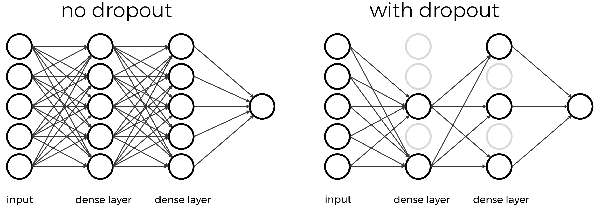
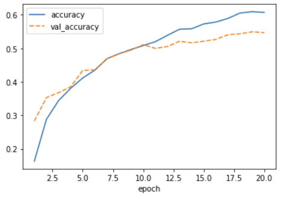

:::::::::::::::::::::::::::::::::::::: questions 

- How do you monitor the training process?
- How do you detect overfitting?
- How do you avoid overfitting?
- How do you measure model accuracy?
- How do you use a model to make a prediction?
- How to you improve model performance?

::::::::::::::::::::::::::::::::::::::::::::::::

::::::::::::::::::::::::::::::::::::: objectives

- Explain what loss and accuracy are
- Know difference between training, testing, and validation datasets
- Understand what steps to take to improve model accuracy

::::::::::::::::::::::::::::::::::::::::::::::::

## Perform a Prediction/Classification
After training the network we can use it to perform predictions. This is the mode you would use the network in after you have fully trained it to a satisfactory performance. Doing predictions on a special hold-out set is used in the next step to measure the performance of the network.

## 7. Perform a prediction/classification

Now that we have a trained neural network, we can use it to predict new samples of penguin using the predict function.

We will use the neural network to predict the species of the test set using the predict function. We will be using this prediction in the next step to measure the performance of our trained network. This will return a numpy matrix, which we convert to a pandas dataframe to easily see the labels.

```python
# predict the classname
result = model.predict(new_img_float) # make prediction
print(result) # probability for each class
```

```output
Result: [[-2.0185328   9.337507   -2.4551604  -0.4688053  -4.599108   -3.5822825
   6.427376   -0.09437321  0.82065487  1.2978227 ]]
Class name: automobile
```

Remember that the output of the network uses the softmax activation function and has three outputs, one for each species. This dataframe shows this nicely.

We now need to transform this output to one penguin species per sample. We can do this by looking for the index of highest valued output and converting that to the corresponding species. Pandas dataframes have the idxmax function, which will do exactly that.

```python
print(class_names[result.argmax()]) # class with highest probability
```
TODO modify all of this section for our example

## Measure Performance
Once we trained the network we want to measure its performance. To do this we use some additional data that was not part of the training, this is known as a test set. There are many different methods available for measuring performance and which one is best depends on the type of task we are attempting. These metrics are often published as an indication of how well our network performs.

## 8. Measuring performance
Now that we have a trained neural network it is important to assess how well it performs. We want to know how well it will perform in a realistic prediction scenario, measuring performance will also come back when tuning the hyperparameters.

We have created a test set during the data preparation stage which we will use now to create a confusion matrix.

### Confusion matrix

With the predicted species we can now create a confusion matrix and display it using seaborn. To create a confusion matrix we will use another convenient function from sklearn called confusion_matrix. This function takes as a first parameter the true labels of the test set. We can get these by using the idxmax method on the y_test dataframe. The second parameter is the predicted labels which we did above.

```python
from sklearn.metrics import confusion_matrix

true_species = y_test.idxmax(axis="columns")

matrix = confusion_matrix(true_species, predicted_species)
print(matrix)
```
```output
[[22  0  8]
 [ 5  0  9]
 [ 6  0 19]]
 ```

Unfortunately, this matrix is kinda hard to read. Its not clear which column and which row corresponds to which species. So let's convert it to a pandas dataframe with its index and columns set to the species as follows:

```python
# Convert to a pandas dataframe
confusion_df = pd.DataFrame(matrix, index=y_test.columns.values, columns=y_test.columns.values)

# Set the names of the x and y axis, this helps with the readability of the heatmap.
confusion_df.index.name = 'True Label'
confusion_df.columns.name = 'Predicted Label'
```

We can then use the heatmap function from seaborn to create a nice visualization of the confusion matrix. The annot=True parameter here will put the numbers from the confusion matrix in the heatmap.

```python
sns.heatmap(confusion_df, annot=True)
```

::::::::::::::::::::::::::::::::::::: challenge 

## Challenge Confusion Matrix

Looking at the training curve we have just made.

Measure the performance of the neural network you trained and visualize a confusion matrix.

- Did the neural network perform well on the test set?
- Did you expect this from the training loss you saw?
- What could we do to improve the performance?

:::::::::::::::::::::::: solution 

The confusion matrix shows that the predictions for Adelie and Gentoo are decent, but could be improved. However, Chinstrap is not predicted ever.

The training loss was very low, so from that perspective this may be surprising. But this illustrates very well why a test set is important when training neural networks.

We can try many things to improve the performance from here. One of the first things we can try is to balance the dataset better. Other options include: changing the network architecture or changing the training parameters

:::::::::::::::::::::::::::::::::
::::::::::::::::::::::::::::::::::::::::::::::::

## Tune Hyperparameters
Hyperparameters are all the parameters set by the person configuring the machine learning instead of those learned by the algorithm itself. The hyperparameters include the number of epochs or the parameters for the optimizer. It might be necessary to adjust these and re-run the training many times before we are happy with the result.

## 9. Tune hyperparameters

As we discussed before the design and training of a neural network comes with many hyper parameter choices. We will go into more depth of these hyperparameters in later episodes. For now it is important to realize that the parameters we chose were somewhat arbitrary and more careful consideration needs to be taken to pick hyperparameter values.

## 9. Tune hyperparameters

Set expectations: How difficult is the defined problem?
Before we dive deeper into handling overfitting and (trying to) improving the model performance, let us ask the question: How well must a model perform before we consider it a good model?

Now that we defined a problem (predict tomorrow's sunshine hours), it makes sense to develop an intuition for how difficult the posed problem is. Frequently, models will be evaluated against a so called baseline. A baseline can be the current standard in the field or if such a thing does not exist it could also be an intuitive first guess or toy model. The latter is exactly what we would use for our case.

TODO might be able to do something like this

## Watch your model training closely

As we saw when comparing the predictions for the training and the test set, deep learning models are prone to overfitting. Instead of iterating through countless cycles of model trainings and subsequent evaluations with a reserved test set, it is common practice to work with a second split off dataset to monitor the model during training. This is the validation set which can be regarded as a second test set. As with the test set, the datapoints of the validation set are not used for the actual model training itself. Instead, we evaluate the model with the validation set after every epoch during training, for instance to stop if we see signs of clear overfitting. Since we are adapting our model (tuning our hyperparameters) based on this validation set, it is very important that it is kept separate from the test set. If we used the same set, we would not know whether our model truly generalizes or is only overfitting.

:::::::::::::::::::::::::::::::::::::: callout
Test vs. validation set

Not everybody agrees on the terminology of test set versus validation set. You might find examples in literature where these terms are used the other way around.

We are sticking to the definition that is consistent with the Keras API. In there, the validation set can be used during training, and the test set is reserved for afterwards.

:::::::::::::::::::::::::::::::::::::::::::::::

TODO add new model with validation data
see this section deep-learning 03 weather

::::::::::::::::::::::::::::::::::::: challenge 

## Challenge Exercise: plot the training progress.

1. Is there a difference between the training and validation data? And if so, what would this imply?
1. (Optional) Take a pen and paper, draw the perfect training and validation curves. (This may seem trivial, but it will trigger you to think about what you actually would like to see)

:::::::::::::::::::::::: solution 

The difference between training and validation data shows that something is not completely right here. The model predictions on the validation set quickly seem to reach a plateau while the performance on the training set keeps improving. That is a common signature of overfitting.

Optional: Ideally you would like the training and validation curves to be identical and slope down steeply to 0. After that the curves will just consistently stay at 0.

:::::::::::::::::::::::::::::::::
::::::::::::::::::::::::::::::::::::::::::::::

### Counteract model overfitting

Overfitting is a very common issue and there are many strategies to handle it. Most similar to classical machine learning might to **reduce the number of parameters**.

TODO revisit this section deep-learning 03 weather
TODO might need to break this out into new episode

:::::::::::::::::::::::::::::::::::::::::::::::::::::::::::::::::::: instructor

Inline instructor notes can help inform instructors of timing challenges
associated with the lessons. They appear in the "Instructor View"

::::::::::::::::::::::::::::::::::::::::::::::::::::::::::::::::::::::::::::::::

::::::::::::::::::::::::::::::::::::: challenge 

## Open question: What could be next steps to further improve the model?

With unlimited options to modify the model architecture or to play with the training parameters, deep learning can trigger very extensive hunting for better and better results. Usually models are "well behaving" in the sense that small chances to the architectures also only result in small changes of the performance (if any). It is often tempting to hunt for some magical settings that will lead to much better results. But do those settings exist? Applying common sense is often a good first step to make a guess of how much better could results be. In the present case we might certainly not expect to be able to reliably predict sunshine hours for the next day with 5-10 minute precision. But how much better our model could be exactly, often remains difficult to answer.

- What changes to the model architecture might make sense to explore?
- Ignoring changes to the model architecture, what might notably improve the prediction quality?

:::::::::::::::::::::::: solution 

This is on open question. And we don't actually know how far one could push this sunshine hour prediction (try it out yourself if you like! We're curious!). But there is a few things that might be worth exploring.

Regarding the model architecture:

- In the present case we do not see a magical silver bullet to suddenly boost the performance. But it might be worth testing if deeper networks do better (more layers).

Other changes that might impact the quality notably:

- The most obvious answer here would be: more data! Even this will not always work (e.g. if data is very noisy and uncorrelated, more data might not add much).
- Related to more data: use data augmentation. By creating realistic variations of the available data, the model might improve as well.
- More data can mean more data points (you can test it yourself by taking more than the 3 years we used here!)
- More data can also mean more features! What about adding the month?
- The labels we used here (sunshine hours) are highly biased, many days with no or nearly no sunshine but few with >10 hours. Techniques such as oversampling or undersampling might handle such biased labels better. Another alternative would be to not only look at data from one day, but use the data of a longer period such as a full week. This will turn the data into time series data which in turn might also make it worth to apply different model architectures....

:::::::::::::::::::::::::::::::::
::::::::::::::::::::::::::::::::::::::::::::::

## Dropout
Note that the training loss continues to decrease, while the validation loss stagnates, and even starts to increase over the course of the epochs. Similarly, the accuracy for the validation set does not improve anymore after some epochs. This means we are overfitting on our training data set.

Techniques to avoid overfitting, or to improve model generalization, are termed **regularization techniques**. One of the most versatile regularization technique is **dropout** (Srivastava et al., 2014). Dropout essentially means that during each training cycle a random fraction of the dense layer nodes are turned off. This is described with the dropout rate between 0 and 1 which determines the fraction of nodes to silence at a time. 

{alt=''}

The intuition behind dropout is that it enforces redundancies in the network by constantly removing different elements of a network. The model can no longer rely on individual nodes and instead must create multiple "paths". In addition, the model has to make predictions with much fewer nodes and weights (connections between the nodes). As a result, it becomes much harder for a network to memorize particular features. At first this might appear a quiet drastic approach which affects the network architecture strongly. In practice, however, dropout is computationally a very elegant solution which does not affect training speed. And it frequently works very well.

**Important to note**: Dropout layers will only randomly silence nodes during training! During a predictions step, all nodes remain active (dropout is off). During training, the sample of nodes that are silenced are different for each training instance, to give all nodes a chance to observe enough training data to learn its weights.

Let us add one dropout layer towards the end of the network, that randomly drops 20% of the input units.

```python
inputs = keras.Input(shape=train_images.shape[1:])
x = keras.layers.Conv2D(50, (3, 3), activation='relu')(inputs)
x = keras.layers.MaxPooling2D((2, 2))(x)
x = keras.layers.Conv2D(50, (3, 3), activation='relu')(x)
x = keras.layers.MaxPooling2D((2, 2))(x)
x = keras.layers.Conv2D(50, (3, 3), activation='relu')(x)
x = keras.layers.Dropout(0.8)(x) # This is new!
x = keras.layers.Flatten()(x)
x = keras.layers.Dense(50, activation='relu')(x)
outputs = keras.layers.Dense(10)(x)

model_dropout = keras.Model(inputs=inputs, outputs=outputs, name="cifar_model")

model_dropout.summary()
```
```output
Model: "cifar_model"
_________________________________________________________________
 Layer (type)                Output Shape              Param #
=================================================================
 input_8 (InputLayer)        [(None, 32, 32, 3)]       0

 conv2d_19 (Conv2D)          (None, 30, 30, 50)        1400

 max_pooling2d_12 (MaxPoolin  (None, 15, 15, 50)       0
 g2D)

 conv2d_20 (Conv2D)          (None, 13, 13, 50)        22550

 max_pooling2d_13 (MaxPoolin  (None, 6, 6, 50)         0
 g2D)

 conv2d_21 (Conv2D)          (None, 4, 4, 50)          22550

 dropout_2 (Dropout)         (None, 4, 4, 50)          0

 flatten_7 (Flatten)         (None, 800)               0

 dense_13 (Dense)            (None, 50)                40050

 dense_14 (Dense)            (None, 10)                510

=================================================================
Total params: 87,060
Trainable params: 87,060
Non-trainable params: 0
_________________________________________________________________
```

We can see that the dropout does not alter the dimensions of the image, and has zero parameters.

We again compile and train the model.

```python
model_dropout.compile(optimizer='adam',
              loss=keras.losses.SparseCategoricalCrossentropy(from_logits=True),
              metrics=['accuracy'])

history_dropout = model_dropout.fit(train_images, train_labels, epochs=20,
                    validation_data=(test_images, test_labels))
```
And inspect the training results:
```python
history_df = pd.DataFrame.from_dict(history_dropout.history)
history_df['epoch'] = range(1,len(history_df)+1)
history_df = history_df.set_index('epoch')
sns.lineplot(data=history_df[['accuracy', 'val_accuracy']])

test_loss, test_acc = model_dropout.evaluate(test_images,  test_labels, verbose=2)
```
```output
313/313 - 2s - loss: 1.4683 - accuracy: 0.5307
```

{alt=''}

```python
# plot the loss from the training process
sns.lineplot(data=history_df[['loss', 'val_loss']])
```

{alt=''}

Now we see that the gap between the training accuracy and validation accuracy is much smaller, and that the final accuracy on the validation set is higher than without dropout. Nevertheless, there is still some difference between the training loss and validation loss, so we could experiment with regularization even more.

::::::::::::::::::::::::::::::::::::: keypoints 

- Use `.md` files for episodes when you want static content
- Use `.Rmd` files for episodes when you need to generate output
- Run `sandpaper::check_lesson()` to identify any issues with your lesson
- Run `sandpaper::build_lesson()` to preview your lesson locally

::::::::::::::::::::::::::::::::::::::::::::::::

