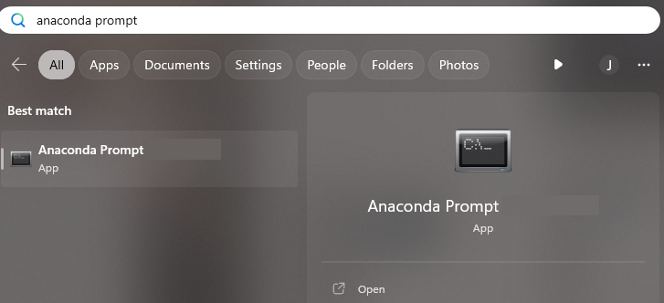
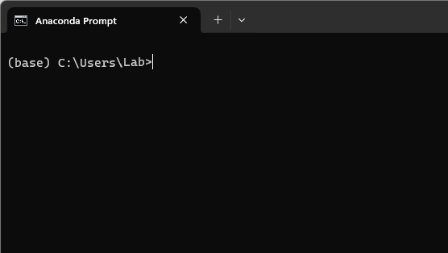
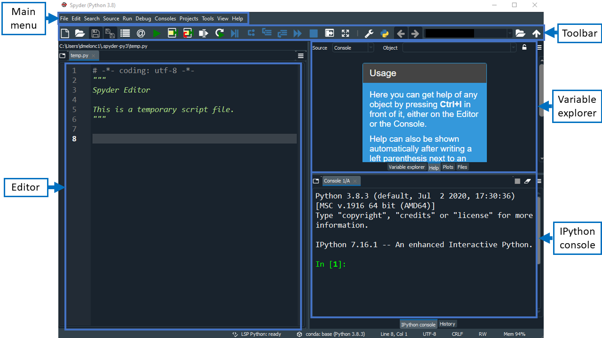
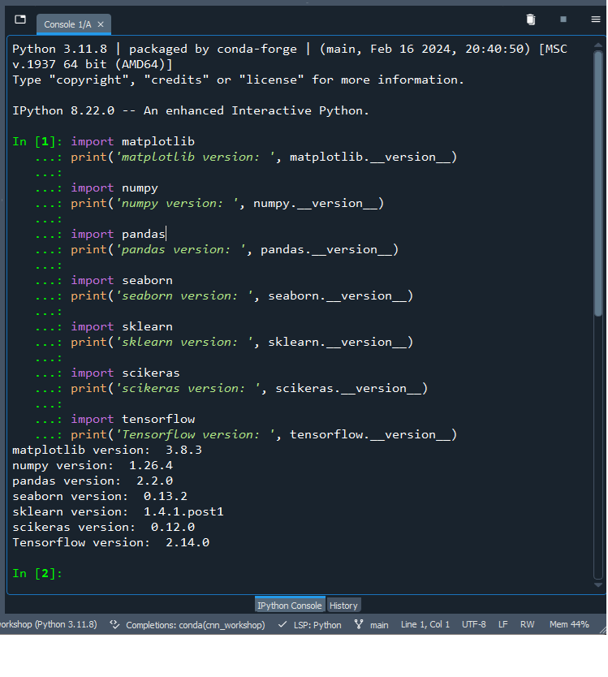

This lesson is designed for Software Carpentry users who have completed [Plotting and Programming in Python] and want to jump straight into image classification. We recognize this jump is quite large and have done our best to provide the content and code to perform these types of analyses.

It uses the Anaconda package manager to install the required python packages, including the Spyder IDE. 

These instructions are for setting up tensorflow in a **CPU** only environment.

::::::::::::::::::::::::::::::::::::::::: callout
Please note this lesson is designed to work with CPU only environments. This was an intentional decision to avoid the difficulties in setting up GPU environments. If you are an advanced user and choose to set up a GPU environment, you are on your own. We will not be able to troubleshoot any issues with GPU set up on the day of the workshop.
:::::::::::::::::::::::::::::::::::::::::::::::::

## Software Setup

::::::::::::::::::::::::::::::::::::: challenge
## Install Python Using Anaconda

[Python] is a popular language for scientific computing, and a frequent choice for machine learning as well. Installing all of its scientific packages individually can be a bit difficult, however, so we recommend the installer [Anaconda] which includes most (but not all) of the software you need. Make sure you install the latest Python version 3.xx.

Also, please set up your python environment **at least** a day in advance of the workshop. If you encounter problems with the installation procedure, ask your workshop organizers via e-mail for assistance so you are ready to go as soon as the workshop begins.

:::::::::::::::::::::::: solution
### Windows

Check out the [Windows - Video tutorial] or:

1. Open [https://www.anaconda.com/products/distribution] with your web browser.

2. Download the Python 3.xx installer for Windows.

3. Double-click the executable and install Python 3 using _MOST_ of the default settings. The only exception is to check the **Make Anaconda the default Python** option.
::::::::::::::::::::::::::::::::::

:::::::::::::::::::::::: solution
### MacOS

Check out the [Mac OS X - Video tutorial] or:

1. Open [https://www.anaconda.com/products/distribution] with your web browser.

2. Download the Python 3 installer for Mac.

3. Install Python 3 using all of the defaults for installation.
::::::::::::::::::::::::::::::::::

:::::::::::::::::::::::: solution 
### Linux

Note the following installation steps require you to work from the shell.
If you run into any difficulties, please request help before the workshop begins.

1.  Open [https://www.anaconda.com/products/distribution] with your web browser.

2.  Download the Python 3 installer for Linux.

3.  Install Python 3 using all of the defaults for installation.

    a.  Open a terminal window.

    b.  Navigate to the folder where you downloaded the installer

    c.  Type

    ```bash
    bash Anaconda3-
    ```

    and press tab.  The name of the file you just downloaded should appear.

    d.  Press enter.

    e.  Follow the text-only prompts.  When the license agreement appears (a colon
        will be present at the bottom of the screen) hold the down arrow until the
        bottom of the text. Type `yes` and press enter to approve the license. Press
        enter again to approve the default location for the files. Type `yes` and
        press enter to prepend Anaconda to your `PATH` (this makes the Anaconda
        distribution the default Python).

:::::::::::::::::::::::::::::::::: 
::::::::::::::::::::::::::::::::::::::::::::::::

## Install the required packages

[Conda] is the package management system associated with [Anaconda] and runs on Windows, macOS and Linux.

Conda should already be available in your system once you installed Anaconda successfully. Conda thus works regardless of the operating system. Make sure you have an up-to-date version of Conda running. See [these instructions] for updating Conda if required.

The easiest way to create a conda environment for this lesson is to use the Anaconda Prompt. You can search for "anaconda prompt" using the Windows search function (Windows Logo Key) or Spotlight on macOS (Command + spacebar).

{alt='Screenshot of the Anaconda Prompt application'}

A terminal window will open with the title 'Anaconda Prompt':

{alt='Screenshot of the terminal window that opens when you launch the Anaconda Prompt application'}

Note the notation of the prompt inside the terminal window. The name inside the parentheses refers to which conda environment you are working inside of, and 'base' is the name given to the default environment included with every Anaconda distribution.

To create a new environment for this lesson, the command starts with the conda keywords `conda create`. This command can be followed by a name for the new environment and the package(s) to install but to make things easier, inside the script download folder, we have given you an environment.yml file to use instead. (See download link below if you haven't already.)

### Windows

```code
(base) C:\Users\Lab> conda env create --file cnn_workshop_environment.yml
```

If the yml is not in your current directory, you can specify the full path to the file, eg:

```code
(base) C:\Users\Lab> conda env create --file C:\Users\Lab\intro-image-classification-cnn\files\cnn_workshop_environment.yml
```

Be patient because it might take a while (15-20 min) for conda to work out all of the dependencies.

After the environment is created we tell Anaconda to use the new environment with the conda keywords `conda activate` followed by the environment name:

```code
(base) C:\Users\Lab> conda activate cnn_workshop
(cnn_workshop) C:\Users\Lab>
```

You will know you are in the right environment because the prompt changes from (base) to (cnn_workshop).

::::::::::::::::::::::::::::::::::::::::: challenge
## MacOS

Creating a MACOS environment requires a different tensorflow package.

:::::::::::::::::::::::: solution
## Macos - Intel

```code
(base) C:\Users\Lab> conda env create --file MACOS_cnn_workshop_environment.yml
```

If the yml is not in your current directory, you can specify the full path to the file, eg:

```code
(base) C:\Users\Lab> conda env create --file C:\Users\Lab\intro-image-classification-cnn\files\MACOS_cnn_workshop_environment.yml
```

Be patient because it might take a while (15-20 min) for conda to work out all of the dependencies.

After the environment is created we tell Anaconda to use the new environment with the conda keywords `conda activate` followed by the environment name:

```code
(base) C:\Users\Lab> conda activate cnn_workshop_macos
(cnn_workshop_macos) C:\Users\Lab>
```

You will know you are in the right environment because the prompt changes from (base) to (cnn_workshop_macos).
:::::::::::::::::::::::::::::::::
:::::::::::::::::::::::: solution
## Macos - Silicon (M1)

After creating the MACOS environment with the yml, M1 and M2 computers (Apple Silicon) require an additional package to be installed.

TODO check if this is because of the integrated GPU and if so, can Intel version also use the graphics card and how?

```code
(cnn_workshop_macos) C:\Users\Lab> pip install tensorflow-metal
```
:::::::::::::::::::::::::::::::::
::::::::::::::::::::::::::::::::::::::::::::::::

## Start Spyder

We teach this lesson using Python in [Spyder] (Scientific Python Development Environment), a free integrated development environment (IDE) included with Anaconda. Editing, interactive testing, debugging, and introspection tools are all included in Spyder.

To start Spyder, type the command `spyder`, making sure you are still in the workshop environment:

```conda
(cnn_workshop) C:\Users\Lab> spyder
```

{alt='Screenshot of the Spyder IDE annotated with boxes and labels for the Editor; Help, Variable Explorer, Plots, Files; and IPython Console areas'}

## Check your setup

To check that all packages installed correctly, go to the interactive `IPython Console` in Spyder (lower right hand side panel) and type in the following commands:

```python
import matplotlib
print('matplotlib version: ', matplotlib.__version__)

import numpy
print('numpy version: ', numpy.__version__)

import pandas
print('pandas version: ', pandas.__version__)

import seaborn
print('seaborn version: ', seaborn.__version__)

import sklearn
print('sklearn version: ', sklearn.__version__)

import scikeras
print('scikeras version: ', scikeras.__version__)

import tensorflow
print('Tensorflow version: ', tensorflow.__version__)
```

Your package versions may vary from the screenshot below but this is similar to what your output will look like. The important thing is that there are no errors.

{alt='Screenshot of the IPython Console in Spyder wtih list of package versions and no error messages.'}

## Download the scripts, files, and model outputs

Download the [scripts, files, and model outputs].


## Get the data

This lesson uses the CIFAR-10 image dataset that comes prepackaged with Keras. There are no additional steps needed to access the data.


<!-- Collect your link references at the bottom of your document -->

[Plotting and Programming in Python]: https://swcarpentry.github.io/python-novice-gapminder/
[Conda]: https://docs.conda.io/projects/conda/en/latest/
[Python]: https://python.org
[Anaconda]: https://www.anaconda.com/products/individual
[Windows - Video tutorial]: https://www.youtube.com/watch?v=xxQ0mzZ8UvA
[Mac OS X - Video tutorial]: https://www.youtube.com/watch?v=TcSAln46u9U
[these instructions]: https://docs.anaconda.com/anaconda/install/update-version/
[pip]: (https://pip.pypa.io/en/stable/)
[Spyder]: https://www.spyder-ide.org/
[scripts, files, and model outputs]: https://drive.google.com/file/d/1SpcusVYomhukFKWuUcK7LwF7RtrKB8Z_/view?usp=drive_link


