This lesson is designed for Software Carpentry users who have completed [Plotting and Programming in Python] and want to jump straight into image classification. We recognize this jump is quite large and have done our best to provide the content and code to perform these types of analyses.

It uses the Anaconda package manager to install the required python packages, including the Spyder IDE. 

These instructions are for setting up tensorflow in a **CPU** only environment.

::::::::::::::::::::::::::::::::::::::::: callout
Please note this lesson is designed to work with CPU only environments. This was an intentional decision to avoid the difficulties in setting up GPU environments. If you are an advanced user and choose to set up a GPU environment, you are on your own. We will not be able to troubleshoot any issues with GPU set up on the day of the workshop.
:::::::::::::::::::::::::::::::::::::::::::::::::

## Software Setup

::::::::::::::::::::::::::::::::::::: challenge
## Install Python Using Anaconda

[Python] is a popular language for scientific computing, and a frequent choice for machine learning as well. Installing all of its scientific packages individually can be a bit difficult, however, so we recommend the installer [Anaconda] which includes most (but not all) of the software you need. Make sure you install the latest Python version 3.xx.

Also, please set up your python environment **at least** a day in advance of the workshop. If you encounter problems with the installation procedure, ask your workshop organizers via e-mail for assistance so you are ready to go as soon as the workshop begins.

:::::::::::::::::::::::: solution
### Windows

Check out the [Windows - Video tutorial] or:

1. Open [https://www.anaconda.com/products/distribution] with your web browser.

2. Download the Python 3.xx installer for Windows.

3. Double-click the executable and install Python 3 using _MOST_ of the default settings. The only exception is to check the **Make Anaconda the default Python** option.
::::::::::::::::::::::::::::::::::

:::::::::::::::::::::::: solution
### MacOS

Check out the [Mac OS X - Video tutorial] or:

1. Open [https://www.anaconda.com/products/distribution] with your web browser.

2. Download the Python 3 installer for Mac.

3. Install Python 3 using all of the defaults for installation.
::::::::::::::::::::::::::::::::::

:::::::::::::::::::::::: solution 
### Linux

Note the following installation steps require you to work from the shell.
If you run into any difficulties, please request help before the workshop begins.

1.  Open [https://www.anaconda.com/products/distribution] with your web browser.

2.  Download the Python 3 installer for Linux.

3.  Install Python 3 using all of the defaults for installation.

    a.  Open a terminal window.

    b.  Navigate to the folder where you downloaded the installer

    c.  Type

    ```bash
    bash Anaconda3-
    ```

    and press tab.  The name of the file you just downloaded should appear.

    d.  Press enter.

    e.  Follow the text-only prompts.  When the license agreement appears (a colon
        will be present at the bottom of the screen) hold the down arrow until the
        bottom of the text. Type `yes` and press enter to approve the license. Press
        enter again to approve the default location for the files. Type `yes` and
        press enter to prepend Anaconda to your `PATH` (this makes the Anaconda
        distribution the default Python).

4.	You may wish to initialise conda, so it configures the path and sets the
    required variables.  To do this, execute the following command (if you have 
	installed anaconda in your home directory):
	
	```code
    $ ./anaconda3/bin/conda init 
	```
    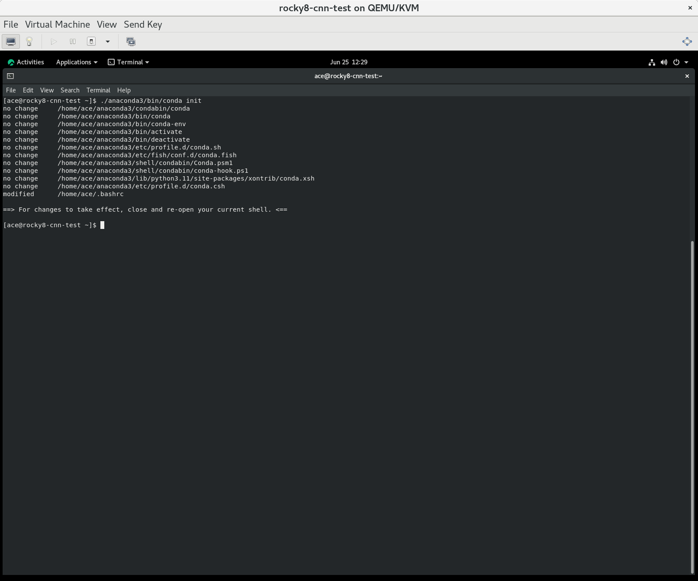{alt='Screenshot of initialising conda on a bash shell.'}

:::::::::::::::::::::::::::::::::: 
::::::::::::::::::::::::::::::::::::::::::::::::

## Download the scripts, files, and model outputs

::::::::::::::::::::::::::::::::::::: challenge
## Download workshop files

Download the [scripts, files, and model outputs].

Create a project folder on your local device for this course and move the downloaded materials to the project folder. Extract all of the download contents here. Check your folder and file structures looks like this:

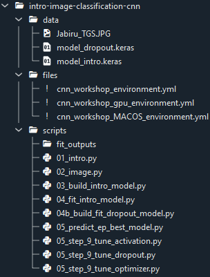{alt='Screenshot of the contents of the intro-image-classification-cnn.zip folder.'}

:::::::::::::::::::::::: solution
### Linux

You can move the downloaded workshop zipped file to your home directory and unzip it using the unzip command.

For example:

```code
[ace@rocky8-cnn-test ~]$ mv ./Downloads/intro-image-classification-cnn.zip .
[ace@rocky8-cnn-test ~]$ unzip intro-image-classification-cnn.zip 
Archive:  intro-image-classification-cnn.zip
   creating: intro-image-classification-cnn/data/
  inflating: intro-image-classification-cnn/data/Jabiru_TGS.JPG  
  inflating: intro-image-classification-cnn/data/model_dropout.keras  
  inflating: intro-image-classification-cnn/data/model_intro.keras  
   creating: intro-image-classification-cnn/files/
  inflating: intro-image-classification-cnn/files/cnn_workshop_environment.yml  
  inflating: intro-image-classification-cnn/files/cnn_workshop_MACOS_environment.yml  
   creating: intro-image-classification-cnn/scripts/
  inflating: intro-image-classification-cnn/scripts/01_intro.py  
  inflating: intro-image-classification-cnn/scripts/02_image.py  
  inflating: intro-image-classification-cnn/scripts/03_build_intro_model.py  
  inflating: intro-image-classification-cnn/scripts/04_fit_intro_model.py  
  inflating: intro-image-classification-cnn/scripts/04b_build_fit_dropout_model.py  
  inflating: intro-image-classification-cnn/scripts/05_predict_ep_best_model.py  
  inflating: intro-image-classification-cnn/scripts/05_step_9_tune_activation.py  
  inflating: intro-image-classification-cnn/scripts/05_step_9_tune_dropout.py  
  inflating: intro-image-classification-cnn/scripts/05_step_9_tune_optimizer.py  
   creating: intro-image-classification-cnn/scripts/fit_outputs/
[ace@rocky8-cnn-test ~]$ 
```

:::::::::::::::::::::::::::::::::: 
::::::::::::::::::::::::::::::::::::::::::::::::

:::::::::::::::::::::::::::::::::::::: callout

In Spyder, when you execute a script in its entirety (Run File F5), the working directory will automatically be set to the directory that contains that script file. 

For this lesson, after launching Spyder, make sure to set the working directory to the 'scripts' folder included in the download. This will help to ensure that all of the scripts we provide run as intended.

::::::::::::::::::::::::::::::::::::::::::::::

## Install the required packages

[Conda] is the package management system associated with [Anaconda] and runs on Windows, macOS and Linux.

Conda should already be available in your system once you installed Anaconda successfully. Conda thus works regardless of the operating system. Make sure you have an up-to-date version of Conda running. See [these instructions] for updating Conda if required.

::::::::::::::::::::::::::::::::::::::::: challenge
## Using Conda to install packages

[Conda] is the package management system associated with [Anaconda] and runs on Windows, macOS and Linux.

Conda should already be available in your system once you installed Anaconda successfully. Conda thus works regardless of the operating system. Make sure you have an up-to-date version of Conda running. See [these instructions] for updating Conda if required.

:::::::::::::::::::::::: solution
## Windows

The easiest way to create a conda environment for this lesson is to use the Anaconda Prompt. You can search for "anaconda prompt" using the Windows search function (Windows Logo Key).

{alt='Screenshot of the Anaconda Prompt application'}

A terminal window will open with the title 'Anaconda Prompt':

{alt='Screenshot of the terminal window that opens when you launch the Anaconda Prompt application'}

Note the notation of the prompt inside the terminal window. The name inside the parentheses refers to which conda environment you are working inside of, and 'base' is the name given to the default environment included with every Anaconda distribution.

To create a new environment for this lesson, the command starts with the conda keywords `conda create`. This command can be followed by a name for the new environment and the package(s) to install but to make things easier, inside the script download folder, we have given you an environment.yml file to use instead. (See download link below if you haven't already.)

```code
(base) C:\Users\Lab> conda env create --file cnn_workshop_environment.yml
```

If the yml is not in your current directory, you can specify the full path to the file, eg:

```code
(base) C:\Users\Lab> conda env create --file C:\Users\Lab\intro-image-classification-cnn\files\cnn_workshop_environment.yml
```

Be patient because it might take a while (15-20 min) for conda to work out all of the dependencies.

After the environment is created we tell Anaconda to use the new environment with the conda keywords `conda activate` followed by the environment name:

```code
(base) C:\Users\Lab> conda activate cnn_workshop
(cnn_workshop) C:\Users\Lab>
```

You will know you are in the right environment because the prompt changes from (base) to (cnn_workshop).

:::::::::::::::::::::::::::::::::
:::::::::::::::::::::::: solution
## Mac

On the Mac, there is no Anaconda Prompt application, thus once the anaconda installation has been completed, simply start a terminal session and the session should look like:

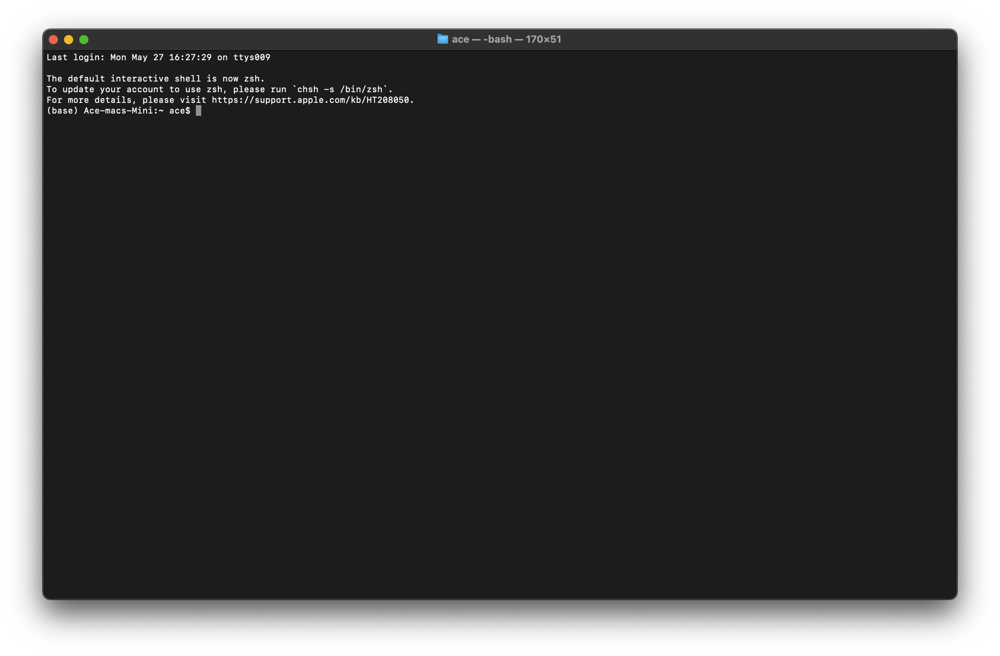{alt='Screenshot of starting a new terminal session on a Mac.'}

Note the notation of the prompt inside the terminal window. The name inside the parentheses refers to which conda environment you are working inside of, and 'base' is the name given to the default environment included with every Anaconda distribution.

To create a new environment for this lesson, the command starts with the conda keywords `conda create`. This command can be followed by a name for the new environment and the package(s) to install.  To make things easier, inside the unziped intro-image-classification-cnn  folder, we have given you an environment.yml file to use instead. (See download link above if you haven't already.)

```code
(base) Mac$ conda env create --file cnn_workshop_environment.yml
```

If the yml is not in your current directory, you can specify the full path to the file, eg:

```code
(base) Mac$ conda env create --file intro-image-classification-cnn/files/cnn_workshop_environment.yml
```

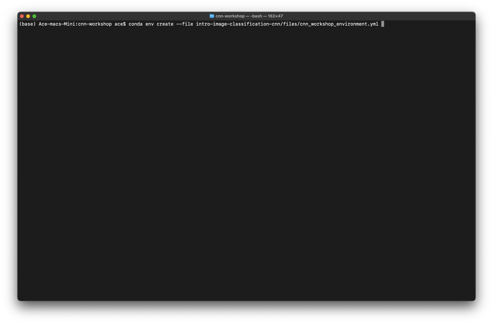{alt='Screenshot of create conda enviroment on a Mac.'}

Be patient because it might take a while (15-20 min) for conda to work out all of the dependencies.  

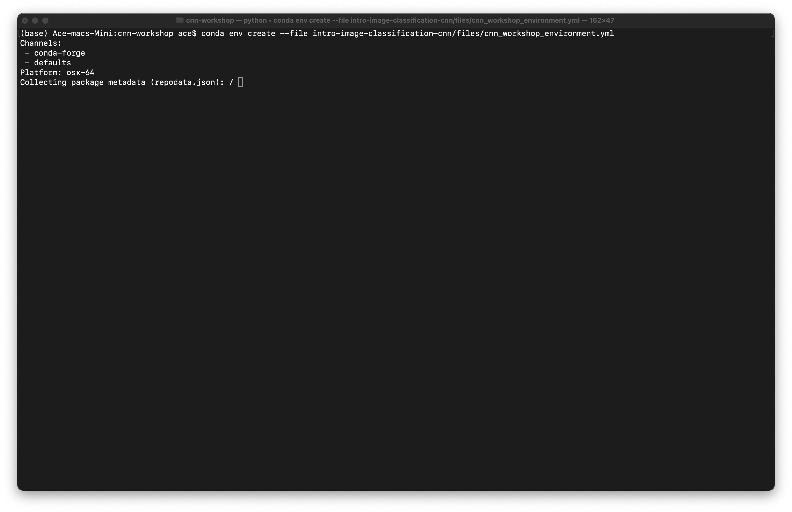{alt='Screenshot of creating conda enviroment on a Mac.'}

{alt='Screenshot of creating conda enviroment on a Mac.'}

If it installs correctly, you should get the following output on the screen.

```code
done
#
# To activate this environment, use
#
#     $ conda activate cnn_workshop
#
# To deactivate an active environment, use
#
#     $ conda deactivate
```

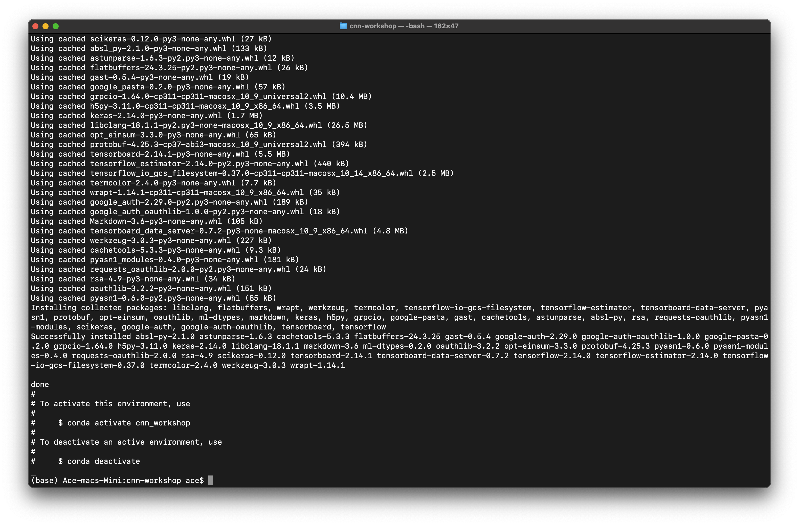{alt='Screenshot of conda enviroment that has been created on a Mac.'}

After the environment is created we tell Anaconda to use the new environment with the conda keywords `conda activate` followed by the environment name:

```code
(base) Mac:cnn-workshop ace$ conda activate cnn_workshop
(cnn_workshop) Mac:cnn-workshop ace$ 
```

You will know you are in the right environment because the prompt changes from (base) to (cnn_workshop).

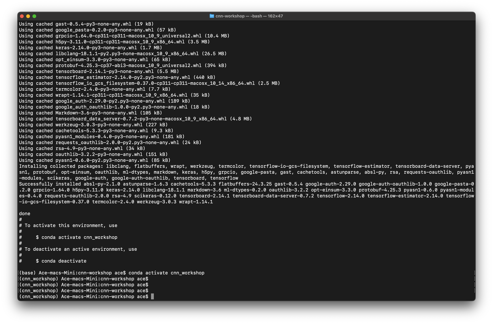{alt='Screenshot of activate conda enviroment on a Mac.'}

## Macos - Silicon (M1 and M2) - This sections needs to be tested and confirmed

After creating the MACOS environment with the yml, M1 and M2 computers (Apple Silicon) require an additional package to be installed.

TODO check if this is because of the integrated GPU and if so, can Intel version also use the graphics card and how?

```code
(cnn_workshop_macos) C:\Users\Lab> pip install tensorflow-metal
```

:::::::::::::::::::::::::::::::::
:::::::::::::::::::::::: solution
## Linux

Within Linux, there is no Anaconda Prompt application, thus once the anaconda installation has been completed, simply start a terminal session.

To create a new environment for this lesson, the command starts with the conda keywords `conda create`. This command can be followed by a name for the new environment and the package(s) to install.  To make things easier, inside the unziped intro-image-classification-cnn  folder, we have given you an environment.yml file to use instead. (See download link above if you haven't already.)

```code
$ conda env create --file cnn_workshop_environment.yml
```

If the yml is not in your current directory, you can specify the full path to the file, eg:

```code
$ conda env create --file intro-image-classification-cnn/files/cnn_workshop_environment.yml
```
Be patient because it might take a while (15-20 min) for conda to work out all of the dependencies.  

***Note, in the screen shots below, I haven't initilised conda, so I had to give it the path to where anaconda was installed.***

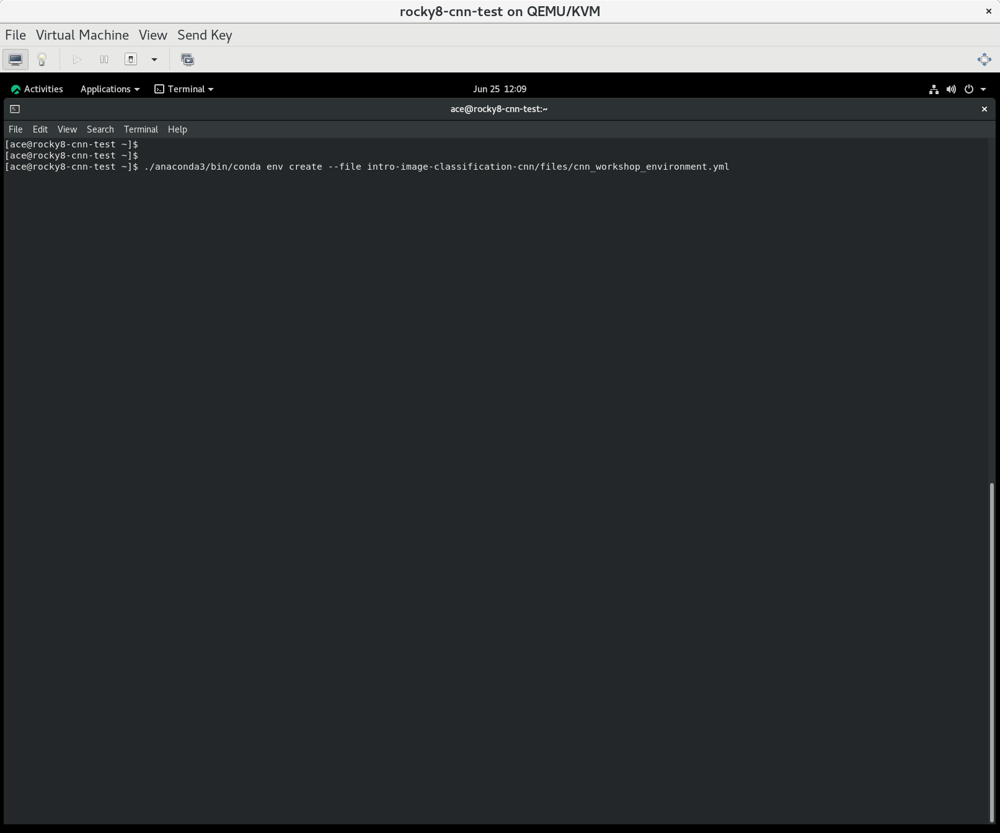{alt='Screenshot of creating conda enviroment on a Linux.'}

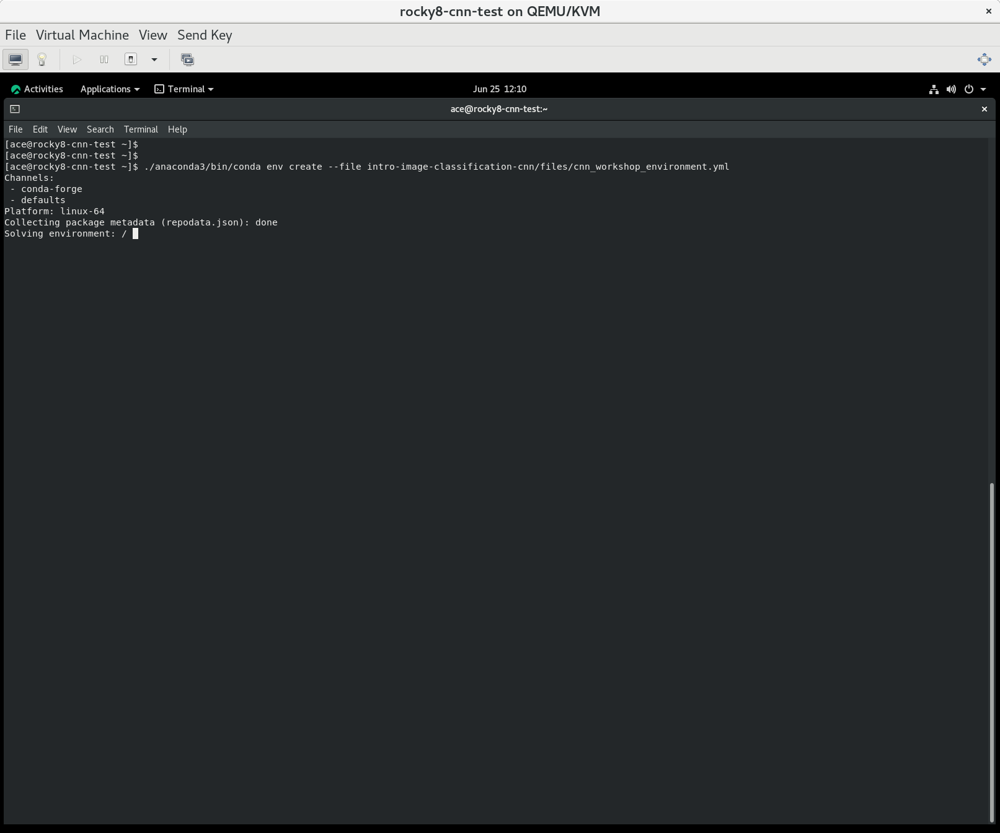{alt='Screenshot of creating conda enviroment on a Linux.'}

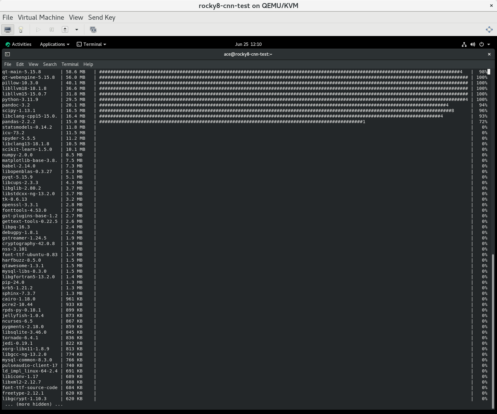{alt='Screenshot of creating conda enviroment on a Linux.'}

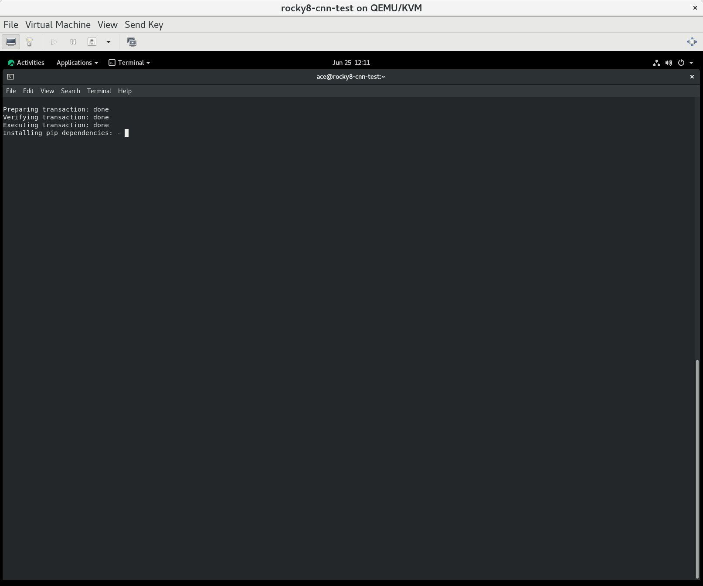{alt='Screenshot of creating conda enviroment on a Linux.'}

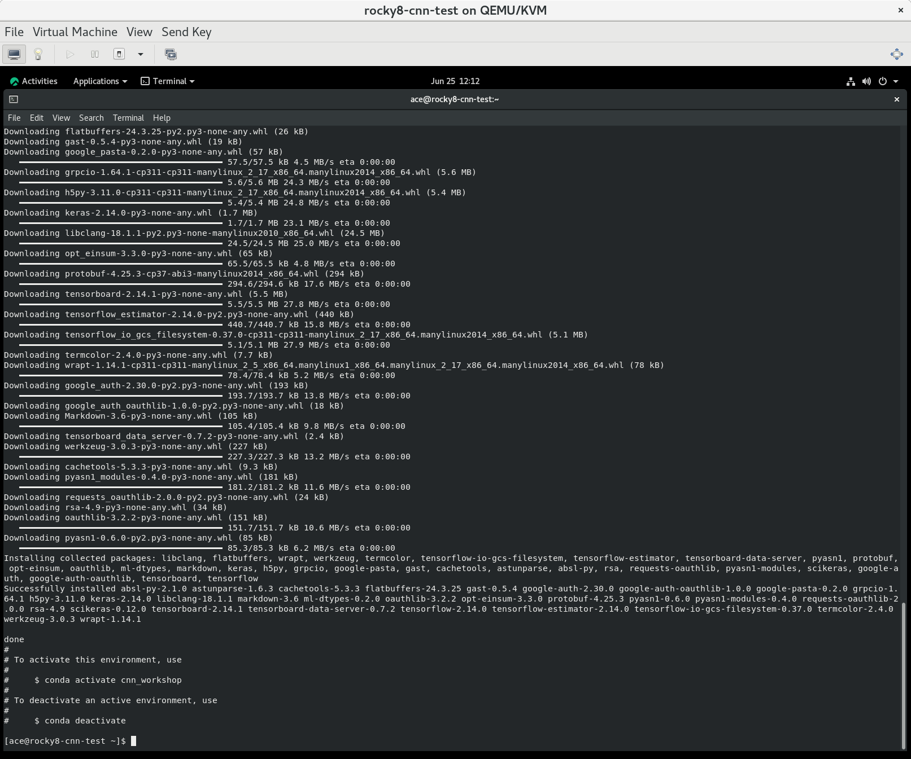{alt='Screenshot of creating conda enviroment on a Linux.'}

If it installs correctly, you should get the following output on the screen.

```code
done
#
# To activate this environment, use
#
#     $ conda activate cnn_workshop
#
# To deactivate an active environment, use
#
#     $ conda deactivate
```

***Note you will need to initialise conda to be able to activate the conda enviroment.***

Additonally, you will need to install scikeras and tensorflow within the conda environment to get everything working.  

To do this, issue the following commands:

```code
$ conda activate cnn_workshop

(base) $ pip install scikeras tensorflow
```

:::::::::::::::::::::::::::::::::
::::::::::::::::::::::::::::::::::::::::::::::::

## Start Spyder

We teach this lesson using Python in [Spyder] (Scientific Python Development Environment), a free integrated development environment (IDE) included with Anaconda. Editing, interactive testing, debugging, and introspection tools are all included in Spyder.

To start Spyder, type the command `spyder`, making sure you are still in the workshop environment:

```conda
(cnn_workshop) C:\Users\Lab> spyder
```

{alt='Screenshot of the Spyder IDE annotated with boxes and labels for the Editor; Help, Variable Explorer, Plots, Files; and IPython Console areas'}

::::::::::::::::::::::::::::::::::::::::: callout
If you are using Linux, you might need to install qt5-qtbase and qt5-qtbase-gui for spyder to work.

On the Rocky 8 Distro, this can be done by issuing the command (as root):

```code
yum install qt5-qtbase qt5-qtbase-gui
```
:::::::::::::::::::::::::::::::::::::::::::::::::

## Check your setup

To check that all packages installed correctly, go to the interactive `IPython Console` in Spyder (lower right hand side panel) and type in the following commands:

```python
import matplotlib
print('matplotlib version: ', matplotlib.__version__)

import numpy
print('numpy version: ', numpy.__version__)

import pandas
print('pandas version: ', pandas.__version__)

import seaborn
print('seaborn version: ', seaborn.__version__)

import sklearn
print('sklearn version: ', sklearn.__version__)

import scikeras
print('scikeras version: ', scikeras.__version__)

import tensorflow
print('Tensorflow version: ', tensorflow.__version__)
```

Your package versions may vary from the screenshot below but this is similar to what your output will look like. The important thing is that there are no errors.

{alt='Screenshot of the IPython Console in Spyder wtih list of package versions and no error messages.'}

## Set the working directory

There are a couple different ways to set the working directory in Spyder. The easiest way is to use the folder icon found on the upper right hand side of the toolbar. Click the folder icon and navigate to '.../intro-image-classification-cnn/scripts' where '...' is your project folder. Verify you are in the right place by selecting the 'Files' pane just below the toolbar and verify its contents.

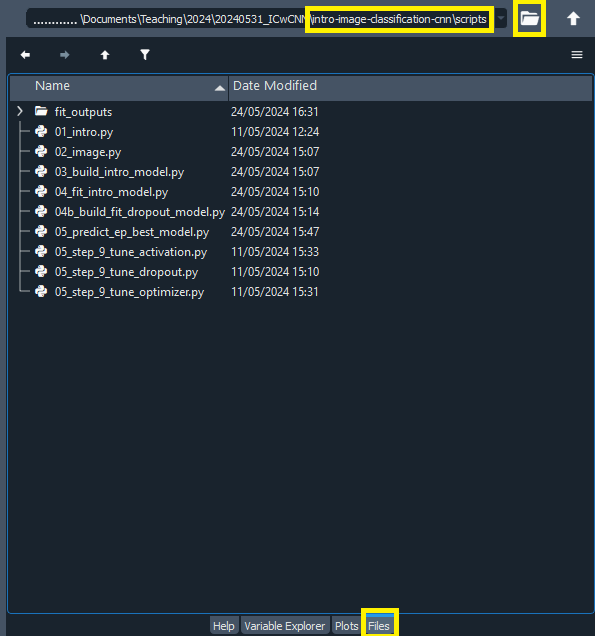{alt='Screenshot of the contents of the scripts folder in the Files tab of the Spyder window after using the folder icon to set the working directory.'}

## Get the data

This lesson uses the CIFAR-10 image dataset that comes prepackaged with Keras. There are no additional steps needed to access the data.


<!-- Collect your link references at the bottom of your document -->

[Plotting and Programming in Python]: https://swcarpentry.github.io/python-novice-gapminder/
[Conda]: https://docs.conda.io/projects/conda/en/latest/
[Python]: https://python.org
[Anaconda]: https://www.anaconda.com/products/individual
[Windows - Video tutorial]: https://www.youtube.com/watch?v=xxQ0mzZ8UvA
[Mac OS X - Video tutorial]: https://www.youtube.com/watch?v=TcSAln46u9U
[these instructions]: https://docs.anaconda.com/anaconda/install/update-version/
[pip]: (https://pip.pypa.io/en/stable/)
[Spyder]: https://www.spyder-ide.org/
[scripts, files, and model outputs]: https://drive.google.com/file/d/1SpcusVYomhukFKWuUcK7LwF7RtrKB8Z_/view?usp=drive_link


